负责的项目中的富文本编辑器要新增搜索高亮的功能，在字符串匹配搜索中比较有名的就是 KMP 算法，下面来简单介绍下 KMP 以及如何在项目中应用。

在常规的字符串匹配中，比较简单的方案就是一个字符一个字符地去对比。

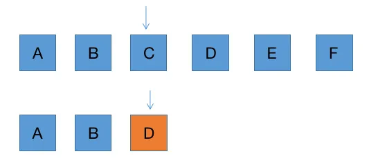

这里第三个字符 C 与 D 不相等，匹配失败

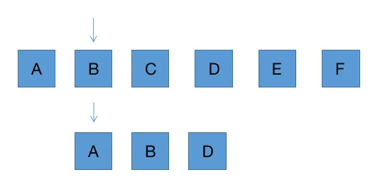

那么将原字符串指针回归到起始位置后一位，匹配字符串指针回归到起始位置继续匹配。这样的做法比较暴力，在 KMP 中有优化的方案。比如在匹配字符串中，D 字符串匹配失败，但前面的 A 与 B 并不相等，能确保 D 前面的字符串不重复，所以无需将原字符串指针回归到起始位置后一位。

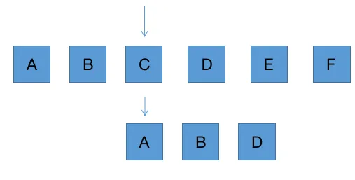

那如果匹配字符串有重复字符呢？

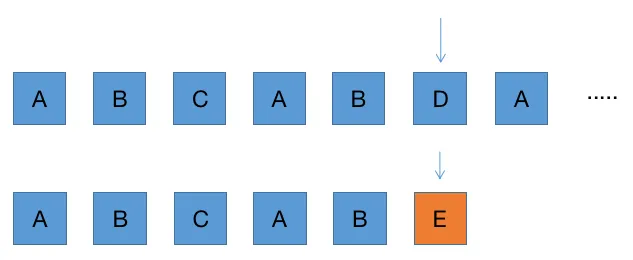

如上图，存在 AB 字符串相同。根据 KMP 中的方法，我们可以将匹配字符串的指针回到 AB 字符串长度 2 的位置

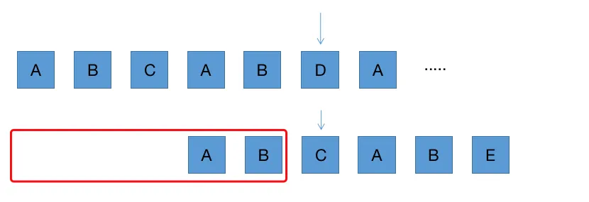

AB 字符串就是在匹配字符串 E 点匹配失败的前面字符串 ABCAB 中的最长公共前后缀字符串。

比如前缀有 A，AB，ABC，ABCA，后缀有 B，AB，CAB，BCAB，公共的前后缀就是 AB。

也就是什么时候匹配失败了，我就去找前面的字符的最长公共前后缀字符串的长度，指针回到该位置就行了。

这里的最长公共前后缀字符串只跟匹配字符串有关，所以可以列一张表，展示对应关系

| 匹配失败位置 | 字符串 | 公共的前后缀字符串 | 公共的前后缀字符串长度 |
| --- | --- | --- | --- |
| A | '' | '' | -1 |
| B | A | '' | 0 |
| C | AB | '' | 0 |
| A | ABC | '' | 0 |
| B | ABCA | A | 1 |
| E | ABCAB | AB | 2 |


得到一个除当前字符外的最长公共前后缀的长度数组，称为 next 列表 [-1, 0, 0, 0, 1, 2]。

如果第一个 A 字符就匹配失败，由于前面没有字符，且原字符串的指针也得后移，这里就定义为 -1。

我们可以通过 2 个指针，遍历匹配字符串来获得 next 列表。首先将列表固定为 [-1]，表示在第一个 A 字符就匹配失败。

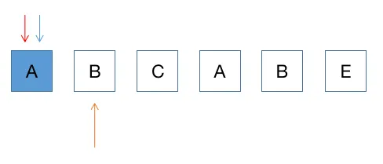

当第二个 B 字符串匹配失败时，前面的字符串只有 A，表示没有公共前后缀，长度设置为 0，此时记做 [-1, 0]


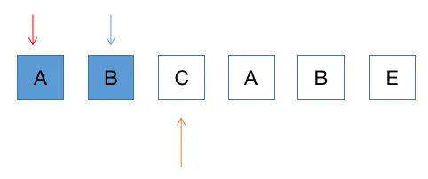
蓝色指针往后移，当第三个 C 字符匹配失败时，前面字符串 AB，两个指针位置的字符 A 与 B 并不相等，所以也没有公共前后缀，长度设置为 0，此时记做 [-1, 0, 0]

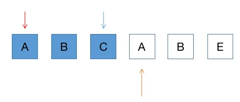
蓝色指针往后移，当第四个 A 字符匹配失败时，前面字符串 ABC，两个指针位置的字符 A 与 C 并不相等，所以也没有公共前后缀，长度设置为 0，此时记做 [-1, 0, 0, 0]

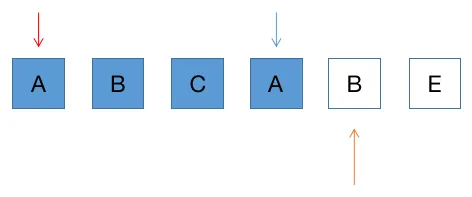
蓝色继续后移，这时候两个指针位置的字符相等了，长度为 1，记做 [-1, 0, 0, 0, 1]。 这时可能会有疑问，有没有可能还有更长的情况呢，假设  AX = XA，那么只有可能是 AAAA，那之前的公共前后缀长度就不可能是 0 了。

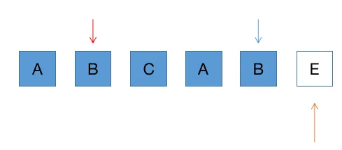
遇到相等情况下，那么红色指针也开始后移了，来判断第二个字符是否相等。这时也是相等的，得再上一个基础上长度 +1，记做  [-1, 0, 0, 0, 1, 2]

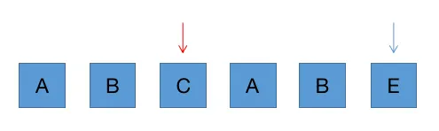

两个指针再往后移，不相等，则回归到 0 位置，在与 E 相比，不相等则没有公共前后缀，记做  [-1, 0, 0, 0, 1, 2, 0]

转换成代码

```javascript
function nextList(pattern) {
    let i = 0;
    let j = -1;
    const next = [];
    next[0] = -1;
    while (i < pattern.length) {
        if (j === -1 || pattern[i] === pattern[j]) {
            i++;
            j++;
            next[i] = j;
        } else {
            j = next[j];
        }
    }
    return next;
}
```

后面就比较简单了，根据 KMP 的策略，两个指针位置字符对比，匹配失败，匹配的字符串的指针位置回到 next 对应的位置，继续对比。如果是第一个字符就匹配失败，那么原字符串的指针也往后移。

最后当匹配字符串的指针走完后，返回两指针位置差就是字符串匹配成功的起始位置。

```javascript
function kmp(str, pattern){
  const next = nextList(pattern);
  let i = 0;
  let j = 0;
  while (i < str.length && j < pattern.length) {
    if (str[i] === pattern[j] || j === -1) {
      i++;
      j++;
    } else {
      j = next[j];
    }
  }
  if (j === pattern.length) {
    return i - j;
  } else {
    return -1;
  }
}

```

回到项目中来，我们具体的需求是在富文本编辑器中添加搜索功能，搜到所以匹配的词然后标记高亮，并且还能上下切换


与原版的 KMP 算法不同，在实际的项目中并不是一个纯字符串匹配搜索。

比如在富文本编辑器中的内容格式就分为词和分词

```javascript
const words = [
  {
    chs: [
      {
        ch: '这'
      },
      {
        ch: '是'
      }
    ]
  },
  {
    chs: [
      {
        ch: '一段'
      }
    ]
  },
  {
    chs: [
      {
        ch: '话'
      }
    ]
  }
]
```

并且查找的还是所有词，并不需要返回结果位置，而是高亮标记

```javascript
const words = [
  {
    chs: [
      {
        ch: '这',
        highlight: true, // 高亮
      },
      {
        ch: '是'
      }
    ]
  },
]
```

所以对原来的 KMP 代码进行改造，首页因为不是纯字符串，所以原代码中 str[i] 和 i++ 就无法使用，我们可以创建一个搜索内容类，提供 text() 和 next() 方法来代替当前字符和指针后移的功能

```javascript
class SearchContent {
  constructor(words) {
    this.words = words;
    this.wIndex = 0; // 词索引
    this.cIndex = 0; // 分词索引
    this.i = 0; // 字符指针
    this.isEnd = false; // 指针是否到底
  }
  
  text() {
    return this.words[this.wIndex].chs[this.cIndex].ch[this.i];
  }
  
  next() {
    const word = this.words[this.wIndex];
    const text = word.chs[this.cIndex];
    this.i++;
    if (this.i >= text.ch.length) {
      this.i = 0;
      this.cIndex++;
    }
    if (this.cIndex >= word.chs.length) {
      this.cIndex = 0;
      this.wIndex++;
    }
    if (this.wIndex >= this.words.length) {
      this.isEnd = true;
    }
  }
}
```

KMP 的代码就改成

```javascript
function kmp(words, pattern){
  const next = nextList(pattern);
  const content = new SearchContent(words);
  // let i = 0;
  let j = 0;
  while (!content.isEnd && j < pattern.length) {
    if (content.text() === pattern[j] || j === -1) {
      // i++;
      content.next();
      j++;
    } else {
      j = next[j];
    }
  }
  if (j === pattern.length) {
    return i - j;
  } else {
    return -1;
  }
}
```

接下来我们并不是只搜索一个词，所以不需要 j < pattern.length 这个条件，指针到底，重置继续搜索

```javascript
function kmp(words, pattern){
  const next = nextList(pattern);
  const content = new SearchContent(words);
  // let i = 0;
  let j = 0;
  while (!content.isEnd) {
    if (content.text() === pattern[j] || j === -1) {
      // i++;
      content.next();
      j++;
      if (j === pattern.length) { // 重置指针位置，继续搜索
        j = 0;
      }
    } else {
      j = next[j];
    }
  }
  // if (j === pattern.length) {
  //   return i - j;
  // } else {
  //   return -1;
  // }
}
```

最后添加字符匹配成功的标记位置功能，搜索到词保存所有的位置功能，匹配失败后的清空位置功能。

```javascript
class SearchContent {
  constructor(words) {
    this.words = words;
    this.wIndex = 0; // 词索引
    this.cIndex = 0; // 分词索引
    this.i = 0; // 字符指针
    this.isEnd = false; // 指针是否到底
    this.textList = []; // 储存每个字符的位置
    this.result = []; // 最终匹配结果
    this.index = 1; // 搜索结果索引，用来标记当前高亮状态，上下切换功能
  }
  
  // 标记位置
  mark() {
    // 记录 词索引、分词索引、分词起始位置、分词结尾位置、搜索结果索引
    if (this.textList.length > 0) {
      const last = this.textList[this.textList.length - 1];
      const [wIndex, cIndex] = last;
      if (wIndex === this.wIndex && cIndex === this.cIndex) {
        last[3] = this.i;
      } else {
        this.textList.push([this.wIndex, this.cIndex, this.i, this.i, this.index]);
      }
    } else {
      this.textList.push([this.wIndex, this.cIndex, this.i, this.i, this.index]);
    }
  }
  
  // 搜索到词后保存位置
  save() {
    this.result.push(this.textList);
    this.index++;
    this.clear();
  }
 
  // 匹配失败后清空位置
  clear() {
    this.textList = [];
  }
}
```

KMP 的代码就改成

```javascript
function kmp(words, pattern){
  const next = nextList(pattern);
  const content = new SearchContent(words);
  // let i = 0;
  let j = 0;
  while (!content.isEnd && j < pattern.length) {
    if (content.text() === pattern[j]) {
      // i++;
      content.mark(); // 标记位置
      content.next();
      j++;
      if (j === pattern.length) {
        j = 0;
        content.save(); // 搜索到词后保存所有位置
      }
    } else if (j === -1) {
      content.clear(); // 匹配失败清空
      content.next();
      j++;
    } else {
      content.clear();
      j = next[j];
    }
  }
  console.log(content.result)
}
```

打印结果 

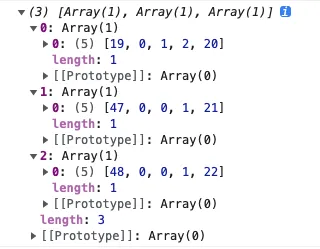

上图表示这一段找到了 3 个词，位置在 第 19 词，第 0 分词中 1-2 索引位置。20 则表示总搜索到的第 20 个词。
