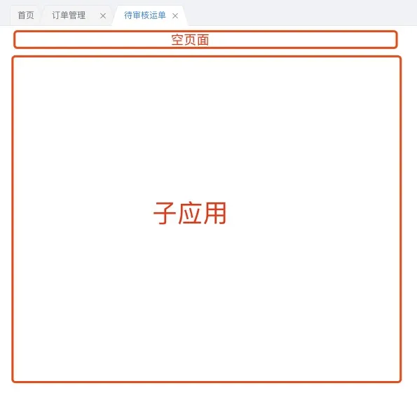

## 基础配置

qiankun的基础配置比较简单

```javascript
import { registerMicroApps, start } from 'qiankun';

registerMicroApps([
  {
    name: 'lyt',
    entry: `http://www.lyt.com/lyt/`,
    container: '#lyt-container',
    activeRule: `/lytAdmin`,
  },
]);

start();
```

registerMicroApps 是注册子应用的方法，接收的第一个参数是数组，里面存放子应用的配置。其中 name 表示应用名称，entry 表示子应用的入口，可以是个对象（具体参照官网文档）。container表示子应用容器，activeRule则表示激活子应用的规则。

上述代码中，假如主应用路由为 www.abc.com/lytAdmin/xxx 就会激活子应用，主应用fetch请求 www.lyt.com/lyt 的html、加载资源，把内容注入的 id 为 lyt-container 的容器中。

在子应用的代码中，我们需要在入口文件添加qiankun的生命周期钩子

```javascript
/**
 * bootstrap 只会在微应用初始化的时候调用一次，下次微应用重新进入时会直接调用 mount 钩子，不会再重复触发 bootstrap。
 * 通常我们可以在这里做一些全局变量的初始化，比如不会在 unmount 阶段被销毁的应用级别的缓存等。
 */
export async function bootstrap() {
  console.log('react app bootstraped');
}

/**
 * 应用每次进入都会调用 mount 方法，通常我们在这里触发应用的渲染方法
 */
export async function mount(props) {
  console.log(props);
  ReactDOM.render(<App />, document.getElementById('react15Root'));
}

/**
 * 应用每次 切出/卸载 会调用的方法，通常在这里我们会卸载微应用的应用实例
 */
export async function unmount() {
  ReactDOM.unmountComponentAtNode(document.getElementById('react15Root'));
}

/**
 * 可选生命周期钩子，仅使用 loadMicroApp 方式加载微应用时生效
 */
export async function update(props) {
  console.log('update props', props);
}
```

在webpack打包配置上也得做点调整

```javascript
const packageName = require('./package.json').name;

module.exports = {
  output: {
    library: `${packageName}-[name]`,
    libraryTarget: 'umd',
    jsonpFunction: `webpackJsonp_${packageName}`,
  },
};
```

如果使用了umi可以直接添加 umijs/plugin-qiankun 插件。

最后是容器，注意容器要放在路由组件之外，确保路由发生变化时，它已经存在不会被重新渲染。

## 静态资源

静态资源加载404是很常见的问题。首先你得保证你的资源不会有跨域问题，其次也要配置好 publicPath。比如css中的图片资源

```css
.image {
	background-image: url('static/image.jpg)
}
```
在开发环境下或者直接访问子应用是没有问题的，因为图片本身就存在你的 localhost:8000/static/image.jpg 或者 www.child.com/static/image.jpg

但是在生产环境下 访问的图片地址可能是 www.parent.com/static/image.jpg 所以会出现404错误。

这种情况一般简单的解决方案就是压缩图片，项目如果使用了url-loader等图片资源打包lodaer会有一个大小限制，图片压缩到8k以下生成base64格式便不会有资源404问题。当然也有可能有比较大的背景图，这时候就得配置 publicPath

在 webpack 下

```javascript
{
  output: {
    publicPath: 'http://www.parent.com';
  }
}
```

这里的 publicPath 必须设置一个 绝对地址url 

在实际的项目中，也有可能有多套环境多种地址，我的解决办法是根据不同的env环境来配置不同的地址。

```javascript
const isProduction = process.env.NODE_ENV === 'production';
const isStable = process.env.STABLE === 'stable';

let publicPath = '/';
if (isProduction) {
  publicPath = 'https://wwww.test.com';
}
if (isStable) {
  publicPath = 'https://www.stable.com';
}

export default {
	publicPath
}
```

```json
{
	"scripts": {
  	"build": "umi build",
    "stable": "STABLE=stable umi build"
  }
}
```

在测试环境下，使用 npm run build 构建， 在预发/开发环境下，使用 npm run stable来构建。

## Externals

在项目中可能会使用 webpack 的 externals 将 例如 map 等几乎不会变的依赖单独抽离出来，脱离webpack打包。

这时候有人可能会想到，如果主应用和子应用同时依赖同一个资源，比如都是使用React@16.8，那可不可以利用externals 将React单独抽离出来，使用script标签引用，主应用再传递给子应用，这样2个应用共用同一个依赖，进行了优化。
答案是可以的，但是违背了微前端的初衷，微前端本质是为了让2个应用彻底解耦。而且复用依赖会使2个应用牢牢绑定在一起，无法单独更新依赖的版本。

如果在主应用中已经引用了一个依赖，子应用本身是不用再去引入的。但是在开发环境中，就没有这个依赖了，所以在 umi 中 document.ejs 模板中，加入了环境判断，使得在开发环境中能正常使用这个依赖。

```html
<html>
  <head>
  	<% if (process.env.NODE_ENV === 'development') { %>
    	<script type="text/javascript" src="https://api.map.baidu.com/api?v=2.0"></script>
  	<% } %>
  </head>
</html>
```

## 路由渲染

前面已经提到，配置了一个 id 为 lyt-container 的容器来展示子应用内容，这个容器是在路由组件之外的，但是主应用本身的路由逻辑依然存在，如果匹配不到路由，就会展示404页面。所以为了兼容，我把所有的子应用路由都指向一个空的页面，这样防止404页面出现。

```javascript
export default {
	'/lyt/xxx': { component: import('./lyt/page') },
  '/lyt/xxx': { component: import('./lyt/page') },
  '/lyt/xxx': { component: import('./lyt/page') },
  '/lyt/xxx': { component: import('./lyt/page') },
  '/lyt/xxx': { component: import('./lyt/page') },
}
```


这样的话子应用与主应用并没有完全解耦，如果子应用有新增页面，那也得在主应用的路由配置加上，否则会出现404页面。所以我进一步做了改进，使用路由通配

```javascript
export default {
	'/lyt/(.*)': { component: import('./lyt/page') },
}
```

这样任意的路由，只要开头带上 lyt 都能匹配到，进入空页面防止404出现。

不过实际上并没有这么简单，因为我的项目使用了页签功能，渲染逻辑是自定义的，这里展示下渲染单个页签的逻辑

```javascript
renderPanel = (pane) => {
    const { routerData, menus } = this.props;
		// ...
  	// routerData 是 路由对象 '/lyt/(.*)': { component: import('./lyt/page') }
  	// Exception 404组件
    const Com = routerData[pane.path]
      ? routerData[pane.path].component
      : Exception;
		// ...
    return (<Com />);
  };
```

上述代码可以看到，这里是直接用当前path去查找对应的路由组件，由于刚刚使用了路由正则匹配，那当前路由 '/lyt/xxx' 肯定找不到 '/lyt/(.*)' 通配路由，甚至这种方法根本不支持动态路由。

所以我使用了 path-to-regexp 路由正则库，加了一层兼容，如果直接找找不到路由组件，则遍历路由对象，利用路由正则匹配来找对应的路由组件。

```javascript
import pathToRegexp from 'path-to-regexp';

renderPanel = (pane) => {
    const { routerData, menus } = this.props;
		// ...
  	// routerData 是 路由对象 '/lyt/(.*)': { component: import('./lyt/page') }
  	// Exception 404组件
    let Com = Exception;
    if (routerData[pane.path]) {
      Com = routerData[pane.path].component;
    } else {
      for (const key in routerData) {
        const match = pathToRegexp(key).exec(pane.path);
        if (match) {
          Com = routerData[key].component;
        }
      }
    }
		// ...
    return (<Com />);
  };
```

## 应用之间的通信

解决完路由渲染问题后，业务方来找麻烦了。因为之前是有页签的，现在页签无非是切换路由的按钮，里面展示的都是空页面，成了一个摆设，导致之前保存页面状态的功能也不复存在了。

当然这跟qiankun也没什么关系，路由更新了，子应用页面自然重载，之前加载的数据，填写的筛选条件肯定也会被刷新。这里有2种解决办法

1. keep-alive
2. 把数据存在model中

使用keep-alive应该是最快的解决办法，但是跟Vue不同，React没有自带的keep-alive组件，试了几个第三方的组件也没成功，只能将部分页面重构，引入model。
将页面请求的数据、用户输入的筛选条件存入model，等页面再次进入时，判断是否有数据，有则直接使用。唯一不足的是，无法记录滚动条（不过业务方好像并不在意）

虽然数据能保存、恢复了但依然还有不足，比如在用户关闭页签后，再次打开依然还保存有原来的数据，这时候理应重新请求数据。这里使用到了qiankun中应用之前通信的功能

主应用
```javascript
import { initGlobalState } from 'qiankun';

const actions = initGlobalState({
  key: '',
});

remove(targetKey) {
  // 关闭页签事件
  // targetKey 为路由key值
  actions.setGlobalState({
    key: targetKey
  });
}
```

子应用
```javascript
import { getDvaApp } from 'umi';

export const qiankun = {
  async mount(props) {
    props && props.onGlobalStateChange((state) => {
      // actionMap 为 key 和 namespace 映射表
      if (state.key.indexOf('lyt') > -1 && actionMap[state.key]) {
        getDvaApp()._store.dispatch({
          type: `${actionMap[state.key]}/resetState`,
        });
      }
    });
  },
};
```

在主应用中定义全局状态，在子应用中监听。 当用户关闭页签时，更改全局状态中的key值，子应用监听到key值变化，查找是否是自己的页面再判断是否注册了model。如果都成立的话，就会重置state清空数据。这样就完美还原了页签功能。

## css样式隔离

其实样式隔离这个问题的影响比较小，但是是花最多时间去解决的。起因是我的主应用用的是antd@3.4.5，在我的子应用中我想更新antd使用3.26.16版本。结果更新完后发现产生了样式冲突，小版本更新都有冲突跟别说未来更新到antd@4.x版本。
由于项目中使用的是css module，自己写的样式是不可能冲突的，关键我们需要去解决主应用和子应用依赖不同版本的组件库所引发的样式冲突。

qiankun本身已经有启用沙箱开启严格的样式隔离模式，开启后会对每个子应用容器上包裹shadow dom节点，从而确保样式不会对全局造成影响。但是shadow dom本身也会带来许多问题，尤其是对于手动加载多个子应用，所以不建议无脑使用，这里我提供了另一种解决方案。

```javascript
start({
	sandbox: { strictStyleIsolation: true },
});
```

### 设置prefixCls

一般组件库的样式肯定不是写死的，我们可以先去修改组件库样式的prefix。例如在antd@3.12.0版本 全局化配置组件 ConfigProvider 新增了 prefixCls 属性

```jsx
<ConfigProvider prefixCls="lyt">
    <App />
</ConfigProvider>
```

这样你在antd组件上可以看到所有的 .ant-xxx 都变成了 .lyt-xxx，可以与主应用的.ant-xxx完全区分开来。

### 修改样式文件prefix

修改了类名前缀还不够，对样式文件还需要处理，因为antd 样式是用 less 写的，我们需要修改前缀 @ant-prefix 即可。以 umi 为例

```javascript
theme: {
    "ant-prefix": "lyt",
},
```

也有可能没有成功，首先确保你是否通过 'antd/dist/antd.css' 引用样式的，需要改为引用 'antd/dist/antd.less' 文件。 如果使用了 babel-plugin-import 插件来按需引入样式，则要将style 设置为 true，这样会引入less文件

```javascript
{
  "libraryName": "antd",
  "style": true,
}
```

### 引入动态生成样式文件

以上方法还不能万无一失，因为antd部分组件是动态生成的，比如 message Modal.confirm notification等，这些组件依然还是.ant开头的类名。于是为了兼容这部分样式，需要再次引入它们原来的样式文件（这些文件可能会有冲突）

```javascript
import 'antd/es/message/style/css';
import 'antd/es/modal/style/css';
import 'antd/es/notification/style/css';
import 'antd/es/button/style/css';
```
接着再把原先写的自定义antd样式 从 .ant 替换成 .lyt

```css
.wrap .ant-xxx {
	width: 100px;
}
// 修改为
.wrap .lyt-xxx {
	width: 100px;
}
```

### css-replace-webpack-plugin

当前的方法其实还存在问题，我们不能直接把 .ant 替换成 .lyt。 因为不能确定你修改的antd组件样式是不是动态生成的，只有非动态生成的组件的样式 才需要修改成 .lyt，动态生成的保持 .ant 不变。
并且在后续开发中，在修改antd样式时你还得考虑是不是动态生成的组件，来判断是用 .ant 还是 .lyt。

这当然是很不合理的。虽然是一个小问题，出现的频率很低，但也不得不解决。在犹豫了到底是要老老实实使用antd@3.4.5 还是 开启 shadow dom，最终我~~选择了秀~~写了插件。

```javascript
{
	plugins: [
  	new CssReplaceWebpackPlugin({
    	prefix: 'lyt',
      ignore: ['message', 'btn']
    })
  ]
}
```
css-replace-webpack-plugin 是个webpack的插件，专门处理css。 接收一个对象，prefix 代表需要替换的前缀， ignore 是需要保留的样式。

这里传入了 message 和 btn，插件会匹配文件中所有关于 ant-message-xxx 和 ant-btn-xxx 有关的样式并且保存一份，接着讲 .ant 全局替换成 .lyt，最后将保存的样式补充进去。

这样的话首先我们无需再去引入原来的（动态组件）样式文件，并且开发时不需要再去关心到底是不是动态组件样式，ant-message-xxx 和 ant-btn-xxx 都会被备份一遍

```css
.ant-message-xxx { width: 100px }
.lyt-message-xxx { width: 100px } // 同时存在 .lyt 前缀的样式
.ant-btn-xxx { width: 100px }
.lyt-btn-xxx { width: 100px }
```


