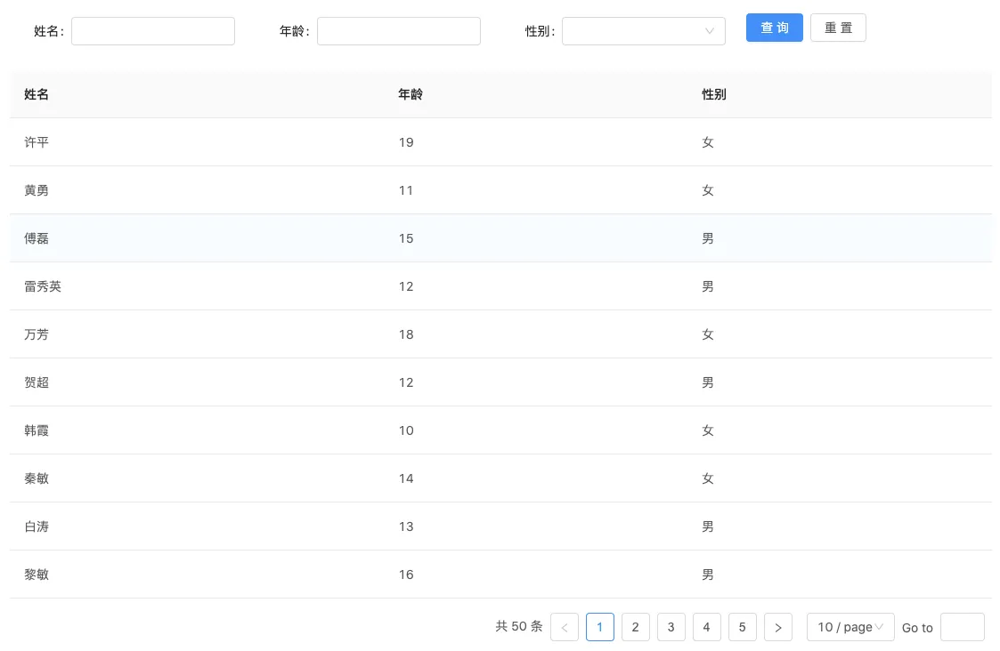
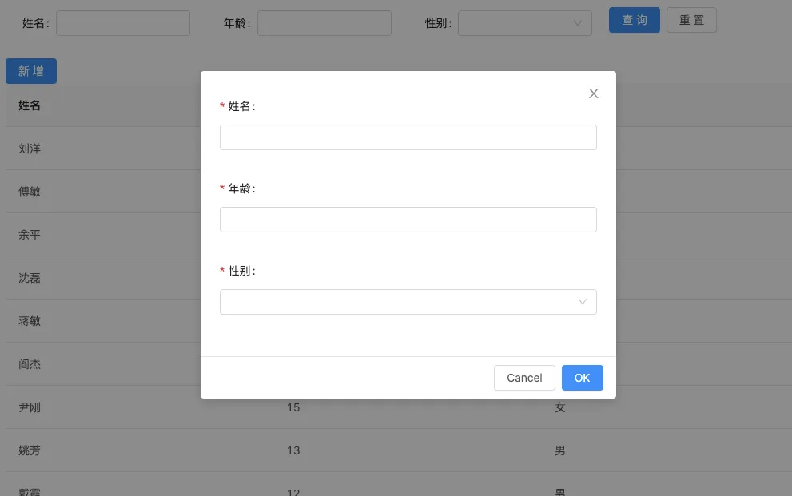
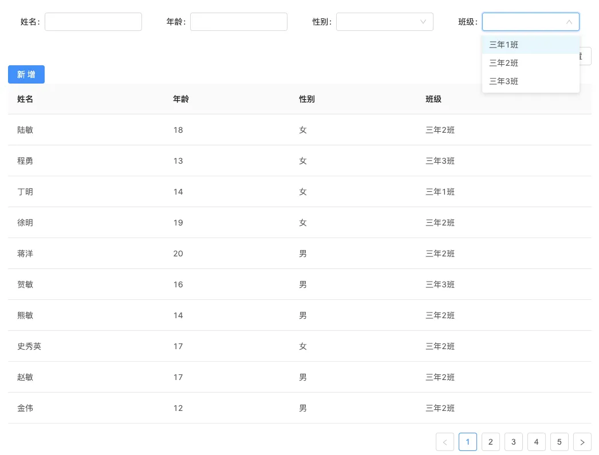
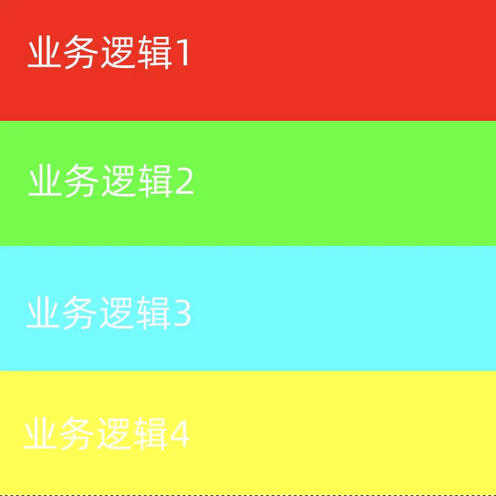

———— 中后台项目hooks实践

先说结论：

- hooks更加灵活，更容易复用代码
- 代码风格清爽，代码量更少

从事中后台项目开发、维护已经有一年多，负责了2个产品多个后台的迭代。随着业务量不断增加，代码量也成倍增多，代码的可读性、可维护性变得尤为重要，其中尝试过多种方案，在不断优化后选择了hooks来处理大量的可复用业务逻辑。以下是多种方案的优劣势分析

## 一个需求


这是一个非常简单的列表页，一般是中后台项目的基础页面，先以这样一个简单需求来编写1.0版本的代码。下面是需求分析：

1. 列表请求渲染
2. 页码/分页
3. 筛选
```javascript
export default class App extends React.Component {
  constructor(props) {
    super(props);
    this.state = {
      list: [],
      formData: {},
      current: 1,
      total: 0,
      pageSize: 10,
    };
  }

  /**
   * 搜索
   */
  onSearch = values => {
    this.getList({
      formData: values,
      current: 1,
    });
  };

  /**
   * 重置
   */
  onReset = () => {
    this.getList({
      formData: {},
      current: 1,
    });
  };
	
	/**
   * 获取列表
   */
  getList(params = {}) {
    this.setState(params, () => this.fetch());
  }

  /**
   * 请求列表
   */
  fetch() {
    const { formData, current, pageSize } = this.state;
    getStudentList({
      ...formData,
      current,
      pageSize,
    }).then(res => {
      this.setState({
        list: res.data,
        total: res.total,
      });
    });
  }

  /**
   * 分页
   */
  onPageChange = (current) => {
    this.getList({
      current,
    });
  };

  /**
   * 页码变化
   */
  onShowSizeChange = (current, pageSize) => {
    this.getList({
      current,
      pageSize,
    });
  };

  componentDidMount() {
    this.getList();
  }

  render() {
    const columns = [
      { title: '姓名', dataIndex: 'name' },
      { title: '年龄', dataIndex: 'age' },
      { title: '性别', dataIndex: 'gender' },
    ];
    const { list, total, current, pageSize } = this.state;
    const pagination = {
      pageSizeOptions: ['10', '30', '50'],
      showSizeChanger: true,
      showQuickJumper: true,
      showTotal: (total, range) => `共 ${total} 条`,
      total,
      current,
      pageSize,
      onChange: this.onPageChange,
      onShowSizeChange: this.onShowSizeChange
    };
    

    return (
      <div className={styles.wrap}>
      	{/* 筛选表单组件 */}
        <ListFilter onSearch={this.onSearch} onReset={this.onReset} />
				{/* 表格 */}
        <Table columns={columns} dataSource={list} rowKey="id" pagination={pagination} />
      </div>
    );
  }
}
```
以上是我负责的后台早期代码，虽然还有可优化的地方，但总体算逻辑清晰，并且完成了需求。在几个版本迭代下来，页面逐渐增多后，可以发现几乎所有的页面关于分页的逻辑都是重复的，几乎没有会在分页切换，分页数变化时有额外的业务逻辑，甚至于当一个页面出现多个table表格，以现在的写法不得不多写几份pagination对象，分页切换的方法。所以怎么去复用分页逻辑是我接下来的一个优化方向。

## 封装Table组件

因为分页是跟Table组件是相关的，我们很容易想到封装一个Table组件把分页逻辑包含进去，这样调用这个组件时也已经囊括了分页的功能，实现了复用的目的。

1.1版本代码，封装ATable组件

```javascript
import React, { Component } from 'react';
import { Table } from 'antd';

class ATable extends Component {
    // 分页
    onPageChange = (current) => {
    	this.props.getList({ current });
    }

    // 页码变化
    onShowSizeChange = (current, pageSize) => {
    	this.props.getList({ current, pageSize });
    }

    render() {
        const { total, current, pageSize, ...other } = this.props;
        const pagination = {
            pageSizeOptions: ['10', '30', '50'],
            showSizeChanger: true,
            showQuickJumper: true,
            showTotal: (total, range) => `共 ${total} 条`,
            total,
            current,
            pageSize,
            onChange: this.onPageChange,
            onShowSizeChange: this.onShowSizeChange
        };
        return (
            <Table {...other} pagination={pagination} />
        );
    }
}
 
export default ATable;
```
引用

```javascript
export default class App extends React.Component {
  render() {
    const columns = [
      { title: '姓名', dataIndex: 'name' },
      { title: '年龄', dataIndex: 'age' },
      { title: '性别', dataIndex: 'gender' },
    ];
    const { list, total, current, pageSize } = this.state;

    return (
      <div className={styles.wrap}>
        {/* <Table columns={columns} dataSource={list} rowKey="id" pagination={pagination} /> */}
        <ATable
          total={total}
          current={current}
          pageSize={pageSize}
          getList={this.getList}
          columns={columns}
          dataSource={list}
          rowKey="id" />
      </div>
    );
  }
}
```

但是封装组件的方法扩展性并不强，比如另一个项目也想用ATable组件，但自身也封装了一个BTable，BTable在加载完成后会有一个加载完成的log

```javascript
class BTable extends Component {
    
    componentDidMount() {
        console.log('table 加载成功');
    }

    render() {
        return (
            <Table {...this.props} />
        );
    }
}
 
export default BTable;
```
这样我无法将<ATable /> <BTable /> 完美融合在一起。所以解决的办法只能修改ATable源码，将加载完成log的功能加上。但是这样又出现新的问题，加载组件肯定是全量加载所有的功能，假设又有一个项目引用ATable，但又不希望有加载完成log功能，这样就无法办到了，总不能多添加一个属性来判断是否运行某功能。

## HOC

对于组件可扩展性不高的问题，我们自然而然会想到一个比较灵活的方案hoc。可以将复用的功能、逻辑写进高阶函数中，再注入到组件里。

```javascript
export default function aHOC (WrappedComponent) {
    return class extends Component {
        onPageChange = (current) => {
            this.props.getList({ current });
        }
        onShowSizeChange = (current, pageSize) => {
            this.props.getList({ current, pageSize });
        }
        render() {
            const { total, current, pageSize, ...other } = this.props;
            const pagination = {
                pageSizeOptions: [ '10', '30', '50' ],
                showSizeChanger: true,
                showQuickJumper: true,
                showTotal: (total, range) => `共 ${total} 条`,
                total,
                current,
                pageSize,
                onChange: this.onPageChange,
                onShowSizeChange: this.onShowSizeChange
            };
            return (
                <WrappedComponent {...other} pagination={pagination} />
            );
        }
    }
}
```

这样就可以灵活地使用复用的功能，甚至也可以将<BTable />的功能抽离出来
```javascript
const ATable = aHOC(BTable);

// const ATable = bHOC(aHOC(Table));
```

问题是解决了，但是总感觉代码不够优雅，当功能复杂，需要复用的逻辑繁多时，难免会出现一层嵌套一层的代码
```javascript
const ATable = dHOC(cHOC(bHOC(aHOC(Table))));
```

hoc同时也存在一些问题，比如props重名、ref传递等等。

以上我们可以发现，2种优化方案都是基于组件的，无论是封装组件还是hoc，都是绑定组件。而对于分页逻辑来说并不强依赖与Table组件（并非离开了Table组件就无法复用）可以换一种方法，类似封装函数一样，需要时调用。

```javascript
export default class App extends React.Component {
	render() {
  	const { list, total, current, pageSize } = this.state;

    const pagination = getPagination(this.getList, total, current, pageSize);

    return (
      <div className={styles.wrap}>
        <Table columns={columns} dataSource={list} rowKey="id" pagination={pagination} />
      </div>
    );
  }
}

function getPagination(getList, total, current, pageSize) {
  /**
   * 分页
   */
  const onPageChange = (current) => {
    getList({
      current,
    });
  };

  /**
   * 页码变化
   */
  const onShowSizeChange = (current, pageSize) => {
    getList({
      current,
      pageSize,
    });
  };

  return {
    pageSizeOptions: [ '10', '30', '50' ],
    showSizeChanger: true,
    showQuickJumper: true,
    showTotal: (total, range) => `共 ${total} 条`,
    total,
    current,
    pageSize,
    onChange: onPageChange,
    onShowSizeChange: onShowSizeChange
  };
}
```
其中 getPagination 就是这样的函数，每当render时，调用 getPagination 获取 pagination 对象，实现了复用。这个hooks已经很接近了。

## 封装逻辑

编写2.0版本代码，将 Class Component 改为 Function Component 并引用hooks来优化代码。

```javascript
const App = () => {
  const [total, setTotal] = useState(0);
  const [current, setCurrent] = useState(1);
  const [pageSize, setPageSize] = useState(10);
  
  const getList = () => { // ...}
  
  const pagination = usePagination(getList, total, current, pageSize);

  return (
  	<Table columns={columns} rowKey="id" pagination={pagination} />
  );
}
```
```javascript
// usePagination.js

export default function usePagination(getList, total, current, pageSize) {
  const onPageChange = (current) => {
    getList({
      current,
    });
  };
  const onShowSizeChange = (current, pageSize) => {
    getList({
      current,
      pageSize,
    });
  };

  return {
    pageSizeOptions: [ '10', '30', '50' ],
    showSizeChanger: true,
    showQuickJumper: true,
    showTotal: (total, range) => `共 ${total} 条`,
    total,
    current,
    pageSize,
    onChange: onPageChange,
    onShowSizeChange: onShowSizeChange
  };
}
```
在usePagination hooks内部封装了分页的逻辑，需要pagination对象时调用即可获取。可以看出，Function Component 较 Class Component 灵活性更高，更容易进行逻辑复用。

再深入地思考可以发现其实不仅仅是分页的逻辑（pagination对象），整个数据请求渲染都是可以复用的，比如这个需求中的请求、查询、分页。对于Table组件而言更注重的是数据的展示，并不是与请求查询分页的逻辑强绑定，我更倾向于逻辑与组件分离，通用的逻辑再进行复用。

这里我使用ahooks库的useAntdTable对代码进行进一步优化

```javascript
const App = () => {
	const formRef = useRef(null);

  const getData = ({ current, pageSize }, formData) => {
    return getStudentList({
      ...formData,
      current,
      pageSize,
    });
  };

  const { tableProps, refresh, search } = useAntdTable(getData, {
    form: formRef.current ? formRef.current.getForm() : false,
    formatResult: (res) => ({
      list: res.data,
      total: res.total,
    }),
  });

  const { submit, reset } = search;
  
  return (
  	<div className={styles.wrap}>
      <ListFilter onSearch={submit} onReset={reset} ref={formRef} />
      <Table columns={columns} rowKey="id" {...tableProps} />
    </div>
  )
}
```

## 封装Modal

接下来新增一个新需求，实现一个新增学生的功能



代码比较简单，总体思路是 打开/关闭弹窗、确认获取Form表单内容发起请求。

```javascript
const App = () => {
	const [visible, setVisible] = useState(false);
  const [key, setKey] = useState(1);
  
  /**
   * 打开新增学生弹窗
   */
  const openUserModal = () => {
    setVisible(true);
    setKey(Math.random());
  }

  /**
   * 关闭新增学生弹窗
   */
  const closeUserModal = () => {
    setVisible(false);
  }
  
  /**
   * 新增
   */
  const add = values => {
    addStudent(values)
      .then(() => {
        refresh();
        closeUserModal();
        message.success('新增成功');
    });
  }
  
  return (
  	<div className={styles.wrap}>
      <Button type="primary" onClick={openUserModal}>新增</Button>
      <UserModal
        visible={visible}
        key={key}
        onCancel={closeUserModal}
        onOk={add} />
    </div>
  );
}
```

但是当业务复杂起来，弹窗增多后，代码也是成倍的增加。我们不得不多写几个visible、打开/关闭弹窗方法

```javascript
const App = () => {
	const [visible1, setVisible1] = useState(false);
  const [visible2, setVisible2] = useState(false);
  const [visible3, setVisible3] = useState(false);
  
  const closeUserModal1 = () => {};
  const closeUserModal2 = () => {};
  const closeUserModal3 = () => {};
  
  return (
  	<div>
    	<UserModal1
        visible={visible1}
        onCancel={closeUserModal1} />
      <UserModal2
        visible={visible2}
        onCancel={closeUserModal2} />
      <UserModal3
        visible={visible3}
        onCancel={closeUserModal3} />
    </div>
  )
}
```

所以弹窗的开关逻辑也需要进行复用
```javascript
let key = 1;
let visible = false;

function getModal() {
  const openUserModal = record => {
    visible = true;
    key = Math.random();
    // render()
  }
  const closeUserModal = () => {
    visible = false;
    // render()
  }
  return {
    openUserModal,
    closeUserModal,
    modalProps: {
      visible,
      key,
    }
  }
}
```
```javascript
const App = () => {
	const { openUserModal, closeUserModal, modalProps } = getModal();
  return (
  	<UserModal
    	{...modalProps}
			onCancel={closeUserModal} />
  )
}
```

参考之前的思路，封装开关弹窗函数、利用闭包保存 visible 和 key 值，返回给Modal作为props。这里只是一段伪代码，只讲解下大概思路，还缺少render方法，所以可以写一个useModal的hooks

```javascript
function useModal(options: IOptions = {}) {
  const [visible, setVisible] = useState<boolean>(false);
  const [key, setKey] = useState<number>(Math.random());

  const {
    form,
    defaultFormData,
  } = options;

  /**
   * 弹窗打开/关闭
   */
  const toggle = useCallback(() => {
    if (visible) {
      // 关闭
      setVisible(false);
    } else {
      // 打开
      setKey(Math.random());
    }
  }, [visible, key]);

  /**
   * 监听key变化，打开弹窗
   */
  useUpdateEffect(() => {
    setVisible(true);
  }, [key]);

  /**
   * 打开弹窗设置默认表单数据
   */
  useUpdateEffect(() => {
    if (visible && form && defaultFormData) {
      form.setFieldsValue(defaultFormData);
    }
  }, [visible, form, defaultFormData]);

  return {
    toggle,
    modalProps: {
      visible,
      key,
      onCancel: toggle,
    },
  };
}
```

## 功能模块拆分

再加一个新需求，筛选跟列表都加上班级属性，其中筛选的班级列表是请求接口获取的



代码逻辑也比较简单，页面初始化后请求数据，再传给筛选组件进行渲染

```javascript
const App = () => {
	const [classes, setClasses] = useState([]);
  
  useEffect(() => {
    getClasses()
      .then(res => {
        setClasses(res);
      });
  }, []);
  
  return (
    <div className={styles.wrap}>
      <ListFilter onSearch={submit} onReset={reset} ref={formRef} classes={classes} />
    </div>
  );
}
```

虽然功能比较简单，但是在需求不断迭代、增加下代码量难免会增大。试想下各种各样的业务逻辑一同写入一个文件中，上千行代码糅杂在一起肯定变得难以维护。

另一方面由于函数组件过于灵活，在代码层面并不会给予约束，就是我们可以随意地写业务逻辑。所以很多时候肯定会以注释或者其他约定来划分业务逻辑，这样使得维护起来更加轻松。



但是在不断迭代，需求不断增加下，由于是人为约定我们很难去严格执行这样的逻辑划分，我们的代码可能慢慢地变成这样


其实Vue也有这样的问题，而且更甚。Vue 的 Option 中分 data methods computed watch, 每当新增功能 data可能会加一些属性，methods加一些方法等等，这样代码量大的时候也会很难去维护。所以后来也出现了Composition Api 来解决这种问题，本质上也跟hooks很想。


如何去解决，首先会想到组件的拆分，各个功能块会以 UI+业务逻辑 组件形式单独分离出来。但并非所有的逻辑（能单独封装的逻辑一般都是独立的）都能封装到相关的组件中，例如上述请求班级列表渲染逻辑，ListFilter 作为公共组件一般是不会把业务逻辑掺杂进来，例如弹窗开关逻辑，肯定是写在父组件中来控制弹窗开启/关闭。所以除了组件的拆分外，还需要对功能模块进行拆分。

得益于函数式组件的灵活性，我们可以在主文件中只保留业务步骤，将功能模块封装成自定义hooks， 包含自身数据、改变数据的方法、副作用。
请求班级列表hooks
```javascript
// hooks/useClasses.js

export default function useClasses() {
  const [classes, setClasses] = useState([]);

  useEffect(() => {
    getClasses().then(res => {
      setClasses(res);
    });
  }, []);

  return classes;
}
```

在主文件中引用
```javascript
const App = () => {
	// const [classes, setClasses] = useState([]);
  
  // useEffect(() => {
  //   getClasses()
  //    .then(res => {
  //      setClasses(res);
  //    });
  // }, []);
 
  // 获取班级列表
  const classes = useClasses();
  
  return (
    <div className={styles.wrap}>
      <ListFilter onSearch={submit} onReset={reset} ref={formRef} classes={classes} />
    </div>
  );
}
```

甚至也可以将新增学生功能拆分
```javascript
export default function useAddStudent(refresh) {
  const { toggle, modalProps } = useModal();

  /**
   * 新增
   */
  const add = values => {
    addStudent(values)
      .then(() => {
      refresh();
      toggle();
      message.success('新增成功');
    });
  }

  return {
    modalProps,
    toggle,
    add,
  }
}
```

最后的主文件代码就是
```javascript
const App = () => {
  // 获取班级列表
  const classes = useClasses();
  
  // 新增学生
  const { modalProps, toggle, add } = useAddStudent(refresh);
  
  return (
    <div className={styles.wrap}>
      <ListFilter onSearch={submit} onReset={reset} ref={formRef} classes={classes} />
      <Button type="primary" onClick={toggle}>新增</Button>
      <UserModal
        {...modalProps}
        onOk={add} />
    </div>
  );
}
```

与把所有逻辑写入同一个文件中相比，将逻辑拆分主文件只保留业务步骤，业务逻辑封装自定义hooks会更容易维护，可读性更高。

