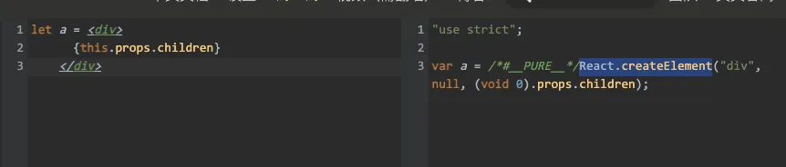

# 减少render

先来看一个经典的例子

```javascript
class ChildComponent  extends React.Component {
  render() {
    console.log('子组件 render')
    return (
      <div>{this.props.msg}</div>
    )
  }
}

export default class App extends React.Component {
  state = {
    count: 0,
    msg: '子组件'
  }
  render() {
    const { count } = this.state;
    return (
      <div>
        <ChildComponent msg={this.state.msg} /> 
        <button onClick={() => this.setState({ count: count + 1})}>按钮 {count}</button>
      </div>
    )
  }
}
```

当点击按钮，使count累加，除了父组件更新以外，子组件也随之更新即便它所依赖的msg并没有发生改变


这里的子组件更新并没有什么意义，它的内部状态没有变化，props也没有更新，如何跳过该组件的render阶段是react当前主流的优化方向。下面介绍几种方案，探索下它们实现的原理。

## shouldComponentUpdate

shouldComponentUpdate接收3个参数，分别是 newProps newState nextContext，返回布尔值表示是否需要更新。子组件依赖了props.msg，这里可以对比msg是否变化来判断子组件是否更新

```javascript
class ChildComponent extends React.Component {
  shouldComponentUpdate(newProps) {
    if (newProps.msg === this.props.msg) {
      return false;
    }
    return true;
  }
  render() {
    console.log('子组件 render')
    return (
      <div>{this.props.msg}</div>
    )
  }
}
```
在React的render阶段会调用beginWork来处理当前fiber，当进行到子组件时，根据子组件的组件类型ClassComponent来调用更新组件方法updateClassComponent并返回结果值。

在updateClassComponent函数内部，定义了一个shouldUpdate变量，然后将shouldUpdate传入了finishClassComponent函数，返回了下一个子fiber

```javascript
function updateClassComponent(
  current: Fiber | null,
  workInProgress: Fiber,
  Component: any,
  nextProps,
  renderExpirationTime: ExpirationTime,
) {
	// ...
  let shouldUpdate;
  // ...
  const nextUnitOfWork = finishClassComponent(
    current,
    workInProgress,
    Component,
    shouldUpdate,
    hasContext,
    renderExpirationTime,
  );

  return nextUnitOfWork;
}
```

在finishClassComponent内部会判断shouldUpdate，是否需要更新，如果不需要更新则进入bailout逻辑。在bailoutOnAlreadyFinishedWork中，当前节点的child没有更新（优先级不高）则直接返回null。

```javascript
function finishClassComponent(
  current: Fiber | null,
  workInProgress: Fiber,
  Component: any,
  shouldUpdate: boolean,
  hasContext: boolean,
  renderExpirationTime: ExpirationTime,
) {
  if (!shouldUpdate && !didCaptureError) {
    if (hasContext) {
      invalidateContextProvider(workInProgress, Component, false);
    }

    return bailoutOnAlreadyFinishedWork(
      current,
      workInProgress,
      renderExpirationTime,
    );
  }
  // ...
}
function bailoutOnAlreadyFinishedWork(
  current: Fiber | null,
  workInProgress: Fiber,
  renderExpirationTime: ExpirationTime,
): Fiber | null {

  // Check if the children have any pending work.
  const childExpirationTime = workInProgress.childExpirationTime;
  if (childExpirationTime < renderExpirationTime) {
    return null;
  } else {
    // ..
  }
}
```

综上，整个逻辑就是shouldUpdate变量会影响beginWork最终的返回值，但shouldUpdate为false时（即不需要更新）beginWork 就是返回null。

根据React render阶段的流程，beginWork会循环处理fiber树并返回child，如果返回null时表示当前fiber已经没有child。所以shouldUpdate为false使得beginWork返回结果为null，让当前fiber跳过了子fiber的beginWork阶段，直接进入了completeWork，子组件最终也没有进行render。

那么shouldComponentUpdate怎么影响了shouldUpdate变量？

在updateClassComponent中，最终是调用checkShouldComponentUpdate，返回值赋值给了shouldUpdate

```javascript
function checkShouldComponentUpdate(
  workInProgress,
  ctor,
  oldProps,
  newProps,
  oldState,
  newState,
  nextContext,
) {
  const instance = workInProgress.stateNode;
  if (typeof instance.shouldComponentUpdate === 'function') {
    const shouldUpdate = instance.shouldComponentUpdate(
      newProps,
      newState,
      nextContext,
    );

    return shouldUpdate;
  }
  // ..

  return true;
}
```
从源码中可以看到，返回的默认值是true，当组件实例中存在shouldComponentUpdate，则返回shouldComponentUpdate的执行结果。最终通过shouldComponentUpdate的返回结果来控制子组件是否render。

## React.PureComponent

PureComponent与shouldComponentUpdate原理相似，它可以自动地帮你做一层新老props、state之间的浅比较

```javascript
class ChildComponent extends React.PureComponent {
  render() {
    console.log('子组件 render')
    return (
      <div>{this.props.msg}</div>
    )
  }
}
```
PureComponent继承于React.Component，在它的基础上再给prototype加上isPureReactComponent标识，代表它是PureComponent

```javascript
function PureComponent(props, context, updater) {
  // ...
}

const pureComponentPrototype = (PureComponent.prototype = new ComponentDummy());
pureComponentPrototype.constructor = PureComponent;
Object.assign(pureComponentPrototype, Component.prototype);
pureComponentPrototype.isPureReactComponent = true;
```

同样的，PureComponent也是修改了shouldUpdate值来达到子组件跳过beginWork

```javascript
function checkShouldComponentUpdate(
  workInProgress,
  ctor,
  oldProps,
  newProps,
  oldState,
  newState,
  nextContext,
) {
  const instance = workInProgress.stateNode;
  // ...shouldComponentUpdate判断

  if (ctor.prototype && ctor.prototype.isPureReactComponent) {
    return (
      !shallowEqual(oldProps, newProps) || !shallowEqual(oldState, newState)
    );
  }

  return true;
}
```
在判断该组件是ReactComponent后，使用shallowEqual浅比较了新老props、state(优先级比shouldComponentUpdate低)

```javascript
function shallowEqual(objA: mixed, objB: mixed): boolean {
  if (is(objA, objB)) {
    return true;
  }

  if (
    typeof objA !== 'object' ||
    objA === null ||
    typeof objB !== 'object' ||
    objB === null
  ) {
    return false;
  }

  const keysA = Object.keys(objA);
  const keysB = Object.keys(objB);

  if (keysA.length !== keysB.length) {
    return false;
  }

  // Test for A's keys different from B.
  for (let i = 0; i < keysA.length; i++) {
    if (
      !hasOwnProperty.call(objB, keysA[i]) ||
      !is(objA[keysA[i]], objB[keysA[i]])
    ) {
      return false;
    }
  }

  return true;
}
```

shallowEqual函数比较简单，先判断是否是同一个对象，再判断属性个数，最后逐个属性判断。

由于是浅比较，当子组件引用对象数据，PureComponent就失效了

```javascript
class ChildComponent  extends React.PureComponent {
  render() {
    console.log('子组件 render')
    return (
      <div>{this.props.msg.msg}</div>
    )
  }
}

export default class App extends React.Component {
  state = {
    msg: {
      msg: '子组件'
    }
  }
  
  render() {
    const { count } = this.state;
    return (
      <div>
        <ChildComponent msg={this.state.msg} /> 
        <button onClick={() => this.setState({ msg: {msg: '111'}} )}>按钮</button>
      </div>
    )
  }
}
```
this.props.msg在例子中是以对象传入，每次父组件设置新的msg，就会创建一个新的引用，永远不会相等，那么子组件也会一直更新，这里可以使用immutable再进行优化。

## React.memo

React.memo也是将新老props进行对比，与前2种不同的是，它可以作用于函数组件。

```javascript
class ChildComponent  extends React.Component {
  render() {
    console.log('子组件 render')
    return (
      <div>{this.props.msg}</div>
    )
  }
}

const ChildComponentMemo = React.memo(ChildComponent)
```

memo函数本身比较简单，把传入的element对象再包了一层

```javascript
export function memo<Props>(
  type: React$ElementType,
  compare?: (oldProps: Props, newProps: Props) => boolean,
) {
  const elementType = {
    $$typeof: REACT_MEMO_TYPE,
    type,
    compare: compare === undefined ? null : compare,
  };
  return elementType;
}
```

等到beginWork时，fiber.tag已经是MemoComponent，走向了新的更新流程 updateMemoComponent

```javascript
function updateMemoComponent(
  current: Fiber | null,
  workInProgress: Fiber,
  Component: any,
  nextProps: any,
  updateExpirationTime,
  renderExpirationTime: ExpirationTime,
): null | Fiber {
  // ...
  const currentChild = ((current.child: any): Fiber); // This is always exactly one child
  if (updateExpirationTime < renderExpirationTime) {
    // This will be the props with resolved defaultProps,
    // unlike current.memoizedProps which will be the unresolved ones.
    const prevProps = currentChild.memoizedProps;
    // Default to shallow comparison
    debugger
    let compare = Component.compare;
    compare = compare !== null ? compare : shallowEqual;
    if (compare(prevProps, nextProps) && current.ref === workInProgress.ref) {
      return bailoutOnAlreadyFinishedWork(
        current,
        workInProgress,
        renderExpirationTime,
      );
    }
  }
  // ...
}
```

在updateMemoComponent中，当该组件没有更新或更新优先级小（updateExpirationTime < renderExpirationTime）则就有调用memo的第二个对比函数（如果没有设置则使用默认的shallowEqual浅比较props）如果返回true，就会进入bailout逻辑。

bailoutOnAlreadyFinishedWork前面已经介绍过了，对比子fiber优先级，没更新则返回null，跳过beginWork。

如果是函数组件，流程还会有一点不同。首次渲染时，判断了memo传入的是函数组件且没有设置第二个参数compare，并且没有defaultProps就会进入updateSimpleMemoComponent，并把tag修改为SimpleMemoComponent

```javascript
function updateMemoComponent(
  current: Fiber | null,
  workInProgress: Fiber,
  Component: any,
  nextProps: any,
  updateExpirationTime,
  renderExpirationTime: ExpirationTime,
): null | Fiber {
  if (current === null) {
  	const type = Component.type;
    if (
      isSimpleFunctionComponent(type) &&
      Component.compare === null &&
      // SimpleMemoComponent codepath doesn't resolve outer props either.
      Component.defaultProps === undefined
    ) {
      let resolvedType = type;
      // If this is a plain function component without default props,
      // and with only the default shallow comparison, we upgrade it
      // to a SimpleMemoComponent to allow fast path updates.
      workInProgress.tag = SimpleMemoComponent;
      workInProgress.type = resolvedType;
      return updateSimpleMemoComponent(
        current,
        workInProgress,
        resolvedType,
        nextProps,
        updateExpirationTime,
        renderExpirationTime,
      );
    }
  }
}
```

updateSimpleMemoComponent 基本与 updateMemoComponent相同，也是浅比较props。不同的是走的是updateFunctionComponent的流程

## 将子组件作为props.children使用

假如子组件不依赖父组件数据，那么可以这么写

```javascript
class ChildComponent  extends React.Component {
  render() {
    console.log('子组件 render')
    return (
      <div>子组件</div>
    )
}
class App extends React.Component {
  state = {
    count: 0,
  }
  render() {
    const { count } = this.state;
    return (
      <div>
        {this.props.children}
        <button onClick={() => this.setState({ count: count + 1})}>按钮 {count}</button>
      </div>
    )
  }
}

ReactDOM.render(<App><ChildComponent /></App>, document.getElementById("root"));
```
这样也能达到一个减少子组件render的目的。

同样在beginWork中，这样写react的流程会有什么不同，答案依然在beginWork中

```javascript
function beginWork(
  current: Fiber | null,
  workInProgress: Fiber,
  renderExpirationTime: ExpirationTime,
): Fiber | null {
	const updateExpirationTime = workInProgress.expirationTime;
  if (current !== null) {
    const oldProps = current.memoizedProps;
    const newProps = workInProgress.pendingProps;
    if (
      oldProps !== newProps ||
      hasLegacyContextChanged() ||
      (__DEV__ ? workInProgress.type !== current.type : false)
    ) {
      didReceiveUpdate = true;
    } else if (updateExpirationTime < renderExpirationTime) {
      didReceiveUpdate = false;
      // ...
      return bailoutOnAlreadyFinishedWork(
        current,
        workInProgress,
        renderExpirationTime,
      );
    }
  }
}
```

在非初次渲染中（current不为null）会对当前fiber做一些判断

1. 新老props是否全等
2. 是否有context更新
3. type是否相等

当以上条件都满足后进入bailout逻辑，根据子fiber是否有更新来复用子fiber或是阻止更新，而这里的子组件刚好符合所有要求，没有进行render

条件2、3是没有争议的，但是条件1中 oldProps 为什么会全等 newProps，每当render后React.createElement会创建一个全新的element对象，oldProps 是无法全等 newProps的，这就是为什么正常写法的子组件每次都会更新。



在babel在线编译上，可以看到 {this.props.children} 其实并没有直接编译成React.createElement，而是使用了props.children，此时子组件的element对象先于父组件创建，最后挂载到了父组件的props.children中props

在react的render阶段中，RootFiber首先会进入beginWork，因为满足条件进入了bailout逻辑并且克隆了子fiber

```javascript
export function cloneChildFibers(
  current: Fiber | null,
  workInProgress: Fiber,
): void {
  if (workInProgress.child === null) {
    return;
  }
  let currentChild = workInProgress.child;
  let newChild = createWorkInProgress(currentChild, currentChild.pendingProps);
  workInProgress.child = newChild;

  newChild.return = workInProgress;
  while (currentChild.sibling !== null) {
    currentChild = currentChild.sibling;
    newChild = newChild.sibling = createWorkInProgress(
      currentChild,
      currentChild.pendingProps,
    );
    newChild.return = workInProgress;
  }
  newChild.sibling = null;
}
```

所以在下一个 父组件 App fiber中，也满足newProps  === oldProps，也进了bailout逻辑。

轮到ChildComponent fiber，由于子组件的element对象并不是通过React.createElement创建的全新对象，用的是父组件props.children，父组件 App fiber 走了bailout逻辑 返回了相同的props，所以子组件fiber也满足了newProps  === oldProps ，进入bailout，没有进行render

# useCallback & useMemo

之前写过useState的原理，我发现hook api实现原理都差不多，核心就是每一个hook都会创建一个hook对象，hook对象是链表结构，多个hook相互串联，最后放到fiber的memoizedState上。

```javascript
hook.next = hook

fiber.memoizedState = hook;
```

同样每个hook都有初次渲染跟非初次渲染之分，分别对应2个函数，比如useCallback就有mountCallback 和 updateCallback

```javascript
function mountCallback<T>(callback: T, deps: Array<mixed> | void | null): T {
  const hook = mountWorkInProgressHook();
  const nextDeps = deps === undefined ? null : deps;
  hook.memoizedState = [callback, nextDeps];
  return callback;
}
```

初次调用useCallback，先会创建一个hook，然后将回调函数和依赖以数组形式放到hook对象的memoizedState上，最后返回回调函数

```javascript
function mountWorkInProgressHook(): Hook {
  const hook: Hook = {
    memoizedState: null,

    baseState: null,
    baseQueue: null,
    queue: null,

    next: null,
  };
	
  if (workInProgressHook === null) {
    currentlyRenderingFiber.memoizedState = workInProgressHook = hook;
  } else {
    workInProgressHook = workInProgressHook.next = hook;
  }
  return workInProgressHook;
}
```
mountWorkInProgressHook 函数的功能就是创建新的hook对象，如果一个函数组件内有多个hook，那么也得负责将多个hook串联。其中workInProgressHook是跟workInProgress一样，表示当前处理的hook，第一次调用hook方法则为null

```javascript
function updateCallback<T>(callback: T, deps: Array<mixed> | void | null): T {
  const hook = updateWorkInProgressHook();
  const nextDeps = deps === undefined ? null : deps;
  const prevState = hook.memoizedState;
  if (prevState !== null) {
    if (nextDeps !== null) {
      const prevDeps: Array<mixed> | null = prevState[1];
      if (areHookInputsEqual(nextDeps, prevDeps)) {
        return prevState[0];
      }
    }
  }
  hook.memoizedState = [callback, nextDeps];
  return callback;
}
```
在非初次调用useCallback，则会先获取之前保留的hook对象，再把之前的hook对象上的依赖于当前传入的依赖一一对比，判断是否返回原来的回调函数

```javascript
function updateWorkInProgressHook(): Hook {
  let nextCurrentHook: null | Hook;
  if (currentHook === null) {
    const current = currentlyRenderingFiber.alternate;
    if (current !== null) {
      nextCurrentHook = current.memoizedState;
    } else {
      nextCurrentHook = null;
    }
  } else {
    nextCurrentHook = currentHook.next;
  }

  let nextWorkInProgressHook: null | Hook;
  if (workInProgressHook === null) {
    nextWorkInProgressHook = currentlyRenderingFiber.memoizedState;
  } else {
    nextWorkInProgressHook = workInProgressHook.next;
  }

  if (nextWorkInProgressHook !== null) {
    workInProgressHook = nextWorkInProgressHook;
    nextWorkInProgressHook = workInProgressHook.next;

    currentHook = nextCurrentHook;
  } else {
    currentHook = nextCurrentHook;

    const newHook: Hook = {
      memoizedState: currentHook.memoizedState,

      baseState: currentHook.baseState,
      baseQueue: currentHook.baseQueue,
      queue: currentHook.queue,

      next: null,
    };

    if (workInProgressHook === null) {
      currentlyRenderingFiber.memoizedState = workInProgressHook = newHook;
    } else {
      workInProgressHook = workInProgressHook.next = newHook;
    }
  }
  return workInProgressHook;
}
```

updateWorkInProgressHook 主要一一获取之前的hook链式对象，所以hook调用顺序很重要，乱序会使得获取hook对象也是错误的。

在函数中，有个currentHook全局变量，来记录上个获取到的hook的位置，当没有hook对象时也与mountWorkInProgressHook方法一样可以创建新的hook对象

areHookInputsEqual就比较简单了，就是遍历依赖的数组，对比每一项是否相同。

```javascript
function mountMemo<T>(
  nextCreate: () => T,
  deps: Array<mixed> | void | null,
): T {
  const hook = mountWorkInProgressHook();
  const nextDeps = deps === undefined ? null : deps;
  const nextValue = nextCreate();
  hook.memoizedState = [nextValue, nextDeps];
  return nextValue;
}

function updateMemo<T>(
  nextCreate: () => T,
  deps: Array<mixed> | void | null,
): T {
  const hook = updateWorkInProgressHook();
  const nextDeps = deps === undefined ? null : deps;
  const prevState = hook.memoizedState;
  if (prevState !== null) {
    // Assume these are defined. If they're not, areHookInputsEqual will warn.
    if (nextDeps !== null) {
      const prevDeps: Array<mixed> | null = prevState[1];
      if (areHookInputsEqual(nextDeps, prevDeps)) {
        return prevState[0];
      }
    }
  }
  const nextValue = nextCreate();
  hook.memoizedState = [nextValue, nextDeps];
  return nextValue;
}
```

useMemo与useCallback相似，多了一步将回调函数执行，保存的是返回值。其他的流程都与useCallback一致。
