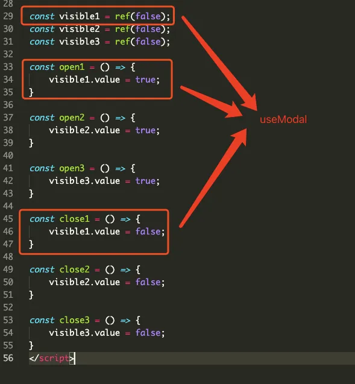
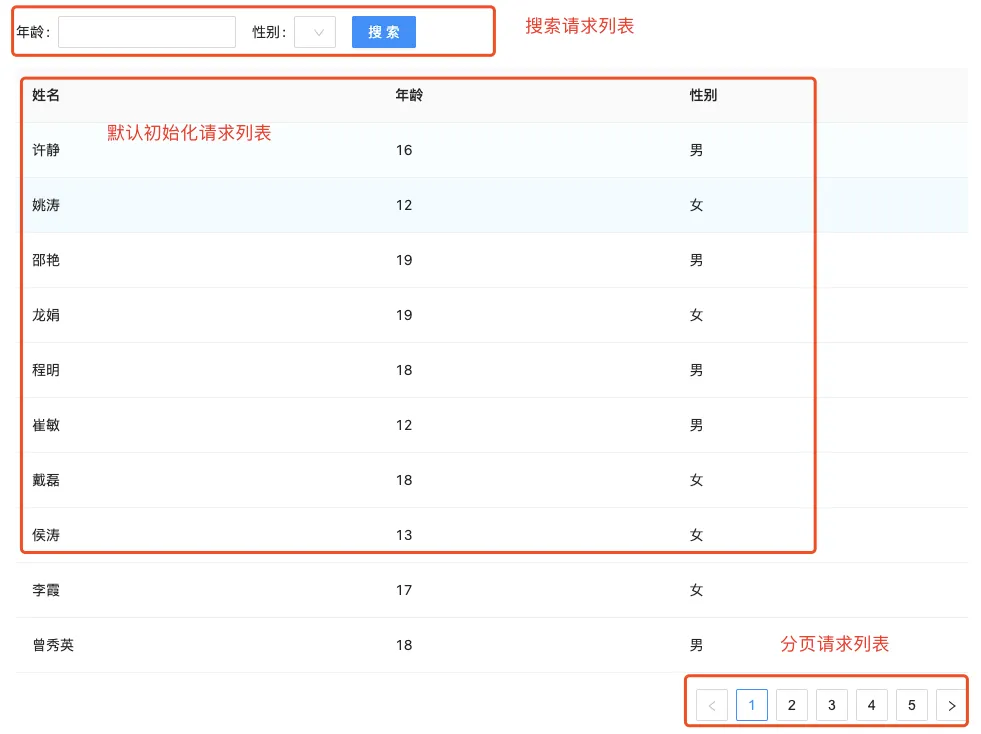

最近准备在新项目中推广、使用 Vue3，用了 2 天 Composition API 发现与 React Hooks 的理念非常相似，简直找到了回家的感觉！于是代入 React 抛开 Vue2 的传统写法来讲讲如何使用 Vue3 Composition API 进行逻辑复用。

~~写了2天我就敢写文章分享了~~

## 复用逻辑

假设有个需求，页面上存在一个按钮，点击按钮可以打开弹窗。这个比较简单，我们可以定义个响应式变量 visible 来控制弹窗的显示隐藏，并创建 2 个方法 open close 来修改 visible 的值

```html
<template>
    <a-button @click="open">打开modal</a-button>
    <a-modal
        title="Title"
        :visible="visible"
        @ok="close"
        @cancel="close">
    </a-modal>
</template>
```
```javascript
export default {
    data() {
        return {
            visible: false
        }
    },
    methods: {
        open() {
            this.visible = true
        },
        close() {
            this.visible = false
        }
    }
}
```

那么多个页面都存在这样的按钮我们就不可能每个页面都复制这段代码，都去定义 visible open close,可以写个 minixs 来解决

```javascript
const modalMixin = {
    data() {
        return {
            visible: false
        }
    },
    methods: {
        open() {
            this.visible = true
        },
        close() {
            this.visible = false
        }
    }
}

export default {
    mixins: [modalMixin]
}
```

这里 minixs 的缺陷就不展开说明了，minixs 也只能免去定义变量方法的功夫，当一个页面有多个按钮对应多个弹窗时，难免要去定义多个 visible1 visible2 visible3

```javascript
import { ref } from 'vue';

const visible1 = ref(false);
const visible2 = ref(false);
const visible3 = ref(false);

const open1 = () => {
    visible1.value = true;
}

const open2 = () => {
    visible2.value = true;
}

const open3 = () => {
    visible3.value = true;
}

const close1 = () => {
    visible1.value = false;
}

const close2 = () => {
    visible2.value = false;
}

const close3 = () => {
    visible3.value = false;
}
```

在代码中可以看到，其实大部分逻辑都是一样的，无非是 visible open 和 close，我们可以将这3类抽象出来，封装成 hooks （约定俗成函数名开头为 use）



```javascript
import { ref } from 'vue';

export default function useModal() {
    const visible = ref(false);

    const open = () => {
        visible.value = true;
    }

    const close = () => {
        visible.value = false;
    }

    return [visible, open, close];
}
```
```javascript
import useModal from './hooks/useModal';

const [visible1, open1, close1] = useModal();
const [visible2, open2, close2] = useModal();
const [visible3, open3, close3] = useModal();
```

这样的代码就简洁多了，而且能面对任意页面、任意多的按钮逻辑。

## 封装表单表格逻辑

上面的例子还是很简单的，在实际项目中，大多数后台相关的项目都会有大量的列表页，列表的搜索、请求、分页是比较通用的逻辑。所以我们可以将这块逻辑封装起来，在大量的场景中进行复用。

### 需求分析



这是一个比较简单的列表页面，上图主要实现 3 个功能

1. 默认初始化请求、渲染数据
2. 搜索表单筛选请求数据
3. 分页

### 定义数据变量

数据列表 data

```javascript
const data = ref([]);
```

搜索表单

```javascript
const formState = reactive({
  	age: '', // 年龄
  	gender: '' // 性别
});
```

分页数据

```javascript
const pagination = reactive({
  	current: 1, // 页码
  	pageSize: 10, // 分页数
  	total: 0, // 总数
});
```

请求方法

```javascript
import getDataList from './server/getDataList';

const getData = () => {
  getDataList({...toRaw(formState), ...toRaw(pagination)})
    .then(res => {
    	const { list, total } = res;
    	data.value = list;
    	pagination.total = total;
  })
}
```

### 功能实现

#### 初始化请求

在组件 mounted 生命周期中发起请求，获得数据渲染即可，这里 vue 提供了 onMounted API

```javascript
import { onMounted } from 'vue';

onMounted(() => {
  getData();
});
```
#### 
#### 搜索

表单搜索会自动改变 formState 里的 age、gender 属性，这里直接定义 submit 方法发起请求

```javascript
const submit = () => {
  getData();
}
```

#### 分页

点击分页会触发 handleTableChange 方法，接收 page 对象包含页码、分页数、总数。这先修改为新的页码，再发起请求

```javascript
const handleTableChange = (page) => {
  pagination.current = page.current;
  getData();
}
```

最后总的代码

```javascript
import { ref, onMounted, toRaw, reactive } from 'vue';
import getDataList from './server/getDataList';

const columns = [
  { title: '姓名', dataIndex: 'name' },
  { title: '年龄', dataIndex: 'age' },
  { title: '性别', dataIndex: 'gender' },
];

const data = ref([]);
const formState = reactive({
  age: '',
  gender: ''
});
const pagination = reactive({
  current: 1,
  pageSize: 10,
  total: 0
});

const getData = () => {
  getDataList({...toRaw(formState), ...toRaw(pagination)})
    .then(res => {
    	const { list, total } = res;
    	data.value = list;
    	pagination.total = total;
  })
}

const submit = () => {
  getData();
}

const handleTableChange = (page) => {
  pagination.current = page.current;
  getData();
}

onMounted(() => {
  getData();
});
```

### 逻辑抽象

 在做封装之前，我们先考虑哪些因素是可变的，哪些又是固定的。比如 formState，不同的页面中 formState 的内容肯定是不同的，例子中是 age 年龄、gender 性别，在其他页面中可能就是姓名、成绩等。还有请求的方法肯定每个页面都不一样，所以我们这里可以把它们作为参数传入

```javascript
export default function useFormTable(getDataList, {
    formState,
}) {
	// ...
}
```

那些固定不变的、在 template 模板中使用到的变量自然要 return 出来，比如 data、pagination 变量，submit、handleTableChange 方法

```javascript
export default function useFormTable(getDataList, {
    formState,
}) {
	// ...
  
  return {
    data,
    pagination,
    submit,
    handleTableChange,
  }
}
```

最后把其余的逻辑补充进来

```javascript
import { ref, onMounted, toRaw, reactive } from 'vue';

export default function useFormTable(getDataList, {
  formState,
}) {
  const data = ref([]);
  const pagination = reactive({
    current: 1,
    pageSize: 10,
    total: 0
  });

  const getData = () => {
    getDataList({...toRaw(formState), ...toRaw(pagination)})
      .then(res => {
      	const { list, total } = res;
      	console.log(res);
      	data.value = list;
      	pagination.total = total;
    })
  }

  const submit = () => {
    getData();
  }

  const handleTableChange = (page) => {
    pagination.current = page.current;
    getData();
  }

  onMounted(() => {
    getData();
  });

  return {
    data,
    pagination,
    submit,
    handleTableChange,
  }
}
```

使用

```javascript
import getDataList from './server/getDataList';
import useFormTable from './hooks/useFormTable';

const columns = [
  { title: '姓名', dataIndex: 'name' },
  { title: '年龄', dataIndex: 'age' },
  { title: '性别', dataIndex: 'gender' },
];

const formState = reactive({
  age: '',
  gender: ''
});

const {
  data,
  pagination,
  submit,
  handleTableChange
} = useFormTable(getDataList, { formState });
```

除此之外还可以进行扩展，添加 loading 功能，添加 manual 属性判断是否手动发起请求，添加 formatResult 方法来格式化请求结果等等。

## 逻辑划分

除了可以逻辑复用以外，还可以对复杂的逻辑进行划分，让代码更精简易于维护。比如在一个复杂的页面中，存在 A、B、C 3个功能，按 Vue2 Option 写法代码可能会是这样的

```javascript
export default {
	data() {
  	return {
    	dataA: '',
      dataB: '',
      dataC: '',
    }
  },
  watch: {
  	dataA(){},
    dataB(){},
    dataC(){},
  },
  mounted() {
    this.methodA();
    this.methodB();
    this.methodC();
  },
  methods: {
  	methodA() {},
    methodB() {},
    methodC() {},
  }
}
```

对应不同的响应式数据、生命周期、方法等，3个功能各自的逻辑都会混杂在一起。当功能数量达到 N 个，代码量突破上千行，混杂的逻辑就会变得难以维护。

而 Composition API 可以写成这样

```javascript
const dataA = ref('');
const methodA = () => {};
watch(dataA, () => {});

const dataB = ref('');
const methodB = () => {};
watch(dataB, () => {});

const dataC = ref('');
const methodC = () => {};
watch(dataC, () => {});

onMounted(() => {
	methodA();
  methodB();
  methodC();
});
```

相比以前的写法，组合式可以将同一个功能的逻辑写在一起，即便后期功能迭代也只需在当前代码“区域”中添加新的方法、变量即可。

甚至可以将各个功能封装为 hooks，写在单独的文件中

```javascript
// hooks/a.js

export default useA() {
	const dataA = ref('');
	const methodA = () => {};
	watch(dataA, () => {});
  onMounted(() => { methodA() });
  
  return { dataA, methodA };
}

// hooks/b.js

export default useB() {
	const dataB = ref('');
	const methodB = () => {};
	watch(dataB, () => {});
  onMounted(() => { methodB() });
  
  return { dataB, methodB };
}

// hooks/c.js

export default useC() {
	const dataC = ref('');
	const methodC = () => {};
	watch(dataC, () => {});
  onMounted(() => { methodC() });
  
  return { dataC, methodC };
}
```

然后调用

```javascript
import useA from './hooks/a.js';
import useB from './hooks/b.js';
import useC from './hooks/c.js';

// A 功能
const { dataA, methodA } = useA();

// B 功能
const { dataB, methodB } = useB();

// C 功能
const { dataC, methodC } = useC();
```

当然这样的写法也有缺陷，很多时候 A B C功能并不是完全相互独立的，比如 B 功能可能会依赖 A 的数据，C 功能依赖 A、 B 的数据，这样就变成了下面的样子

```javascript
// A 功能
const { dataA, methodA } = useA();

// B 功能
const { dataB, methodB } = useB(dataA);

// C 功能
const { dataC, methodC } = useC(dataA, dataB);
```

这样不得不先去确认相互依赖关系，对于比较繁琐的依赖关系，写起来就很麻烦了。所以建议大型的单页，有复杂的功能建议这样去写。


## 与React Hooks的比较

首先我只用了 2 天，不是很熟悉 Composition API （其实我 React Hooks 也不是很懂）所以就从开发体验上来讲讲。

两者一个很大的不同点就是，setup 只运行一次，而 React 组件每次渲染都会执行 hooks。我觉得这样一来，Composition API 更容易让人理解也更简单。我相信即便是 React 开发者们从 Class 转到 Hooks 也会有很多不习惯。

因为不用每次渲染都会执行 setup，就产生相对较小的垃圾回收机制压力，不用强调 hooks 的顺序执行，也不用关心 useCallback useMemo 等优化，更不会有 “为什么这个值没有变” 常见的闭包陷阱。

当然不是捧一踩一，Composition API 肯定是借鉴了 React Hooks，我只是更倾向于逻辑组合这种形式的开发，建议大家学起来，拥抱变化[doge]
