# 使用大语言模型 API 搭建个人 AI 助理

本文介绍如何使用大语言模型的 API 去搭建个人 AI 助理，并且可以结合已有的能力，赋予助理“技能”，找寻日常复杂场景，尽量解决实际问题，提升效率。

后面涉及到代码均使用 React ，模型的一些标准会参照 Open AI，最后演示的效果会使用 Claude API ，示例代码 [Github](https://github.com/rywaroy/ai-assistant) (绝大部分代码由 AI 生成，质量无法把控不具有参考意义)

## Function calling

在大语言模型火了之后，市面上出现大量的仿 ChatGPT 的套壳应用。本质上它们都是基于 Open AI API 实现的。实现起来也非常简单，只要按照 API 规范，传递对话数据，接口就会返回对话结果。例如

```json
[
	{
		"role": "user",
		"content": "你好"
	},
	{
		"role": "assistant",
		"content": "你好!很高兴见到你。我是 Claude。有什么我可以帮你的吗?"
	}
]
```

这里的 user 表示用户对应的 content 表示用户输入的内容，assistant 则表示大模型。在多轮对话过程中，就是不断组装这个 messages 数据发送，让它理解上下文，再返回回答内容继续组装。

于是把这个 messages 数据渲染成页面，就构成了最基本的聊天界面

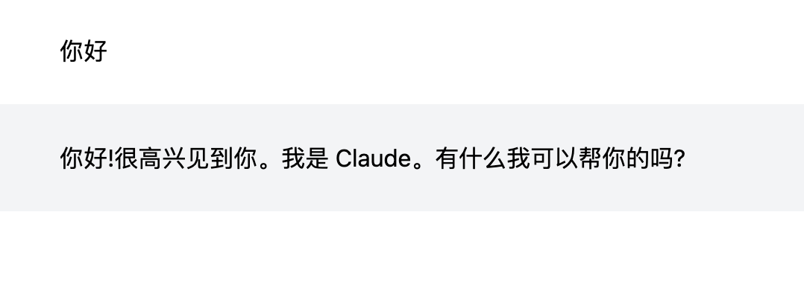

但问题是这仅仅只是一个聊天机器人，平时只能陪你聊聊天，并没有实际能力。比如我想查询杭州的天气

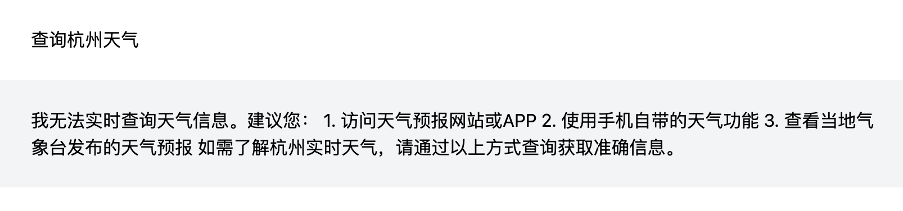

~~现在看来是比较诚实了，以前还会胡诌~~

当然不要对它要求过高，毕竟现在来讲接一个查询天气的 API 是非常容易的事。那如何让它来做一名助理，理解我想查询天气的意图，再去调用 API 查询结果并返回给我，就需要这段重点介绍的 Function calling

上文说到我们需要把对话的上下文组装成 messages 发送过去，除此之外还有个 tools 字段，表示我还有哪些工具/技能的能力，比如

```json
{
	"messages": [], // ...
	"tools": [
		{
	    "type": "function",
	    "function": {
	      "name": "getWeather",
	      "description": "获取一个位置的天气，用户应该先提供一个位置",
	      "parameters": {
	        "type": "object",
	        "properties": {
	          "location": {
	            "type": "string",
	            "description": "城市",
	          }
	        },
	        "required": ["location"]
	      },
	    }
	  },
	]
}
```

功能也很清晰，表示这个一个工具，名字叫 getWeather，是用来查询一个位置的天气，接收一个对象参数，有 location 表示哪个城市且必填。

带上 tools 再来看这次会返回什么

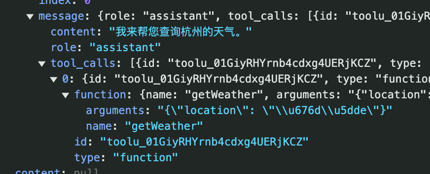

除了 role 和 content，这次与之前不同的是多了一个 tool_calls，里面包含一个 name 为 getWeather 的 funcion，而这个 function 就是对应我们设置的 tool。它的意思很明确，希望我们调用 getWeather 函数/工具，并且传入 {location: \\u676d\\u5dde\ （杭州）} 参数

写一个简单示例

```jsx
function getWeather({ location }) {
	return `${location} 的气温是 10℃`
}
```

 按照规范再把 messages 拼接起来，新增一个 role 为 tool 的 message，把结果加入，并注明对应的 tool_call_id

```json
[
	{
		"role": "user",
		"content": "查询杭州天气"
	},
	{
		"role": "assistant",
		"content": "我来帮您查询杭州天气",
		"tool_cals": [] // 省略...
	},
	{
		"role": "tool",
		"content": "杭州的气温是 10℃",
		"tool_call_id": "toolu_01GiyRHYrnb4cdxg4UERjKCZ"
	}
]
```

最后返回数据，渲染出来的结果

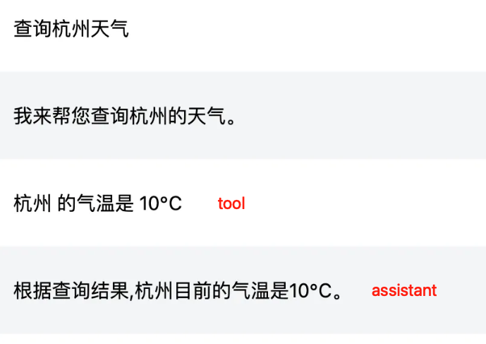

实际上一轮的工具调用可能还不能满足业务需求，我们还可以配合多个工具查询到最后结果。高德天气 API 查询需要城市的 code，但我们并不知道城市对应的 code 是什么，于是可以再写一个工具用来查询 code

```json
[
	{
		// getWeather tool
	},
	{
    "type": "function",
    "function": {
      "name": "getLocationCode",
      "description": "获取一个位置的 code，用户应该先提供一个位置",
      "parameters": {
        "type": "object",
        "properties": {
          "location": {
            "type": "string",
            "enum": ["北京", "上海", "广州", "深圳", "杭州"],
            "description": "城市，例如：北京、上海、广州、深圳、杭州",
          }
        },
        "required": ["location"],
      },
    }
  }
]
```

```jsx
function getWeather({ locationCode }) {
	const res = await weatherApi(locationCode); // 高德天气 API
  const { lives } = res.data;
  return JSON.stringify(lives);
}

function getLocationCode({ location }) { // 模拟 code 查询
	const map = {
	  '北京': '110000',
	  '上海': '310000',
	  '广州': '440100',
	  '深圳': '440300',
	  '杭州': '330100',
	}
	return map[location] || '未查询到 code';
}
```

最后的效果：


可以看到是会按照我们预定的流程 查询城市 code → 根据 code 查询城市天气 来执行，最后把查询的数据转成自然语言来表述杭州的天气状况。另外还提问了南京的天气，在上述工具中特地枚举了 5 座城市，大模型依然能返回无法查询的原因，效果已经非常出色。

另外还要注意的是，并不是加上了 tools，那它只局限于这几个工具能力，只会查城市 code 和查天气。而是同样保留其他推理等能力，无法命中 tools 那就会正常聊天。举个例子


这里我没有直接询问天气，问了有相关性的穿衣建议，依然能够命中查询天气的意图。最后没有意图也能正常答复，没有强行去调用工具。（同时也受限于大模型的能力，起初用的是 deepseek，但效果不好有时进入一直调用工具的死循环，而后改成 claude 演示）

总体流程如下

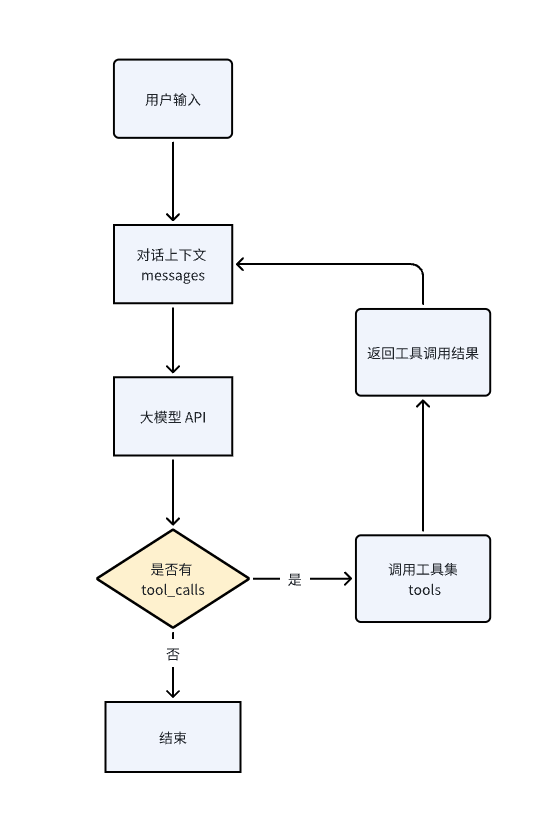

最后 function calling 的应用场景，我认为当我们自身有各种能力，如查天气、检索数据、算命等等能够以某种形式（如 API）暴露出调用该能力的方法，就可以接入这个 AI 助理，让它来了解用户意图并执行对应的能力。

## 多形态展示

这次我们换一个场景，我接入了知乎日报 API （模拟）每天直接通过 AI 助理来看知乎日报。照例编写了 tools 和 function，这里具体代码就不写了，返回的日报数据格式如下

```jsx
export const toolsFunction = {
  getNews: async () => {
    return JSON.stringify([
      {
        title: "「凯旋归来」这个用法对吗？",
        img: "https://picx.zhimg.com/v2-6131cb95427fea9644e8fca5c4fa17b2.jpg?source=8673f162",
        url: 'https://daily.zhihu.com/story/9778456',
        intro: '“凯旋”符合语法规范，但“凯旋归来”的用法亦正确。分享我的一次教学经历：教语文素来是一项颇具挑战的活儿...',
      },
      {
        title: "为什么医生穿上无菌手术衣之后，胸前算无菌的，但是背后不算无菌？",
        img: "https://pic1.zhimg.com/v2-fe384fe67cd42bb4d6f32d236dbab9de.jpg?source=8673f162",
        url: 'https://daily.zhihu.com/story/9778439',
        intro: '谢邀！（这个问题在我上医学院的时候，也反复思考过~）先说一个基本概念：无菌在医学上，无菌不是一个绝对...',
      },
      {
        title: "塔里木河尽头是什么样的，内流河是如何收尾的？",
        img: "https://picx.zhimg.com/v2-bfc2a8bbe568545af8f0d3b05cff11f6.jpg?source=8673f162",
        url: 'https://daily.zhihu.com/story/9778389',
        intro: '内流河的尽头，通常以尾闾湖的方式收尾。这种特别的湖泊，通常水位变动很大。水多的时候...',
      }
    ]);
  }
}
```

其中包含标题、图片、详情地址和正文简介。然后来看效果

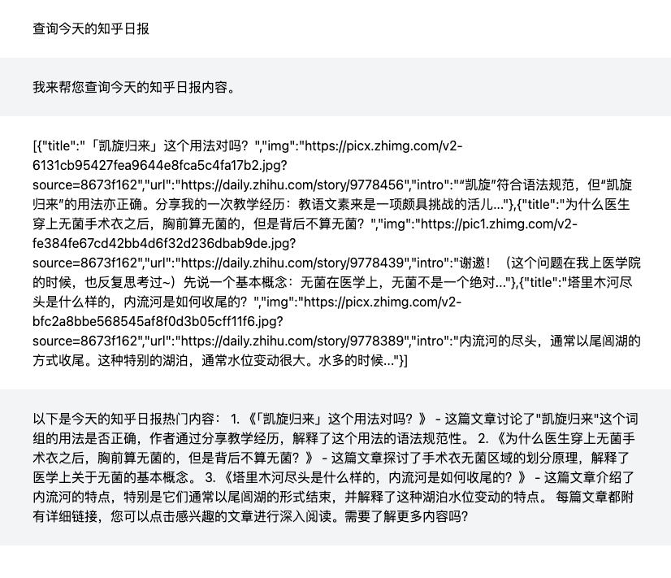

其实并不直观，因为受限于纯文本，查询到的内容中无法展示图片、链接等。所以针对于比较丰富的内容，需要扩展出更多展现形式，而不仅仅是文字输出。

于是我在聊天窗口右侧扩展一个 blocks 区域（在 coze 中称卡片），这里可以展示自定义的展示组件，比如可以展示 3 条日报的内容

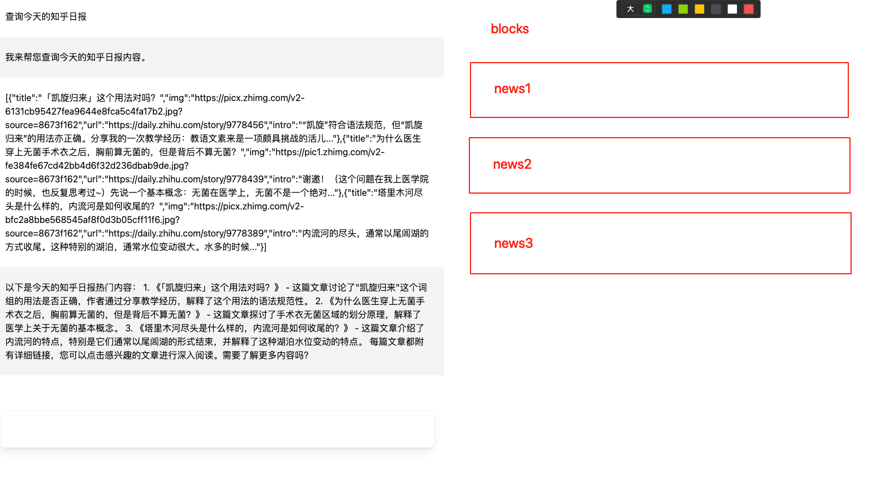

因为 function 是我们自己可控，所以当获取到知乎日报的列表时，就可以进行右侧 blocks 内容的渲染

用 AI 生成一个展示知乎日报的 block 组件，把 getNews 这个 tool 与 block 绑定，表示当调用这个 tool 获取到结果后，自动渲染出对应的 block

```jsx
export default {
  tools,
  toolsFunction,
  systemMessage,
  name: '知乎日报',
  id: 'news',
  block: {
    getNews: {
      component: NewsBlock, // 自定义 block
      type: 'add',
    }
  }
}
```

在执行到该工具，发现这个工具绑定了 block

```jsx
const sendMessage = async (text?: string) => {
    // ...
    // 处理工具调用
    if (message.tool_calls) {
      // ...
      const fn = toolsFunction.current[name as keyof typeof toolsFunction.current](params);
      const result = await fn; // 执行工具
      messageRef.current.push({ role: 'tool', content: result, tool_call_id: toolCall.id, name });
      if (block.current[name]) { // 如果工具绑定了 block
        const { component, type } = block.current[name];
        if (type === 'add') {
          setBlocks((prev: Block[]) => {
            const newBlocks = [...prev];
            newBlocks.push({ component, data: JSON.parse(result) });
            return newBlocks;
          })
        }
      }
      sendMessage();
    }
  }
```

相应的，通过 blocks 来渲染组件

```jsx
<div className='flex-1'>
  {
    blocks.map((item, index) => {
      const BlockComponent = item.component;
      return <BlockComponent data={item.data} key={index} />
    })
  }
</div>
```

最后的效果


总结来说，在返回工具调用结果这个阶段，因为是自己可控的，就可以以其他更好的数据展现形式来展现数据。当然也不仅是上面举的 blocks 例子，具体以实际场景为主。

## 多交互形态

上面的 AI 助理方案设计上还存在一个问题，在与 AI 交互上依赖于文字的输入输出，就是我必须在输入框中打字再发送，才能得到响应。那现在有了多种数据展现形式，多种 blocks，blocks 怎么与 AI 助理进行交互和通信呢？

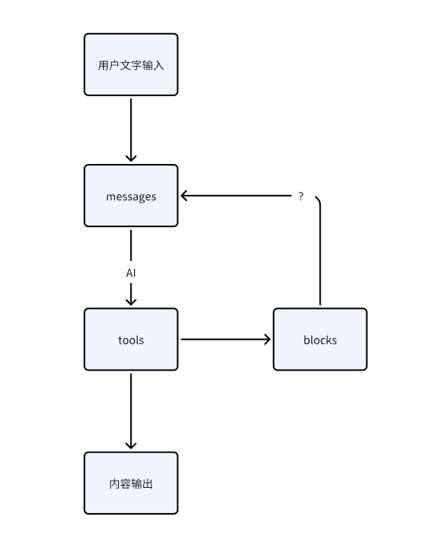

如果流程图比较抽象，那举个实际点的例子，比如我想搭建一个五子棋游戏助理陪你下五子棋。按照上面的思路设计 tools 和 function，还有 2 种行为分别是开始游戏 startGobangGame 和落子 gobangMove

```jsx
function startGobangGame() {
	// 创建一个 8 * 8 的二维数组，表示棋盘数据，0：空 1：白棋 2：黑棋
	const board = Array.from({ length: 8 }, () => Array.from({ length: 8 }, () => 0));
	// 渲染棋盘...
	return JSON.stringify(board);
}

function gobangMove({ row, col }) {
	// AI 落子的行列位置
	// 更新棋盘数据
}
```

效果是这样的

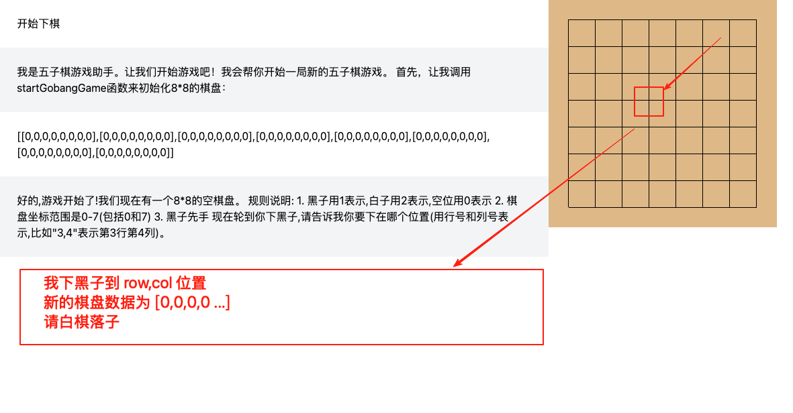

出现了一个问题，我不可能在输入框输入我将要下到某某位置，红框的文字不应该是我要去手动输入的，而是要给棋盘添加落子功能，把数据传递出来，拼接到 messages 中发送。

所以需要给 blocks 内置数据更新 onChange 和 发送文本 sendMessage 的能力，以达到更便捷的交互

```jsx
<div className='flex-1'>
  {
    blocks.map((item, index) => {
      const BlockComponent = item.component;
      return <BlockComponent data={item.data} key={index} id={item.id} onChange={item.onChange} sendMessage={item.sendMessage} />
    })
  }
</div>
```

```jsx

 const handleClick = (rowIndex: number, colIndex: number) => {
  if (data[rowIndex][colIndex] === 0 && onChange) {
    const newData = [...data];
    newData[rowIndex][colIndex] = 1;
    onChange(id, newData);
    if (sendMessage) {
      sendMessage(`
        黑棋落子成功，位置为(${rowIndex}, ${colIndex})
        新的棋盘状态为：
        ${JSON.stringify(newData)}
        请白棋落子
      `);
    }
  }
};
```

最终效果


以上已经列举了 3 个例子，其实 AI 助理并不是只能注册一种功能的 Function calling，可以多加入几个技能让它自己来识别需要调用哪个技能。于是我封装了 registerTool 方法来注册多个技能，按照上面讲的 tools、function、 system prompt 以及 block 4 个要素，将它们整合到一起

```jsx
const tools = [
	tools1,
	tools2,
	tools3,
];

const toolsFunction = {
	function1,
	function2,
	function3,
};

const systemPrompt = `
你是一名 AI 助手，你拥有以下技能和配套的工具，你可以使用这些技能和工具来完成任务：

技能1：你是一个天气预报助手，你可以根据用户提供的位置获取天气信息，也可以根据用户提供的位置获取该位置的 code
工具: tool1

技能2：你是一个知乎日报助手
工具：tool2

技能3：你是一个五子棋游戏助手，和用户进行五子棋游戏。五子棋棋盘是8*8的，棋子有黑子和白子，黑子用1表示，白子用2表示。落子后，返回棋盘二维数组。注意：必须在规定的棋盘范围内落子
工具：tool3
`

const block = {
	tools1: {
		block1,
		block2,
		blcok3,
	},
	tools2: {
		block1,
		block2,
		blcok3,
	},
	tools3: {
		block1,
		block2,
		blcok3,
	},
}
```


## 多平台交互

不仅仅局限在 web，只要其他平台能够暴露调用平台能力的方法/API，再通过 http、web socket等连接交互，那么 AI 助理就可以作为一个通用入口，集成其他平台的基础能力供用户统一调用。

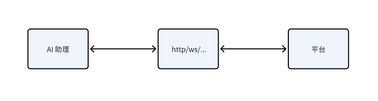

举几个例子

### 数据查询系统

用 express、sequelize、sqlite 快速搭建简单服务，模拟一家公司员工以及他们的销售数据，注入 20 条员工数据以及他们 2021-2023 年的销售额 60 条

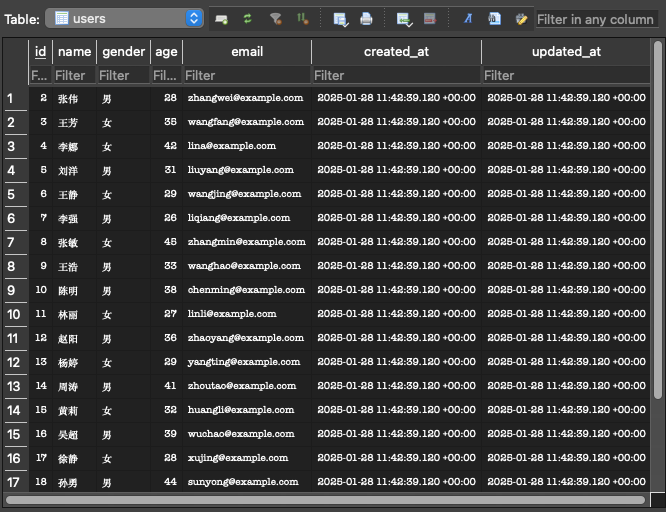

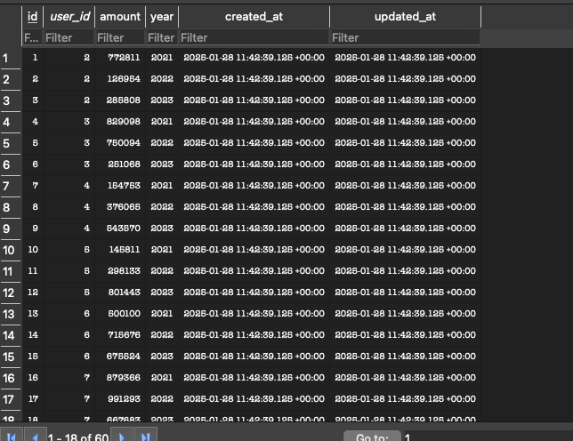

然后写一个查询用户列表的接口，并在 AI 助理上注册这个查询用户的技能

```jsx
router.get('/', async (req, res) => {
  try {
    const users = await User.findAll();
    res.json(users);
  } catch (error) {
    res.status(500).json({ error: error.message });
  }
});
```


不过这里有问题，假如每一个查询都要写一个接口，并且 AI 助理都要注册一次查询技能，工作量将大幅增加。而且这种方案也无法覆盖到所有的查询条件。

所以可以让 AI 去理解用户查询意图，生成 SQL 语句再去查询，服务端只要透传 SQL 语句即可。

添加一个 SQL 语句查询接口

```jsx
router.post('/', async (req, res) => {
  try {
    const { sql } = req.body;
    
    // 判断是否是 SELECT 查询来决定返回结果的方式
    const isSelect = sql.trim().toLowerCase().startsWith('select');
    
    const results = await sequelize.query(sql, {
      type: isSelect ? QueryTypes.SELECT : QueryTypes.RAW,
      raw: true
    });

    res.json({
      sql,
      results,
      count: Array.isArray(results) ? results.length : undefined
    });
  } catch (error) {
    res.status(500).json({ 
      error: error.message,
      sql: req.body.sql 
    });
  }
});
```

system prompt 也得添加一下表结构便于生成更准确的 SQL 语句

```jsx
const systemMessage = {
  role: 'system',
  content: `你是一个数据助手，根据用户的需求，查询数据。
一共有 2 张表，分别是
CREATE TABLE revenues (
    id INTEGER PRIMARY KEY AUTO_INCREMENT,
    user_id INTEGER NOT NULL,
    amount DECIMAL(10,2) NOT NULL CHECK (amount >= 0),
    year INTEGER NOT NULL CHECK (year >= 2000 AND year <= 2100),
    created_at TIMESTAMP NOT NULL,
    updated_at TIMESTAMP NOT NULL,
    UNIQUE INDEX idx_user_year (user_id, year)
);
CREATE TABLE users (
    id INTEGER PRIMARY KEY AUTO_INCREMENT,
    name VARCHAR(255) NOT NULL,
    gender ENUM('男', '女', '其他') NOT NULL DEFAULT '其他',
    age INTEGER NOT NULL CHECK (age >= 0 AND age <= 150),
    email VARCHAR(255) NOT NULL UNIQUE,
    created_at TIMESTAMP NOT NULL DEFAULT CURRENT_TIMESTAMP,
    updated_at TIMESTAMP NOT NULL DEFAULT CURRENT_TIMESTAMP ON UPDATE CURRENT_TIMESTAMP
);
如果没有找到对应的工具，请根据用户需求生成 sql 语句，然后使用queryDataBySQL 工具查询数据。`,
}
```

其他 tools function 都照旧（相信大家都已经熟能生巧不用我写示例代码了）


常规查询的效果还行，下面是对应生成的 SQL 语句，总体是满足查询需求的。

```sql
SELECT
u.name,
u.gender,
SUM(r.amount) as total_revenue
FROM users u
JOIN revenues r ON u.id = r.user_id
WHERE r.year = 2021
GROUP BY u.id, u.name, u.gender
ORDER BY total_revenue DESC
LIMIT 3;
```

```sql
SELECT
u.name,
u.gender,
u.age,
u.email,
SUM(r.amount) as total_revenue,
COUNT(DISTINCT r.year) as active_years,
GROUP_CONCAT(DISTINCT r.year ORDER BY r.year) as sales_years
FROM users u
JOIN revenues r ON u.id = r.user_id
WHERE r.year BETWEEN 2021 AND 2023
GROUP BY u.id, u.name, u.gender, u.age, u.email
ORDER BY total_revenue DESC
LIMIT 5;
```

### 低代码应用

除了创建配套的服务，也可以在已有的应用上扩展能力，提供给 AI 助理使用。比如我有一个低代码产品，我希望有一个低代码助手，能上传图片解析图片的内容，最后展示到低代码的编辑器上。

分析一下需求

1. 图片上传
2. AI 助理调用图片解析工具
3. 图片解析成低代码识别的数据
4. AI 助理与低代码通信，传入数据

图片上传因为不是这里的重点，所有直接写死，上传图片就发送一条固定图片地址的信息。

然后注册图片解析工具

```jsx
export const tools = [
  {
    type: 'function',
    function: {
      name: 'getDataByImg',
      description: '根据图片地址获取图片中对应低代码数据源',
      parameters: {
        type: 'object',
        properties: {
          url: { type: 'string', description: '图片的 url' },
        },
        required: ['url'],
      },
    }
  }
]

async getDataByImg({ url }: { url: string }) {
  // ...请求图片解析服务
  return data;
}

export const systemMessage = {
  role: 'system',
  content: `你是一个低代码助手，根据用户的需求，操作低代码平台。`,
}
```

图片解析的服务我在第三方平台配置的，用的是 GPT 4o 的多模态能力 （claude 太贵了！）大家也可以再 coze 或者 dify 等平台上搭建，比较方便。实现的方式也很简单，跟大模型说明低代码平台 DSL 语言规范，枚举低代码平台所有物料组件及其 DSL 数据，最后解析图片内容转成对应的数据返回。

最后在 server 上再建一层 Web Socket，使 AI 助理与低代码平台通信，传递数据。

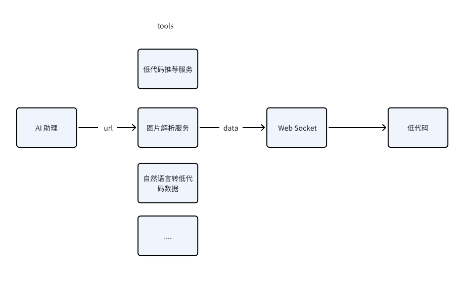

最后的效果

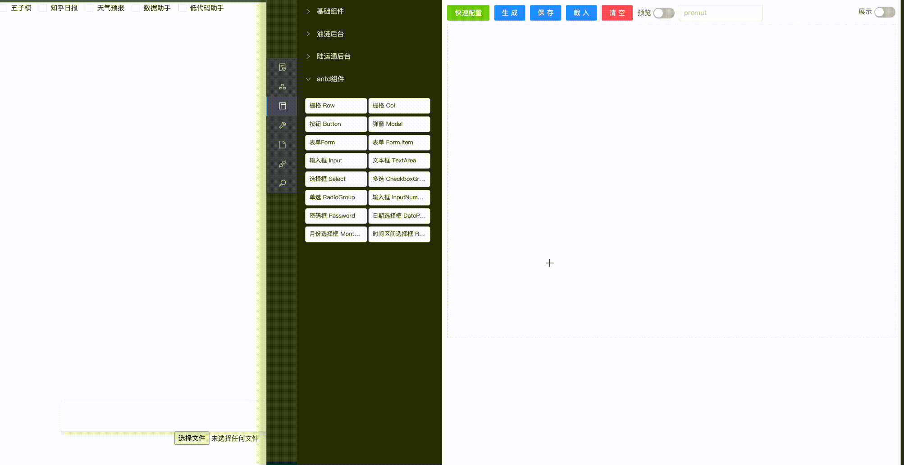

除了图片解析生成低代码数据外，上面还提到低代码推荐和自然语言转低代码数据，流程都相似，让 AI 助理根据用户的意图来调用不同服务，再把数据传给低代码渲染。

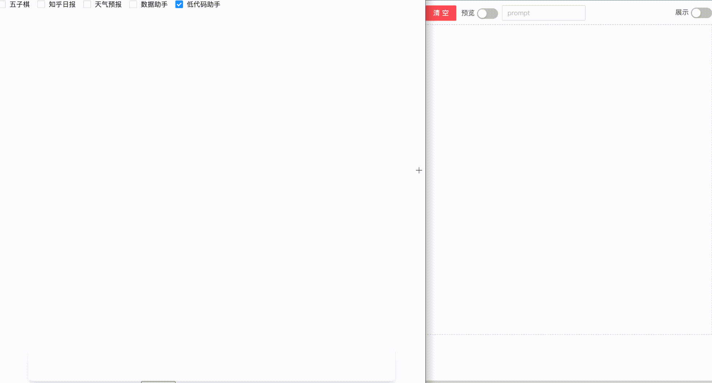

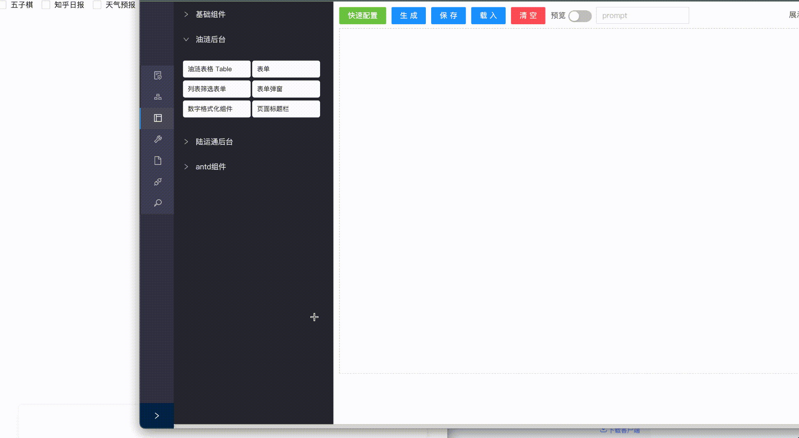

效果总体效果是能达到的，虽然只是一个例子距离生产可用还差很远。另外通过 web socket 通信还是挺麻烦的，最好还是在低代码平台内置 AI 助理。

### AI Code Review

我们给 AI 助理套一层 electron 让它有调用系统的能力，这样它可以调用本地文件、执行终端命令，改造成一个简易的终端


能执行命令，自然操作 git 也不在话下，希望它能够使用 git 获取代码修改内容，再通过三方服务进行 AI 评审。

原理很简单，先通过 git 获取文件变更内容

```bash
git status --porcelain # M file.js
```

在判断文件状态，如果是 A 新增文件，那就获取文件内容

```bash
git show: file.js
```

如果是 M 或 R，修改、重命名文件，那就获取修改内容

```bash
git diff -- "file.js"
```

如果是 D 删除文件就略过。

最后把这些修改内容发送给 coze 或 dify 上搭建的 AI Code Review 服务进行分析并返回内容。

然后配置 2 个 tool，获取 git diff 内容和发送获取 code review 结果

```jsx
const tools = [
	{
    type: 'function',
    function: {
      name: 'getGitDiff',
      description: '获取 git diff',
    },
  },
  {
    type: 'function',
    function: {
      name: 'getCodeReview',
      description: '获取代码审查结果',
      parameters: {
        type: 'object',
        properties: {
          diffCode: {
            type: 'string',
            description: '差异代码',
          },
        },
      },
    },
  },
];

const toolsFunction = {
  getGitDiff: async () => {
	  // 与主进程通信，获取 git diff 内容
    const result = await window.electronAPI.invokeMessage('git-diff');
    return result;
  },
  getCodeReview: async (diffCode: string) => {
    // 请求 code review 服务
    return content;
  },
}
```

其实还应该有个选择文件夹的工具，这里就直接写死了

在目标项目中生成一段三数之和的代码，并用 AI 进行优化，以审查这段优化代码为例。

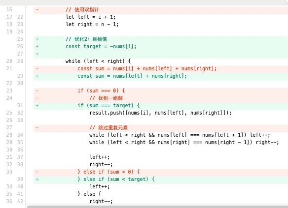

最后效果


已经拥有操作 git 命令行能力的话，自然我们也可以用 AI 生成 commit message 帮助我们提交代码

分别注册 git add 、git commit、git push 命令

```jsx
const tools = [
	{
    type: 'function',
    function: {
      name: 'gitAdd',
      description: 'git add',
    },
  },
  {
    type: 'function',
    function: {
      name: 'gitCommit',
      description: 'git commit',
      parameters: {
        type: 'object',
        properties: {
          message: {
            type: 'string',
            description: 'commit message',
          },
        },
        required: ['message'],
      },
    },
  },
  {
    type: 'function',
    function: {
      name: 'gitPush',
      description: 'git push',
    },
  },
];

const toolsFunction = {
  gitAdd: async () => {
    const result = await window.electronAPI.invokeMessage('git-add');
    return result;
  },
  gitCommit: async ({ message }: { message: string }) => {
    console.log('gitCommit', message);
    const result = await window.electronAPI.invokeMessage('git-commit', message);
    return result;
  },
  gitPush: async () => {
    const result = await window.electronAPI.invokeMessage('git-push');
    return result;
  },
}
```

效果如下

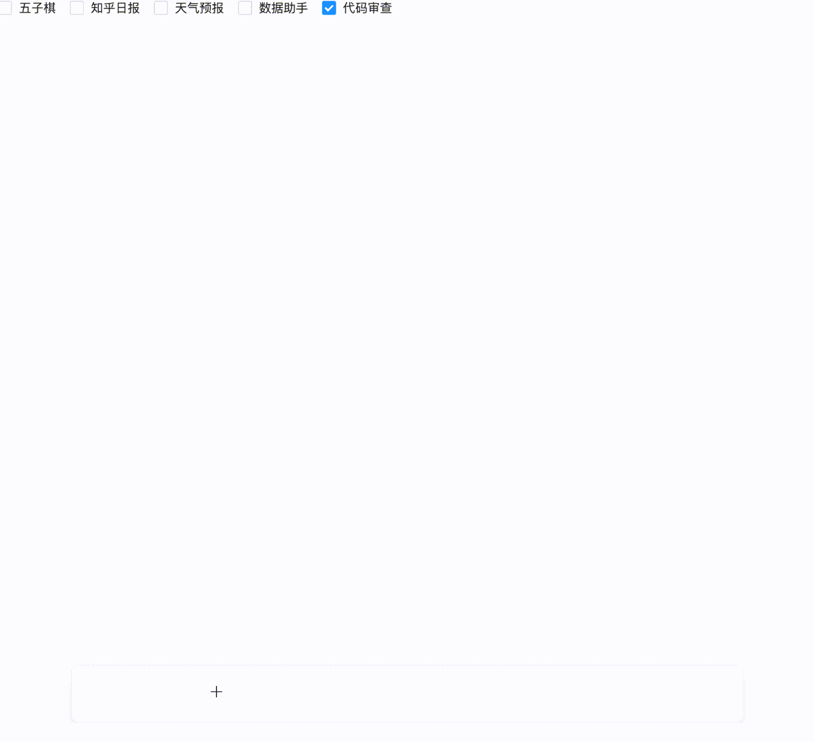

提交结果

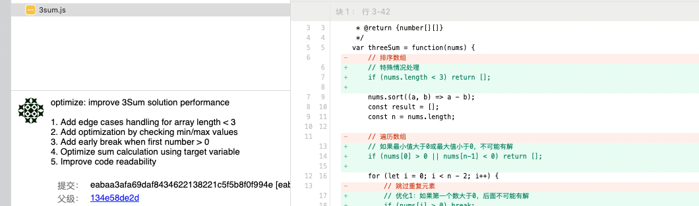

### 闹钟

最后一个例子简单来试一下 AI 助理来操控另一个应用。用 AI 来快速生成一个类似苹果闹钟的应用。内置了添加、删除、修改状态功能

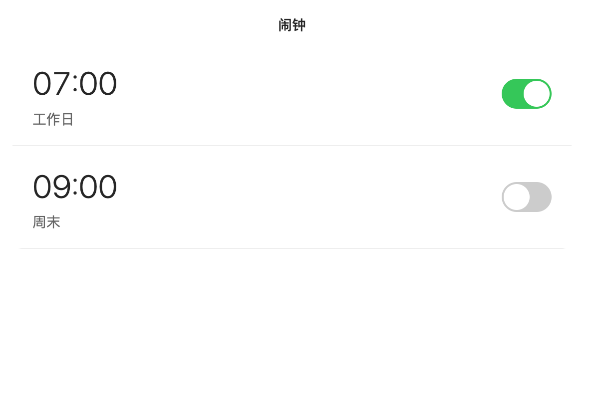

在闹钟应用的主进程中注册自定义协议，AI 助理通过协议去传输数据，从而来操控闹钟的添加、删除和修改

```jsx
const createWindow = () => {
	// ...
  // 注册自定义协议处理器
  if (!app.isDefaultProtocolClient('ai-assistant-alarm-clock')) {
    app.setAsDefaultProtocolClient('ai-assistant-alarm-clock');
  }
};
```

在 AI 助理这块，分别注册添加、删除、修改的工具

```jsx
const tools = [
  {
    type: 'function',
    function: {
      name: 'addClock',
      description: '添加闹钟',
      parameters: {
        type: 'object',
        properties: {
          time: {
            type: 'string',
            description: '闹钟时间',
          },
          days: {
            type: 'array',
            description: '闹钟重复天数 0-6 0表示周日',
            items: {
              type: 'number',
            },
            enum: [0, 1, 2, 3, 4, 5, 6],
          },
          enabled: {
            type: 'boolean',
            description: '闹钟是否启用',
            default: true,
          },
        },
        required: ['time', 'days', 'enabled'],
      },
    },
  },
  {
    type: 'function',
    function: {
      name: 'deleteClock',
      description: '删除闹钟',
      parameters: {
        type: 'object',
        properties: {
          index: {
            type: 'number',
            description: '闹钟索引',
          },
        },
      },
    },
  },
  {
    type: 'function',
    function: {
      name: 'toggleClock',
      description: '切换闹钟状态',
      parameters: {
        type: 'object',
        properties: {
          index: {
            type: 'number',
            description: '闹钟索引',
          },
          enabled: {
            type: 'boolean',
            description: '闹钟是否启用',
          },
        },
        required: ['index', 'enabled'],
      },
    },
  }
]

const toolsFunction = {
  addClock: async (data: any) => {
    const params = {
      id: Math.random().toString(36).substring(2, 15),
      ...data,
    }
    const result = await window.electronAPI.invokeMessage('send-message-to-clock', JSON.stringify({ action: 'add', data: params }));
    return result;
  },
  deleteClock: async ({ index }: { index: number }) => {
    const result = await window.electronAPI.invokeMessage('send-message-to-clock', JSON.stringify({ action: 'delete', data: { index } }));
    return result;
  },
  toggleClock: async ({ index, enabled }: { index: number, enabled: boolean }) => {
    const result = await window.electronAPI.invokeMessage('send-message-to-clock', JSON.stringify({ action: 'toggle', data: { index, enabled } }));
    return result;
  },
}
```

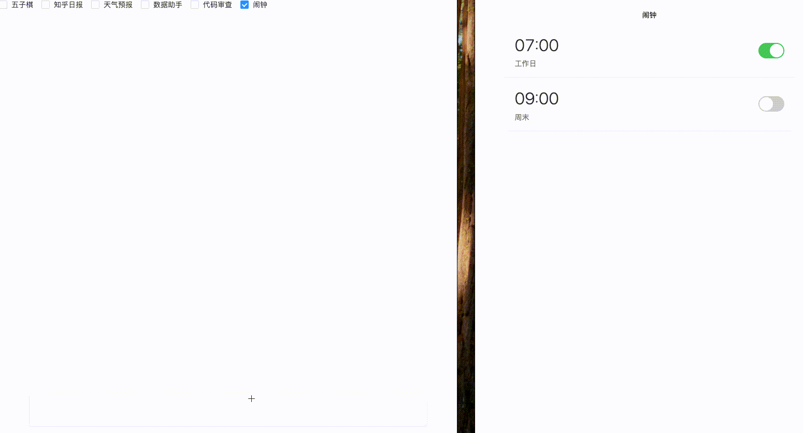

可以看到效果还是不错的，处理 2 个应用之间通信的场景也是完全可行的。

## 总结

与“聊天助手”相比，我觉得这类 AI 助理有 2 个优势。一是它可以统筹各类弱交互的平台/工具/服务/能力，把它们集中在一个聊天窗口中处理。比如上述这些例子，我可以通过聊天来调用它们的功能

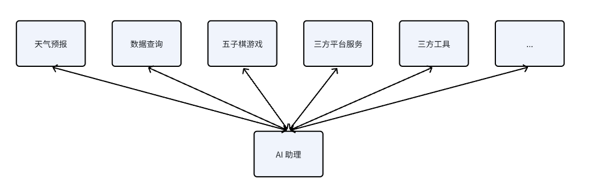

另外除了调用三方能力外还可以附加自然语言的理解、归纳、处理。比如接入了饿了么 APP 的搜索能力，就可以直接查询“牛肉”相关的外卖。当然我们也可以直接打开饿了么 APP 搜索“牛肉”，相关外卖也是一目了然。不过依托于大语言模型，它可以快速结合各家店的评分，各个评价的好坏来推荐最佳的外卖，这个是人所不具备的，毕竟检索评分分析评价我们需要花费大量时间。

不过技术虽然炫酷具体还要去思考场景！场景！场景！上述的例子主要还是为了探索能力的边界，其实并不是真正的刚需或是痛点，为了跑 demo 而举的例子。所以总体来说能力是有了，但是还需要探索真实的应用场景，这样才能发挥它最大的价值。