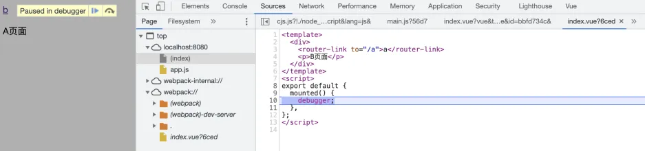
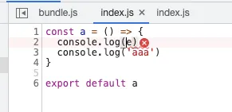
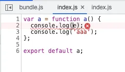
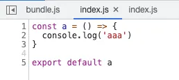
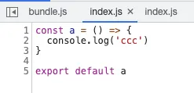
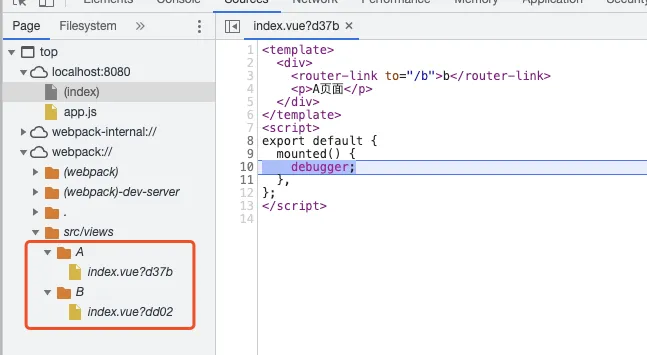
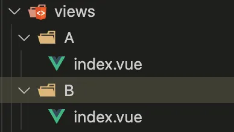

事情的起因是同事发现了一个很神奇的 bug，在 vue 项目中 deubg 调试时发现 chrome 控制台中 Sources 源码中显示不正确。针对这个问题做了一点点研究，总结下关于 webpack source map 一些东西。

阅读前必须学的前置知识 [阮一峰 source map](http://www.ruanyifeng.com/blog/2013/01/javascript_source_map.html)

## bug 复现

首先用 vue-cli 创建项目，当前版本为 3.7.0，再分别创建 A B 两个页面



**文件名都取名为 index.vue, **内容就简单打上debug，两个页面可以相互跳转
```html
<template>
  <div>
    <router-link to="/b">b</router-link>
    <p>A页面</p>
  </div>
</template>
<script>
export default {
  mounted() {
    debugger;
  },
};
</script>
```

```html
<template>
  <div>
    <router-link to="/a">a</router-link>
    <p>B页面</p>
  </div>
</template>
<script>
export default {
  mounted() {
    debugger;
  },
};
</script>

```

起服务进入 A 页面，打开控制台可以看到显示的是 B 页面的源码，且相互跳转后显示的依然是 B 页面的源码, 似乎是 source map 的地址写错了



打开打包后的 app.js ，查看对应的 sourceMappingURL

A 页面
```json
{"version":3,"file":"./node_modules/cache-loader/dist/cjs.js?!./node_modules/babel-loader/lib/index.js!./node_modules/cache-loader/dist/cjs.js?!./node_modules/vue-loader/lib/index.js?!./src/views/A/index.vue?vue&type=script&lang=js&.js","sources":["webpack:///index.vue?6ced"],"sourcesContent":["<template>\n  <div>\n    <router-link to=\"/b\">b</router-link>\n    <p>A页面</p>\n  </div>\n</template>\n<script>\nexport default {\n  mounted() {\n    debugger;\n  },\n};\n</script>\n"],"mappings":";;;;;;;AAOA;AACA;AACA;AACA;AAHA","sourceRoot":""}
```
B 页面
```json
{"version":3,"file":"./node_modules/cache-loader/dist/cjs.js?!./node_modules/babel-loader/lib/index.js!./node_modules/cache-loader/dist/cjs.js?!./node_modules/vue-loader/lib/index.js?!./src/views/B/index.vue?vue&type=script&lang=js&.js","sources":["webpack:///index.vue?6ced"],"sourcesContent":["<template>\n  <div>\n    <router-link to=\"/a\">a</router-link>\n    <p>B页面</p>\n  </div>\n</template>\n<script>\nexport default {\n  mounted() {\n    debugger;\n  },\n};\n</script>\n"],"mappings":";;;;;;;AAOA;AACA;AACA;AACA;AAHA","sourceRoot":""}
```
对比下两个页面的 source map 信息，发现 sources 是一样的，都为 webpack:///index.vue?6ced 于是导致了它们内容的相互覆盖。综上的情况，我们可以大致把问题定位在 webpack 生成 source map 的阶段，在研究哪里出了问题前先来简单讲下关于 webpack source map 的配置

## webpack devtool

创建一个 webpack demo

```javascript
// src/A/index.js
const a = () => {
  debugger
  console.log('aaa')
}

export default a

// src/B/index.js
const b = () => {
  debugger
  console.log('bbb')
}

export default b
```
```javascript
// index.js

import a from './A'
import b from './B'

const buttonA = document.getElementById('a')
const buttonB = document.getElementById('b')

buttonA.addEventListener('click', () => {
  a()
})

buttonB.addEventListener('click', () => {
  b()
})
```

在 webpack.config.js 中，配置 devtool 可以控制是否生成，以及如何生成 source map，可选有很多项，详情可以查看 [webpack devtool 文档](https://webpack.docschina.org/configuration/devtool/#root)。但是总的还有由以下几个关键字排列组合而成:

### source-map


```javascript
module.exports = {
    devtool: 'source-map',
}
```

打包后在 dist/bundle.js 的底部会出现，同时也会生成 bundle.js.map

```javascript
//# sourceMappingURL=bundle.js.map
```


### inline


```javascript
module.exports = {
    devtool: 'inline-source-map',
}
```


加上 inline 就不会再生成 bundle.js.map，直接以带上 DataUrl 形式的 source map

```javascript
//# sourceMappingURL=data:application/json;charset=utf-8;base64,eyJ2ZXJzaW9uIjozLCJzb3VyY2VzIjpbIndlYnBhY2s6Ly8vd2VicGFjay9ib290c3R......
```


### eval


```javascript
module.exports = {
    devtool: 'eval-source-map',
}
```
加上了 eval 每个模块都会被 eval 包裹，并在后面带上 DataUrl 形式的 source map

```javascript
eval("__webpack_require__.r(__webpack_exports__);\n/* harmony import */ var _A__WEBPACK_IMPORTED_MODULE_0__ = __webpack_require__(/*! ./A */ \"./src/A/index.js\");\n/* harmony import */ var _B__WEBPACK_IMPORTED_MODULE_1__ = __webpack_require__(/*! ./B */ \"./src/B/index.js\");\n\n\n\nconst buttonA = document.getElementById('a')\nconst buttonB = document.getElementById('b')\n\nbuttonA.addEventListener('click', () => {\n  Object(_A__WEBPACK_IMPORTED_MODULE_0__[\"default\"])()\n})\n\nbuttonB.addEventListener('click', () => {\n  Object(_B__WEBPACK_IMPORTED_MODULE_1__[\"default\"])()\n})//# sourceURL=[module]\n//# sourceMappingURL=data:application/json;charset=utf-8;base64,eyJ2ZXJzaW9uIjozLCJzb3VyY2VzIjpbIndlYnBhY2s6Ly8vc3JjL2luZGV4LmpzPzEyZDUiXSwibmFtZXMiOltdLCJtYXBwaW5ncyI6Ijs7O0FBQUE7QUFDQTs7QUFFQTtBQUNBOztBQUVBO0FBQ0E7QUFDQTs7QUFFQTtBQUNBO0FBQ0EiLCJmaWxlIjoiLi9zcmMvaW5kZXguanMuanMiLCJzb3VyY2VzQ29udGVudCI6WyJpbXBvcnQgYSBmcm9tICcuL0EnXG5pbXBvcnQgYiBmcm9tICcuL0InXG5cbmNvbnN0IGJ1dHRvbkEgPSBkb2N1bWVudC5nZXRFbGVtZW50QnlJZCgnYScpXG5jb25zdCBidXR0b25CID0gZG9jdW1lbnQuZ2V0RWxlbWVudEJ5SWQoJ2InKVxuXG5idXR0b25BLmFkZEV2ZW50TGlzdGVuZXIoJ2NsaWNrJywgKCkgPT4ge1xuICBhKClcbn0pXG5cbmJ1dHRvbkIuYWRkRXZlbnRMaXN0ZW5lcignY2xpY2snLCAoKSA9PiB7XG4gIGIoKVxufSkiXSwic291cmNlUm9vdCI6IiJ9\n//# sourceURL=webpack-internal:///./src/index.js\n")
```
### cheap


```javascript
module.exports = {
    devtool: 'cheap-source-map',
}
```

cheap 则是生成一个没有列信息的 source map，同时也不包含 loader 的 source map

比如在 source-map 模式下，在 a 函数中报一个错误，能准确定位到 e is not defined



但是在 cheap-source-map 模式下，不能准确定位到 e，只能指向整行错误。并且可以发现，里面的代码是已经经过 babel-loader 转译后的代码



为了更好地理解，写一个简单的 loader 把 log 打印的 aaa 转成 ccc

```javascript
// rename-loader.js

const sourcemap = require('source-map')
const path = require('path')

const splitRE = /\r?\n/g;
const emptyRE = /^(?:\/\/)?\s*$/;

module.exports = function rename(source) {

  const {
    rootContext,
    resourcePath,
  } = this
	
  // 生成 source map
  const filename = path.basename(resourcePath)
  const context = rootContext || process.cwd()
  const sourceRoot = path.dirname(path.relative(context, resourcePath))

  const map = new sourcemap.SourceMapGenerator({
    file: filename.replace(/\\/g, '/'),
    sourceRoot: sourceRoot.replace(/\\/g, '/')
  })
  map.setSourceContent(filename, source);

  source.split(splitRE).forEach((line, index) => {
    if (!emptyRE.test(line)) {
        map.addMapping({
            source: filename,
            original: {
                line: index + 1,
                column: 0
            },
            generated: {
                line: index + 1,
                column: 0
            }
        });
    }
	});
  const sourceMaps = JSON.parse(map.toString())
  
  // replace 替换字符串
  source = source.replace('aaa', 'ccc')
	
  
  // 抛出替换后的代码以及 source map
  this.callback(null, source, sourceMaps);
}
```

关闭 babel-loader 引入 rename-loader 来看下效果

source-map 模式下 依然是 aaa



cheap-source-map 模式下已经是 ccc 了，显示 loader 以后的代码



所以 cheap 会忽略掉我在 rename-loader 中抛出的 source map

### cheap-module


```javascript
module.exports = {
    devtool: 'cheap-module-source-map',
}
```


加上 cheap-module 就可以解决 cheap 模式下没有 loader 的 source map，跟 source-map 模式相比仅仅少了列信息，所以更适合于开发环境

### hidden


```javascript
module.exports = {
    devtool: 'hidden-source-map',
}
```

带上 hidden 会生成 source map 但是源码中不会显示 source map 地址，比较适合生产环境

### nosources


nosources 比较少见，就是生成的 source map 不带源码，就算部署到生产环境也不会造成源码泄漏。本质上也就是没有 sourcesContent


## 排查原因

再回到开头讲的 bug 上来，从 [vue-cli 的源码](https://github.com/vuejs/vue-cli/blob/v3/packages/%40vue/cli-service/lib/config/dev.js#L5) 中可以发现，在开发模式下用的是 cheap-module-eval-source-map，在我尝试了各种 source map 模式下发现只有当 cheap-module 模式下，source map 的 sources 路径会出错，会生成 webpack:/// + 文件名 + hash。所以文件名相同时，路径就会冲突，相互覆盖。非 cheap-module 模式下会生成 webpack:/// + 路径 + 文件名 + hash，这样就不会冲突。

下面就来跟踪下 source map 的生成来查找到底哪一步产生了错误的 sources

### vue-loader

首先可以想到是解析 .vue 文件的 vue-loader，先查找解析后的 source map 是否正确

[vue-loader 源码](https://github.com/vuejs/vue-loader/blob/master/lib/select.js#L21)

```javascript
// script
if (query.type === `script`) {
  if (appendExtension) {
    loaderContext.resourcePath += '.' + (descriptor.script.lang || 'js')
  }
  console.log(descriptor.script.map) // 打印 map
  loaderContext.callback(
    null,
    descriptor.script.content,
    descriptor.script.map
  )
  return
}
```

打印结果是

```javascript
{
  version: 3,
  sources: [ 'index.vue' ],
  names: [],
  mappings: ';;;;;;;AAOA;AACA;AACA;AACA;AACA',
  file: 'index.vue',
  sourceRoot: 'src/views/A',
  sourcesContent: [
    '<template>\n' +
      '  <div>\n' +
      '    <router-link to="/b">b</router-link>\n' +
      '    <p>A页面</p>\n' +
      '  </div>\n' +
      '</template>\n' +
      '<script>\n' +
      'export default {\n' +
      '  mounted() {\n' +
      '    debugger;\n' +
      '  },\n' +
      '};\n' +
      '</script>\n'
  ]
}
```

可以看到 sources 和 sourceRoot 是正确的

### webpack loader

vue-loader 没有问题，下一步看看 webpack loader 的处理机制中是否发生了问题

[webpack loader source map相关源码](https://github.com/webpack/webpack/blob/webpack-4/lib/NormalModule.js#L346)

```javascript
this._source = this.createSource(
  this.binary ? asBuffer(source) : asString(source),
  resourceBuffer,
  sourceMap
);
console.log(this._source) // 打印下创建的 _source
```

打印结果是

```javascript
{
  _value: '//\n' +
    '//\n' +
    '//\n' +
    '//\n' +
    '//\n' +
    '//\n' +
    'export default {\n' +
    '  mounted: function mounted() {\n' +
    '    debugger;\n' +
    '  }\n' +
    '};',
  _name: '/Users/zhangzhihao/Project/vue-test/node_modules/cache-loader/dist/cjs.js??ref--12-0!/Users/zhangzhihao/Project/vue-test/node_modules/babel-loader/lib/index.js!/Users/zhangzhihao/Project/vue-test/node_modules/cache-loader/dist/cjs.js??ref--0-0!/Users/zhangzhihao/Project/vue-test/node_modules/vue-loader/lib/index.js??vue-loader-options!/Users/zhangzhihao/Project/vue-test/src/views/A/index.vue?vue&type=script&lang=js&',
  _sourceMap: {
    version: 3,
    sources: [ 'index.vue' ],
    names: [],
    mappings: ';;;;;;AAOA,eAAA;AACA,EAAA,OADA,qBACA;AACA;AACA;AAHA,CAAA',
    sourcesContent: [
      '<template>\n' +
        '  <div>\n' +
        '    <router-link to="/b">b</router-link>\n' +
        '    <p>A页面</p>\n' +
        '  </div>\n' +
        '</template>\n' +
        '<script>\n' +
        'export default {\n' +
        '  mounted() {\n' +
        '    debugger;\n' +
        '  },\n' +
        '};\n' +
        '</script>\n'
    ],
    sourceRoot: 'src/views/A'
  },
  _originalSource: undefined,
  _innerSourceMap: undefined
}
```

多了一些属性，但是 _sourceMap 依然是没问题的

### webpack plugin

loader 没有问题，那就再往下，到生成 DataUrl 形式的 source map 的插件上

[webpack EvalSourceMapDevToolModuleTemplatePlugin 源码](https://github.com/webpack/webpack/blob/webpack-4/lib/EvalSourceMapDevToolModuleTemplatePlugin.js#L45)

```javascript

console.log(source._source._source._sourceMap) // 打印处理前的 _sourceMap
if (source.sourceAndMap) {
  const sourceAndMap = source.sourceAndMap(options);

  sourceMap = sourceAndMap.map;
  content = sourceAndMap.source;
} else {
  sourceMap = source.map(options);
  content = source.source();
}
if (!sourceMap) {
  return source;
}
console.log(sourceMap)  // 打印处理后的 sourceMap
```

打印结果是

```javascript
{                                                     
  version: 3,
  sources: [ 'index.vue' ],
  names: [],
  mappings: ';;;;;;AAOA,eAAA;AACA,EAAA,OADA,qBACA;AACA;AACA;AAHA,CAAA',
  sourcesContent: [
    '<template>\n' +
      '  <div>\n' +
      '    <router-link to="/b">b</router-link>\n' +
      '    <p>A页面</p>\n' +
      '  </div>\n' +
      '</template>\n' +
      '<script>\n' +
      'export default {\n' +
      '  mounted() {\n' +
      '    debugger;\n' +
      '  },\n' +
      '};\n' +
      '</script>\n'
  ],
  sourceRoot: 'src/views/A'
}


```
```javascript
{
  version: 3,
  file: 'x',
  sources: [ 'index.vue' ],
  sourcesContent: [
    '<template>\n' +
      '  <div>\n' +
      '    <router-link to="/b">b</router-link>\n' +
      '    <p>A页面</p>\n' +
      '  </div>\n' +
      '</template>\n' +
      '<script>\n' +
      'export default {\n' +
      '  mounted() {\n' +
      '    debugger;\n' +
      '  },\n' +
      '};\n' +
      '</script>\n'
  ],
  mappings: ';;;;;;;AAOA;AACA;AACA;AACA;AAHA'
}
```

前后结果竟然不相同，处理后多了一个 file 为 x 的属性，sourceRoot 也丢失了。这样关键就是 webpack 生成 sourceMap 的 sourceAndMap 函数了，怎么导致了 sourceRoot 的丢失。

### sourceAndMap

sourceAndMap 函数的源码在 webpack-sources 库中，因为当前用的是 1.3.0 版本，github 最新的已经是 3.2.0 版本了，所以相关源码可以在 node_modules 里查找

```javascript
// node_modules/webpack-sources@1.3.0/lib/SourceAndMapMixin.js

module.exports = function mixinSourceAndMap(proto) {
	// ...
	proto.sourceAndMap = function(options) {
		options = options || {};
		if(options.columns === false) {
			return this.listMap(options).toStringWithSourceMap({
				file: "x"
			});
		}

		var res = this.node(options).toStringWithSourceMap({
			file: "x"
		});
		return {
			source: res.code,
			map: res.map.toJSON()
		};
	};
}
```

可以看到在源码中对 columns 做了一次判断，~~虽然我没有证据，但是~~从命名上应该就是 devtool cheap 模式，因为 cheap 会忽略列信息，然后来看下 listMap

```javascript
// node_modules/webpack-sources@1.3.0/lib/SourceMapSource.js

class SourceMapSource extends Source {

	listMap(options) {
		options = options || {};
		if(options.module === false)
			return new SourceListMap(this._value, this._name, this._value);
		return fromStringWithSourceMap(this._value, typeof this._sourceMap === "string" ? JSON.parse(this._sourceMap) : this._sourceMap);
	}

}
```

这里的 module 应该就是 devtool module 模式，可算被我逮住了，cheap-module 一直饱受区别待遇的原因就是这个！ 

这里的 fromStringWithSourceMap 函数来源于 source-list-map 库，webpack 在不展示 columns 的情况下，优先使用 source-list-map 来优化生成 source map 的性能

### source-list-map

[source-list-map 源码](https://github.com/webpack/source-list-map/blob/master/lib/SourceListMap.js#L95)

```javascript
toStringWithSourceMap(options) {
  const mappingsContext = new MappingsContext();
  const source = this.children.map(function(sln) {
    return sln.getGeneratedCode();
  }).join("");
  const mappings = this.children.map(function(sln) {
    return sln.getMappings(mappingsContext);
  }).join("");
  const arrays = mappingsContext.getArrays();
  return {
    source,
    map: {
      version: 3,
      file: options && options.file,
      sources: arrays.sources,
      sourcesContent: mappingsContext.hasSourceContent ? arrays.sourcesContent : undefined,
      mappings: mappings
    }
  };
}
```

最后的返回结果值可以看到并没有 sourceRoot，同样 sources 也没有额外地处理，所以导致了 source map 的路径错误。如果要修改的话可以拿到 sourceRoot 合并到 sources

```javascript
toStringWithSourceMap(options) {
  // ...
  const arrays = mappingsContext.getArrays();
  const sources = arrays.sources.map(item => path.join(this.sourceRoot ? this.sourceRoot : '', item)) // 假设这里已经获取到了 sourceRoot
  return {
    source,
    map: {
      version: 3,
      file: options && options.file,
      sources: sources,
      sourcesContent: mappingsContext.hasSourceContent ? arrays.sourcesContent : undefined,
      mappings: mappings
    }
  };
}
```

最后在 cheap-module 模式下也能正确获取到 source map 路径



相反地，非 cheap 模式下会使用 source-map 库来处理，在 source-map 的源码中可以看到 sourceRoot 与 sources 合并的身影

```javascript
// node_modules/source-map@0.5.7/lib/source-map-consumer.js

SourceMapConsumer.prototype.eachMapping =
  function SourceMapConsumer_eachMapping(aCallback, aContext, aOrder) {
		// ...

    var sourceRoot = this.sourceRoot;
    mappings.map(function (mapping) {
      var source = mapping.source === null ? null : this._sources.at(mapping.source);
      if (source != null && sourceRoot != null) {
        source = util.join(sourceRoot, source);
      }
      return {
        source: source,
        generatedLine: mapping.generatedLine,
        generatedColumn: mapping.generatedColumn,
        originalLine: mapping.originalLine,
        originalColumn: mapping.originalColumn,
        name: mapping.name === null ? null : this._names.at(mapping.name)
      };
    }, this).forEach(aCallback, context);
  };
```

### hash

最后还有一个问题，即便是最后的 source map 路径出错，但不是还有 hash 保底吗，为什么根据上文 demo 的结果，2个 hash 也是相同的？

看下 webpack 是怎么创建 hash 的

[webpack EvalSourceMapDevToolModuleTemplatePlugin 源码](https://github.com/webpack/webpack/blob/webpack-4/lib/EvalSourceMapDevToolModuleTemplatePlugin.js#L65)

```javascript
class EvalSourceMapDevToolModuleTemplatePlugin {
	constructor(compilation, options) {
		this.compilation = compilation;
		this.sourceMapComment =
			options.append || "//# sourceURL=[module]\n//# sourceMappingURL=[url]";
		this.moduleFilenameTemplate =
			options.moduleFilenameTemplate ||
			"webpack://[namespace]/[resource-path]?[hash]";
		this.namespace = options.namespace || "";
		this.options = options;
	}
  
  apply() {
    // ...
  	const modules = sourceMap.sources.map(source => {
      if (source.startsWith("webpack://")) {
        source = absolutify(context, source.slice(10));
      }
      const module = self.compilation.findModule(source); // 通过 source 查找对应的 module
      return module || source; // 找不到 module 则直接返回 source
    });
    let moduleFilenames = modules.map(module => {
      return ModuleFilenameHelpers.createFilename(
        module,
        {
          moduleFilenameTemplate: self.moduleFilenameTemplate,
          namespace: self.namespace
        },
        moduleTemplate.runtimeTemplate.requestShortener
      );
    });
    // ...
  }
}
```

这里的 webpack://[namespace]/[resource-path]?[hash] 就是创建 sourceMappingURL 的模板，然后通过 ModuleFilenameHelpers.createFilename 方法来生成对应的 sources

在这之前，webpack 通过 sourceMap 的 sources 来找到对应的 module。但是我们目标文件的 sources 只是 index.vue 肯定是找不到 module 的，只能直接返回 source 即 “index.vue” 字符串

再看 createFilename 做了什么

[ModuleFilenameHelpers.createFilename 源码](https://github.com/webpack/webpack/blob/webpack-4/lib/ModuleFilenameHelpers.js#L58)

```javascript
ModuleFilenameHelpers.createFilename = (module, options, requestShortener) => {
	// ...
	if (typeof module === "string") {
		shortIdentifier = requestShortener.shorten(module);
		identifier = shortIdentifier;
		moduleId = "";
		absoluteResourcePath = module.split("!").pop();
		hash = getHash(identifier);
	} else {
		// ...
	}
  // ...
}
```

因为这里的 module 是 “index.vue” 字符串，走这块逻辑，hash 是根据 identifier 生成的，identifier 是根据 module 生成的，总的来说一样的 module 就会生成一样的 hash

至此终于告一段落了，webpack 的源码也太难找了！

