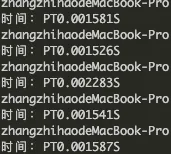

在前文 [音频波形的渲染优化](/article/音频波形的渲染优化/) 中，采用了多种方案去优化音频波形的渲染，其本质都是围绕着 “对一个大任务切割成多个小任务分别去完成” 来做的。究其根本，主要的瓶颈还是 js 计算太慢了。

后来了解了 WebAssembly，想着能不能把开销最大的 “音频波形数据计算” 让 WebAssembly 来做。下面利用 WebAssembly 来进行实验性优化，顺便调研下 WebAssembly 在音视频业务下的能力。

首先下载 rust 和 cargo，使用 cargo 创建一个 lib，在 Cargo.toml 中添加依赖

```yaml
[dependencies]
wasm-bindgen = "0.2"
```

在 src/lib.rs 文件中写入计算波形数据函数（看了一天的 rust 教程，如有更好的写法请不吝赐教）

```rust
extern crate wasm_bindgen;
use wasm_bindgen::prelude::*;

#[wasm_bindgen]
pub fn get_wave(arr: Vec<f64>, step_num: u32) -> Vec<f64> {
    let mut max: f64 = -1.0;
    let mut min: f64 = 1.0;
    let mut step = 0;
    let mut res: Vec<f64> = Vec::new();


    for &item in arr.iter() {
        step = step + 1;

        if item > max {
            max = item;
        } else if item < min {
            min = item;
        }
        if step >= step_num {
            res.push(max - min);
            step = 0;
            max = -1.0;
            min = 1.0;
        }
    }
    return res;
}
```

然后再写 main 函数测试下执行速度，这里创建了 44 万长度的数据，在 js 中大概花费 10ms 来计算

```rust
extern crate rand;
use rand::Rng;

fn main() {
    let mut arr: Vec<f64> = vec![];
    let mut rng = rand::thread_rng();
    for _ele in 0..440000 {
        arr.push(rng.gen_range(-1.0, 1.0));
    }
    let t1 = Local::now();
    get_wave(arr, 440);
    let t2 = Local::now();
    println!("时间：{}", t2 - t1);
}
```

编译执行
```bash
cargo build --release

./target/release/wasm_get_wave
```



大约 1.6 ms，比 js 强很多，不过不具参考性，具体主要还是看编译出来的 wasm 文件

```bash
wasm-pack build
```

使用 wasm-pack 编译，根目录下会生成 pkg 文件夹，再将文件夹移到测试项目中调用

```javascript
const arr = [];
for (let i = 0; i < 440000; i++) {
  if (Math.random() > 0.5) {
    arr.push(Math.random());
  } else {
    arr.push(-Math.random());
  }
}
const step = 440;

import('../pkg/wasm_get_wave')
  .then((res) => {
    console.time('rust');
    res.get_wave(arr, step);
    console.timeEnd('rust');
  });
```

这里同样创建 44 万长度数据来测试下花费时间，大约 6 ms，果然性能损耗还是不小的，不过还是比 js 强一点。

接下来将 wasm 的 get_wave 方法用在实际计算的地方，替换原来的 js 计算波形数据

改写 Task 类中的 run 方法
```javascript
run() {
    if (this.times > this.maxTimes) {
      return null;
    }
    const start = (this.times - 1) * this.renderLength;
    const end = start + this.renderLength;
  	// 使用 get_wave
    const res = this.get_wave(this.channelData.slice(start, end), this.step);
  
  	// 得到结果再遍历一遍，绘制波形
    for (let i = 0; i < res.length; i += 1) {
      this.x += 1;
      const num = Math.floor(this.x / this.w);

      if (this.vm[`wave${num}Ctx`]) {
        this.vm[`wave${num}Ctx`].fillStyle = 'rgba(0, 0, 0, 0.1)';
        const l = res[i] * 40 * 0.8;
        this.vm[`wave${num}Ctx`].fillRect((this.x % this.w), 40 - (l / 2), 1, Math.max(1, l));
        this.stepIndex = 0;
        this.min = 1;
        this.max = -1;
      }
    }
    this.times += 1;
    return this;
}
```

就是这么简单！最后看下 js 与 wasm 对比结果

|  | js | wasm |
| --- | --- | --- |
| 26分钟音频 | 执行时间1.6s，渲染时间4s | 执行时间1.04s，渲染时间3.7s |
| 54分钟音频 | 执行时间3.4s, 渲染时间8.3s | 执行时间2.1s, 渲染时间7.4s |
| 1小时38分钟音频 | 执行时间5.8s, 渲染时间16s | 执行时间3.9s, 渲染时间15s |
| 3小时43分钟音频 | 执行时间18.3s, 渲染时间42.5s | 执行时间10.3s, 渲染时间37.5s |


这里统计了执行时间（波形计算时间 + canvas绘图时间）和 渲染时间（从音频数据 decode 到波形绘制完总时间）

可以看到 wasm 的执行时间明显要比 js 的时间短，大约提升了 50% - 70%，但是这点提升放到总的渲染时间里就不太明显了。原因在于使用了 requestIdleCallback 在浏览器繁忙下需要花额外的时间等待，再加上音频数据 decode 时间，这两段时间占了大头。所以纠结总时间的优化也没太大意义。而执行时间的缩短，在浏览器每帧的 task 任务中，花费更少的时间去执行任务，保证了浏览器的流畅。

总的来说使用 WebAssembly 来提升性能还是很明显（一开始以为它能翻倍的。。）希望能在后面的业务中大放异彩。
