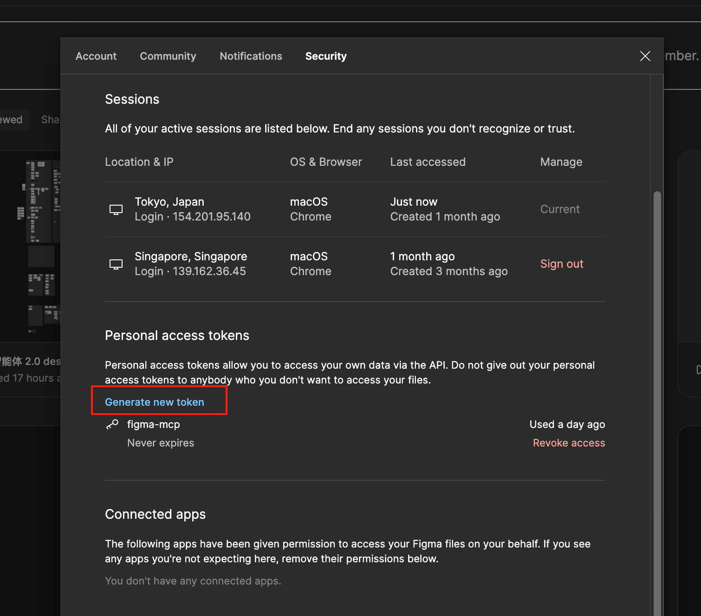

# 在 Cursor 中搭建 MCP 服务，利用 AI 将 Figma 转成代码

Cursor 的 MCP Servers 上线快有一个月，开发者可以部署本地的 MCP 服务，然后在 Composer Agent 模式下使用。不过我一直没有很好的想法，直到逛 B 站有博主分享了 [Figma-Context-MCP](https://github.com/GLips/Figma-Context-MCP) 这个库，试了一下挺好玩的所以过来分享一下。

MCP 在我的理解里，最最通俗的解释就是它属于一种与大模型的协议，可以定义一些工具方法，然后在于大模型对话的时候根据对话内容触发这些工具方法返回结果。这里 Figma-Context-MCP 库就是定义了获取 Figma 文件节点和下载 Figma 图片 2 个工具（当前版本）当我们把自己的 Figma 链接贴给大模型后，它会调用工具去获取文件节点数据（如果有图片则下载）最后把节点数据转成 UI 代码。

首先克隆代码

```bash
git clone https://github.com/GLips/Figma-Context-MCP.git
```

然后在 Figma 账号-设置-安全下创建 token，因为工具需要调用 Figma API 去获取节点数据



在项目 .env 文件中添加 token


安装依赖启动服务

```bash
npm i
npm run dev
```


打开 Cursor 设置，添加新的 MCP 服务


名字自定义，type 选 sse，server url 填入本地服务地址


最后这样就成功了，可以看到这个 MCP 服务中有 2 个工具


来测试一下效果，在 Figma 中选中图层，右键 Copy link to selection


在 Curosor 中打开 Composer 选 Agent 模式，粘贴 Figma 链接并输入 prompt 约束一些规则


点击发送后会弹出获取 Figma 节点数据工具，需手动点击执行


因为示例 UI 里还有头像的图标，所以这里还弹出下载图标的工具，继续执行


最后输出代码


总体效果还行，渐变色处理有点问题。其实之前也用过 Figma 的 D2C 插件比如海豹 D2C，这些基本是用写代码逻辑解析 Figma 数据再转成 code，与 AI 转 code 方案相比准确率更高。但是 AI 方案易用性更好点，可以通过 prompt 来生成 React 、Vue、html，或者使用  tailwind、css module 等等，生成的 css  类名也具有意义这个是代码方案达不到的。

不过它们都有一个问题，无法直接解析 UI 库的组件


比如我想生成这个 Input 代码，我用的是 antd 自然想要 antd Input


继续按照上述的流程，它会给我一个 div 并用样式模拟成 Input，从 UI 上看确实一模一样，但是我们的需求还是希望是 antd Input

为了让 AI 明白，首先要在 prompt 添加 antd 组件的支持

```bash
请帮我用这个 figma 链接获取 figma ui 元素，并从元素数据转成代码。要求
1. 转成 React 代码
2. 使用 tailwind css
3. 如果有图标则下载到 src/assets 文件夹下，对应的 使用 import Icon from '@/assets/icon.svg' 路径引用
+ 4. 对于一些特定的元素比如 表格相关组件Form Input Select Checkbox Switch Button，使用 antd 组件
```

然后在 Figma 图层上做个标记 （通过实验部分大的图层 AI 可以推断出元素是 antd 组件，自己标记可以更准确）


把图层名称改成 Antd Input，重新运行一下整个生成流程


这次就可以生成使用 antd Input 组件的代码。在获取 Figma 节点信息的工具返回数据中可以看到name 为 Antd Input 所以 AI 能知道这是个 Input 的组件。

其他比如像 Table 组件，在 UI 最外的图层标记成 Antd Table 组件，AI 就不会把整个 Table 样式写出来，而是引用 antd 的 Table 组件，并配有 dataSource 和 columns 数据，比 Figma 的 D2C 插件更智能

最后简单截取几处源码。搭建 mcp 服务需要依赖 https://www.npmjs.com/package/@modelcontextprotocol/sdk 这个库

在 figma-context-mcp 中就是用这个库注册了 2 个工具


get_figma_data 和 download_figma_images，这 2 个工具名就对应着 Cursor MCP Servers 的 Tools。同 Function Calling 一样用工具入参定义，比如获取 Figma 节点信息需要 fileKey nodeId depth 参数，这些来自于我们提供的 Figma 链接


最后第四个参数就是执行函数，获取 Figma 节点信息，再精简处理保留样式信息（原信息内容过大）


整个流程如图。搭建 MCP 服务基本的功能都已经封装到 SDK 中了，我们只需注册工具即可，有好的想法可以多多交流