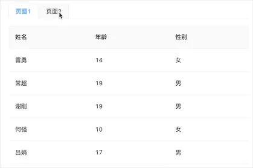

# 
# 背景

我维护的是一个基于qiankun做微前端的子工程项目，由于运营人员有经常切换页面，核对不同页面的数据的需求，所以在主工程中使用了页签。因为子工程的展示容器不能动态生成多个，所以这里的页签切换只是修改路由，使子工程的容器内展示不同页面，页面切换后会重启页面的生命周期，重新请求加载数据。


但是由于业务爆发式增长，数据量变大，接口请求响应速度难免变慢。当请求响应时间超过1秒后，切换页面去核对数据还得花时间去等待请求完成，这样极大的影响了操作。


# 方案

针对请求慢的问题，我们第一时间可以想到的是缓存数据，每次页面切换展示缓存数据。

1. 页面缓存数据

这种方法是比较容易实现的，可以借助 redux 等全局状态管理将当前数据缓存下来，等再次进入页面后查到有数据后阻止请求，直接展示。

但是缺点也比较明显，在数据量大的情况下，数据的时效还是比较短的，操作人员得经常手动去刷新页面请求数据，设置新的缓存。

2. 请求缓存数据

在请求后缓存数据，下次页面加载再次请求时，现将缓存的数据直接返回，再去发起请求更新最新数据。这种方案相比页面缓存数据可以更容易保证数据的实时、有效性，且社区有完美的解决办法。

最后我选择在原来的用hooks封装的请求库上添加数据缓存的能力。


# 实现

项目原先已经封装了hooks请求库，这里展示一个简版的。
```javascript
export default function useRequest(service) {
  const [state, dispatch] = useReducer((state, action) => ({
    ...state,
    ...action.payload,
  }), {
    data: undefined,
    error: undefined,
    loading: false,
  });

  const run = (...arg) => {
    dispatch({
      payload: {
        loading: true,
      },
    });
    return service(...arg).then((res) => {
      dispatch({
        payload: {
          data: res,
          error: undefined,
          loading: false,
        },
      });
    }).catch((err) => {
      dispatch({
        payload: {
          data: undefined,
          error: err,
          loading: false,
        },
      });
    });
  };

  useEffect(() => {
    run();
  }, []);

  return {
    ...state,
    run,
  };
}
```

首先先设置一个全局的map用来缓存数据

```javascript
const cache = new Map();
```

添加缓存方法，接收缓存时间，设置延时器到时间后清除缓存

```javascript
const setCache = (key, cacheTime, data) => {
  const currentCache = cache.get(key);
  if (currentCache && currentCache.timer) {
    clearTimeout(currentCache.timer);
  }

  let timer;

  if (cacheTime > -1) {
    timer = setTimeout(() => {
      cache.delete(key);
    }, cacheTime);
  }

  cache.set(key, {
    data,
    timer,
    startTime: new Date().getTime(),
  });
};
```

获取缓存方法

```javascript
const getCache = (key) => {
  const currentCache = cache.get(key);
  if (currentCache) {
      return {
        data: currentCache.data,
        startTime: currentCache.startTime,
      };
  }
  return {};
};
```

接着再页面初始化后，先去查询是否有缓存，有则使用缓存，没有则使用默认数据

```javascript
function useRequest(service, options = {}) {
	const { cacheKey } = options;

  const getState = () => {
    // 如果传入了cacheKey，则去查询缓存
    if (cacheKey) {
      const cacheData = getCache(cacheKey);
      return {
        ...cacheData.data,
        loading: false,
      };
    }
    return {
      data: undefined,
      error: undefined,
      loading: false,
    };
  };
  const [state, dispatch] = useReducer((state, action) => ({
    ...state,
    ...action.payload,
  }), getState());
  
  // ...
}
```

在每次请求后缓存数据

```javascript
function useRequest(service, options = {}) {
	const { cacheKey, cacheTime = 300000 } = options;
  
  // 这里使用 ahooks 的 useUpdateEffect 会更好
  useEffect(() => {
    if (cacheKey) {
      setCache(cacheKey, cacheTime, state);
    }
  }, [cacheKey, state]);
}
```

这样基本完成了一个数据缓存读取展示的功能，图中可以看到，第二次进入页面1时，会优先展示上一次缓存的数据，等新数据返回后再替换。


# 优化

初步的效果其实还不够完善，在使用的缓存时，并不应该出现loading效果，这里加一个是否使用缓存的标识符，有缓存且还未加载缓存则不出现loading

```javascript
function useRequest(service, options = {}) {
	const isLoadCache = useRef(false); // 默认未加载缓存
  
  const getState = () => {
    if (cacheKey) {
      const cacheData = getCache(cacheKey);
      if (!cacheData.data) {
        isLoadCache.current = true; // 没有缓存则设置为已加载缓存
      }
      return {
        ...cacheData.data,
        loading: false,
      };
    }
    isLoadCache.current = true; // 没有缓存则设置为已加载缓存
    return {
      data: undefined,
      error: undefined,
      loading: false,
    };
  };
  
  const run = (...arg) => {
    if (isLoadCache.current) { // 如果不使用缓存则加载loading效果
      dispatch({
        payload: {
          loading: true,
        },
      });
    }
    return service(...arg).then((res) => {
      isLoadCache.current = true;
      // ...
    })
  };
}
```


但是这样的效果还是有点问题，如果没有loading效果直接加载了新数据替换了原来的数据，容易造成操作人员误操作，这里再加上一个加载新数据后的loading效果

```javascript
const run = (...arg) => {
    if (isLoadCache.current) {
      dispatch({
        payload: {
          loading: true,
        },
      });
    }
    return service(...arg).then((res) => {
      if (isLoadCache.current) { // 如果加载完缓存则直接显示数据
        dispatch({
          payload: {
            data: res,
            error: undefined,
            loading: false,
          },
        });
      } else { // 如果还未使用缓存，则先展示loading效果，在显示新数据
        isLoadCache.current = true;
        dispatch({
          payload: {
            loading: true,
          },
        });
        setTimeout(() => {
          dispatch({
            payload: {
              data: res,
              error: undefined,
              loading: false,
            },
          });
        }, 300);
      }
      
    })
  };
```


其实这样还不够！我们可以再加一层新老数据的浅比较，如果数据一致，就不需要loading了，提升用户体验。但是对于数据量比较大，数据内容多，每一次数据对比都需要开销，所以可以传入一个 rowKey，通过 rowKey 来验证新老数据是否改变，如果只是单条数据内容变化则不触发loading效果。

```javascript
// 根据 rowKey 比较规则
const isLoadingUpdate = (target, source, rowKey) => {
  if (!rowKey || !target || !source || (target.length !== source.length)) {
    return true;
  }
  for (let i = 0; i < target.length; i++) {
    if (target[i][rowKey] !== source[i][rowKey]) {
      return true;
    }
  }
  return false;
};
```

```javascript
return service(...arg).then((res) => {
  // 通过比较判断是否需要loading
  if (!isLoadCache.current && isLoadingUpdate(state.data ? state.data.data : null, res.data, rowKey)) {
    dispatch({
      payload: {
        loading: true,
      },
    });
    setTimeout(() => {
      dispatch({
        payload: {
          data: res,
          error: undefined,
          loading: false,
        },
      });
    }, 300);
  } else { // 如果数据基本相同，不需要loading直接覆盖
    dispatch({
      payload: {
        data: res,
        error: undefined,
        loading: false,
      },
    });
  }
  isLoadCache.current = true;

})
```


这样基本实现了缓存功能，添加了loading提示优化
