前置阅读文章 [《语音转写富文本编辑器的设计》](/article/语音转写富文本编辑器的设计/)

在上文长列表优化中提到了虚拟滚动优化方案，但是因为富文本内容不确定，也极容易变更内容引起高度变化，所以不适合使用虚拟滚动。不过由于第三版的设计，能控制整个渲染流程，我想可以从这方面入手，实现动态虚拟滚动。

先来简单讲下虚拟滚动，一般都是采用定位的形式。假设每个元素高 50 像素，一共有 8 个元素，那么总高度为 400 像素。然后给每个元素进行定位，top 值就是 index * 50。再获取滚动高度 scrollTop 为 125，125 / 50 = 2.5，表示处在第 3 个元素 C 之间。在计算可视高度 150，150 / 50 = 3 可容纳 3 个元素，所以最后展示 C - E 之间的元素。因为 C 元素只展示了一半，一般都会扩充点展示元素。

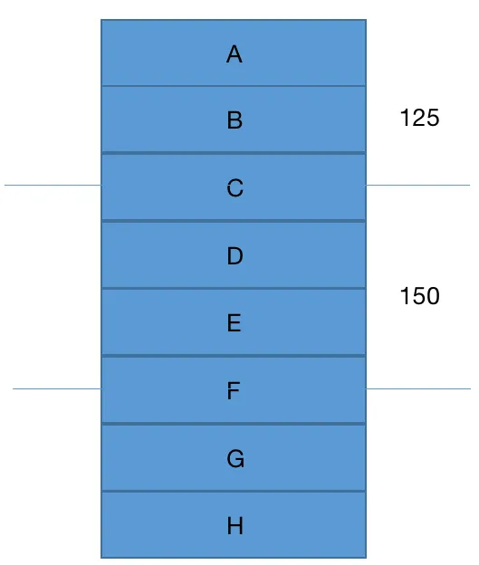

正常的虚拟滚动都有一个大前提，就是已知元素高度，这样很容易算出当前滚动距离应该展示哪个元素。如果高度不是固定，其实也有办法，可以先全部渲染，拿到每个元素高度存储，滚动时通过这些高度算出具体滚动到哪个元素的位置。

但是对于富文本编辑器，情况就更加复杂，因为元素是可编辑的，高度也会动态变化。也就是用户每一次的编辑操作，都要去收集每一个段落的高度，去设置它们合适的高度。

如果使用 vue react，假设每一个段落都是组件，每次的 update 都要去上报自身元素的高度。那如果元素不在可视区（某一段落编辑后，滚动离开，再回撤），组件根本没被创建，更别说上报高度了。在这里框架反而限制了功能。

因为第三版富文本编辑器的渲染流程是可控的，可以在渲染前计算段落高度、top位置处理来完成整个虚拟滚动的功能。

首先创建 4 个段落数据

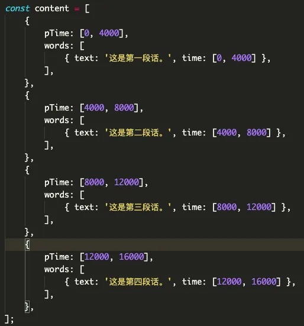

在初次渲染的时候，会把数据转化成 vnode 全部渲染

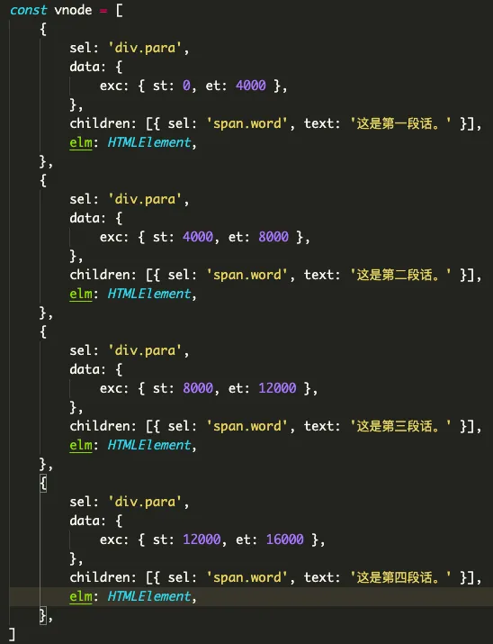

正常渲染到这里已经结束了，对于虚拟滚动还得获取下段落的高度和 top，放到 data 中

```javascript
let totalHeight = 0; // 计算总高度
const paras = vnode.children; // 段落 vnode 列表
for (let i = 0; i < paras.length; i++) {
  const prev = paras[i - 1]; // 前一个段落 vnode
  // top 值为 前一个段落的 top + height
  const top = i === 0 ? 0 : prev.data.pos.top + prev.data.pos.height;
  // 获取段落高度
  const height = paras[i].elm.offsetHeight;
  paras[i].data.pos = {
    top,
    height,
  }
  totalHeight += height;
  paras[i].elm.style.top = `${top}px`;
}
vnode.elm.style.height = `${totalHeight}px`;
```

这里我采用一个计算段落 top 的策略，该段落的 top 值为上一个段落的 top + height。因为每一个段落的高度变化都会引起后面段落的 top 变化。顺序遍历所有的段落，只要保证前一个段落的位置正确，那当前段落的位置也是可靠。由于我的 diff 策略是判断起始时间顺序遍历的，所以计算 top 值就更加容易了。

接着把信息数据存放到 data，假设每一行高度为 20 像素

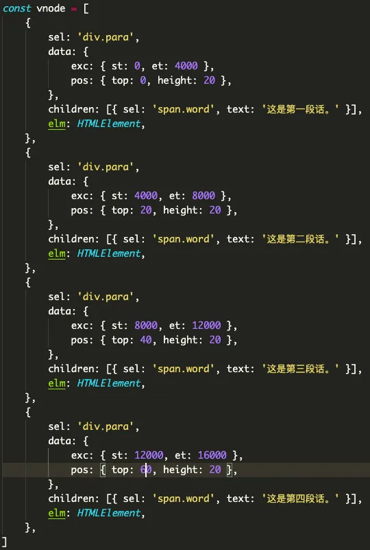

得到位置信息后，再计算可视区内的段落，假设现在可视区是  0 - 40 像素

```javascript
const svnode = vnode.filter(p => {
  if ((p.data.pos.top + p.data.pos.height) >= 0 && p.data.pos.top <= 40) {
    return true;
  }
  return false;
})
```

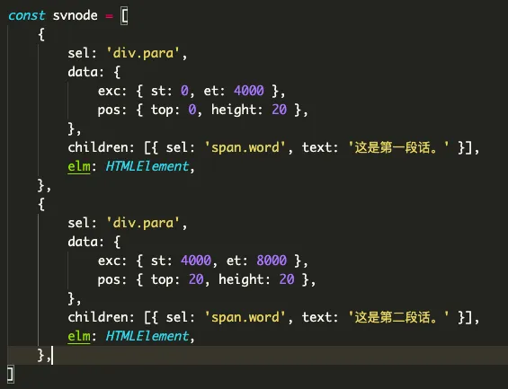

再创建 svnode 表示可视区 vnode，判断条件为 top + height 大于可视区开始位置，而且 top 小于可视区结束位置。

最后 patch (vndoe, svnode) 把可视区外的段落删除，完成初次渲染！

后面的渲染、diff 参照原来的逻辑，再添加一些位置变化的处理。

这时候 diff 过程中发现 B 元素要被删除，同时下面的 C 元素要上移占住 B 元素的位置，所以还得将 B 元素的 top 赋给下一个 C 元素

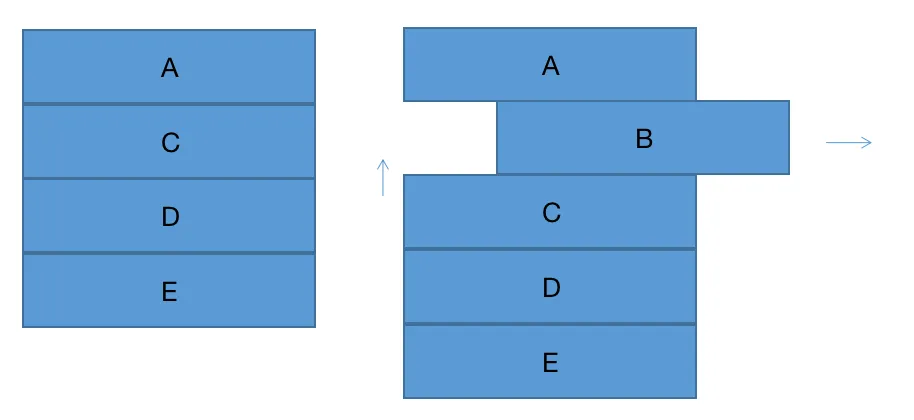

```javascript
if (oldPara[i].data.exc.st < para[j].data.exc.st) { // 删除段落
  oldPara[i].elm.remove();
  // 位置重置
  if (oldPara[i + 1]) { // 这里指代 C 元素
    oldPara[i + 1].data.pos.top = oldPara[i].data.pos.top;
  }
  i++;
} 
```

如果新增了一个 F 元素，那得考虑 3 个变化，F 元素占据 B 元素位置，B 元素下移，再同步跟新 C 元素位置

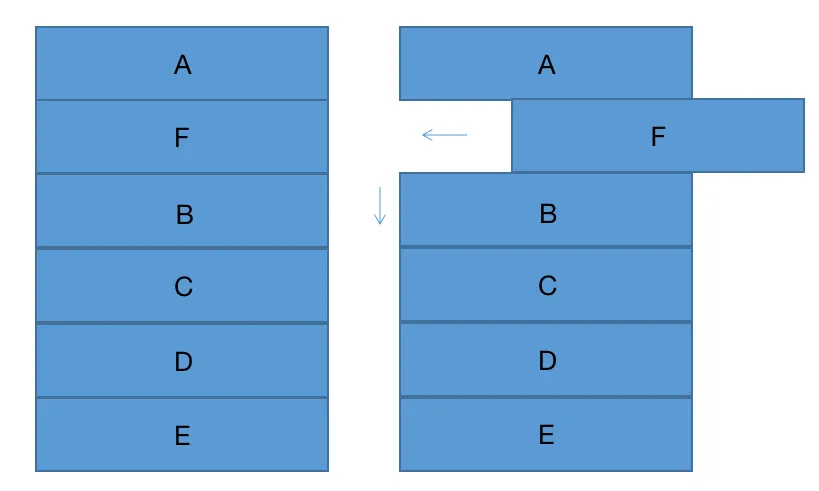

```javascript
if (oldPara[i].data.exc.st < para[j].data.exc.st) { // 新增段落
  const newPara = createElm(para[j]); // 创建 dom
  // oldVnode.elm.insertBefore(newPara, oldPara[i].elm); 创建后并不直接插入，等后续判断是否在可视区内
  para[j].data.pos = {};
  // 设置新dom的top值
  let top = 0;
  if (oldPara[i - 1]) {
    // top 获取的是 B 的上一个 A 元素的 top + height
    // 新增大多数因为分段，所以 A 元素高度会变化
    const height = oldPara[i - 1].elm.offsetHeight; 
    top = oldPara[i - 1].data.pos.top + height;
    oldPara[i - 1].data.pos.height = height;
  }
  para[j].data.pos.top = top; // 设置新增的 F 元素 top
  para[j].elm.style.top = `${para[j].data.pos.top}px`;

  oldVnode.elm.appendChild(newPara);
  const height = newPara.offsetHeight;
  newPara.remove();

  para[j].data.pos.height = height;
  totalHeight += height;

  oldPara[i].data.pos.top = para[j].data.pos.top + height; // B 元素下移，设置新的 top
  if (oldPara[i + 1]) { // 更新 C 元素位置
    oldPara[i + 1].data.pos.top = oldPara[i].data.pos.top + oldPara[i].data.pos.height;
  }

  j++;
}
```
其实创建了一个新段落 dom 但没有直接插入编辑器内，等后续判断是否在可视区内。不过后续又插入文档获取到高度后即刻删除，是因为 dom 被创建后还没添加到网页中是获取不到高度的，所以做了一个小操作。

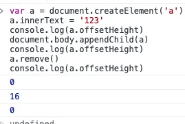 

最后一种情况元素不变内容可能变化了

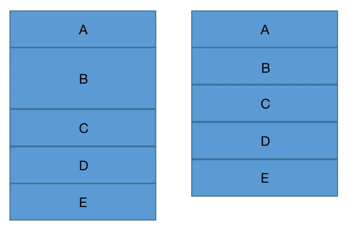

这时候重写下 patchWords 方法，返回一个布尔值表示该段落的词是否有更新。因为段落的高度只有被词影响，一旦词更新了，那就得重新获取段落高度。如果没有更新，就可以复用旧数据的高度

这里还有一种情况，词更新了但并不一定在可视区内，所以并不一定能获取高度。如果拿不到高度就先把 dom 插入编辑器，获取高度后立即移除

```javascript
if (oldPara[i].data.exc.st < para[j].data.exc.st) {
  para[j].elm = oldPara[i].elm;
  const updateWords = patchWords(); // 是否更新了 words

  const top = oldPara[i].data.pos.top;
  para[j].data.pos = {};
  para[j].data.pos.top = top; // 复用旧数据的 top
  para[j].elm.style.top = `${top}px`;
  let height;
  if (updateWords) { // 词更新了
    height = para[j].elm.offsetHeight; // 获取新的段落高度
    if (!height) { // 如果拿不到高度，先插入编辑器，再移除
      oldVnode.elm.appendChild(para[j].elm);
      height = para[j].elm.offsetHeight;
      para[j].elm.remove();
    }
  } else { // 词没更新，就复用旧数据的高度
    height = oldPara[i].data.pos.height;
  }

  totalHeight += height;

  para[j].data.pos.height = height; 

  if (oldPara[i + 1]) { // 更新下一个 C 元素的 top
    oldPara[i + 1].data.pos.top = top + height;
  } 
  i++;
	j++;
}

```

以上几种情况都有一个共同点，当前段落位置变化后会同步更新下一个段落的 top 值。这样保证了段落位置的准确性，一个段落位置变化后，后面的段落位置都能得到更新

假设我更新了第二段内容变成 2 行，删除了第三段

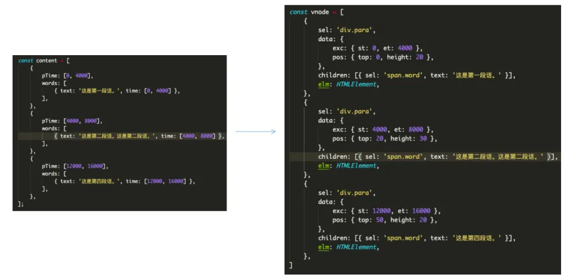

再把可视区变为 20 - 60，筛选出了新的 svnode

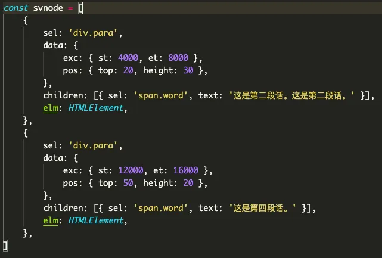

最后再把之前保存的 oldSVnode 与 新的 svnode 进行 diff 就可以了

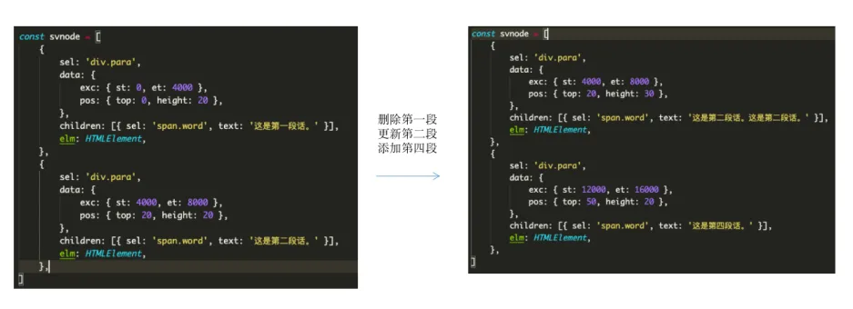

最终的效果

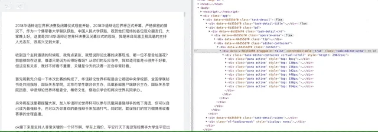

在段落编辑时，增加一行或减少一行都会引起后面段落位置的更新

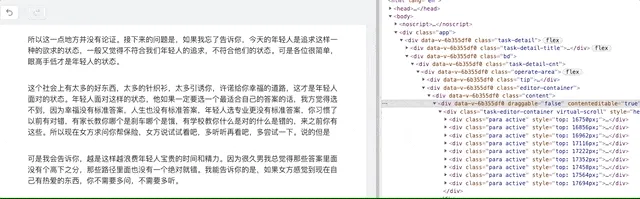
