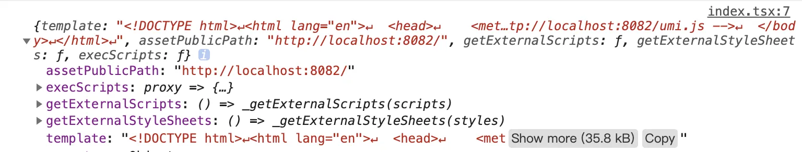
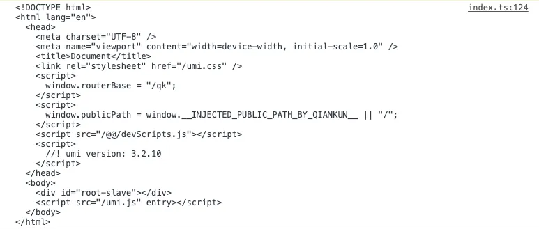

在qiankun的源码中，使用了 import-html-entry 库来加载html，这里实现下一个简版的import-html-entry来介绍微前端的第一步怎么去加载子应用资源。

## import-html-entry

首先简单介绍下import-html-entry使用方法

```typescript
import importHTML from 'import-html-entry';

interface IOpts {
	fetch?: Function;
  getPublicPath?: (url: string) => string;
  getDomain?: (url: string) => string;
  getTemplate?: (html: string) => html;
}

interface ILifeCycle {
	bootstrap?: (props: any) => Promise<void>;
  mount?: (props: any) => Promise<void>;
  unmount?: (props: any) => Promise<void>;
}

interface IImportReturn {
  template: string;
  assetPublicPath: string;
  getExternalScripts: () => Promise<string[]>;
  getExternalStyleSheets: () => Promise<string[]>;
  execScripts: (proxy: any) => Promise<ILifeCycle>;
}

interface IImportHTML {
  (url: string, opts?: Function | IOpts): Promise<IImportReturn>;
}

async function () {
	const { template, execScripts, assetPublicPath } = await importHTML('http://localhost:8082');
}
```

import-html-entry默认导出importHtml方法，接收2个参数

- url     html地址
- opts  可选，如果传入函数则会作为自定义fetch


如果所示，返回一个对象

- template                      已做处理的html模板字符串
- assetPublicPath            资源的根路径地址
- getExternalScripts         获取外部引用样式文件的方法
- getExternalStyleSheets   获取外部引用脚本文件的方法
- execScripts                   执行子应用的脚本文件的方法，可以传入proxy指定作用域

在qiankun的源码中，主要用到了 template 作为子应用容器的内容，execScripts(proxy) 调用子应用js，并获取子应用的生命周期

## importHTML

importHTML是import-html-entry默认导出的方法，这里简化成接收一个html url参数。其中import-html-entry是可以传入自定义fetch方法的，这里直接使用封装fetch的request方法。

```typescript
import { request, defaultGetPublicPath } from '../utils';

interface IEmbedHTMLCache {
    [url: string]: Promise<IImportReturn>;
}
const embedHTMLCache: IEmbedHTMLCache = {};

export default function importHTML(url: string): Promise<IImportReturn> {
  return embedHTMLCache[url] || 
  (embedHTMLCache[url] = request(url).then((html: string) => {
    console.log(html);
  }));
}
```

importHTML函数内部首先会做一层缓存，然后fetch请求html字符串



当然这种html的字符串不能直接使用，import-html-entry会使用 processTpl 方法对字符串进行处理，返回处理好的模板字符串、script、style等。

## processTpl

processTpl主要使用正则去收集style script，处理对应的字符串。主要流程：

1. 去除html注释
2. 查找link标签
3. 查找style标签
4. 查找所有的script标签

最后返回出处理后的字符串、scripts 数组、styles 数组 以及 entry
```typescript
export default function processTpl(tpl: string, baseURI: string) {
  const styles: string[] = [];
  let scripts: string[] = [];
  let entry = null;

  const template = tpl
		// 去除html注释 <!-- xxx -->
    .replace(HTML_COMMENT_REGEX, '')
  
  	// 查找link标签
    .replace(LINK_TAG_REGEX, (match) => {})
  
  	// 查找style标签
    .replace(STYLE_TAG_REGEX, (match) => {})
  
  	// 查找所有的script标签
    .replace(ALL_SCRIPT_REGEX, (match) => {})
  
  scripts = scripts.filter(function (script) {
		// 过滤空script
		return !!script;
  });
  
  return {
		template,
		scripts,
		styles,
		entry: entry || scripts[scripts.length - 1], // 把最后一个script作为入口
	};
}
```

**去除html注释**

```typescript
const HTML_COMMENT_REGEX = /<!--([\s\S]*?)-->/g;

const template = tpl

    // 去除html注释 <!-- xxx -->
    .replace(HTML_COMMENT_REGEX, '')
```
去除html注释比较简单，使用replace将 <!-- --> 注释中任意内容替换为空字符串

**查找link标签**
```typescript
const LINK_TAG_REGEX = /<(link)\s+.*?>/gi;
const STYLE_TYPE_REGEX = /\s+rel=('|")?stylesheet\1.*/;

const template = tpl
	// 查找link标签
    .replace(LINK_TAG_REGEX, (match) => {

        // 查找是否是 link style 样式标签
        const styleType = !!match.match(STYLE_TYPE_REGEX);
        
        if (styleType) {
            // 查找 link 标签中的 href
            const styleHref = match.match(STYLE_HREF_REGEX);
            
            if (styleHref) {
                const href = styleHref && styleHref[2]; // /umi.css
                let newHref = href;

                // 获取完整路径
                if (href && !hasProtocol(href)) {
                    newHref = getEntirePath(href, baseURI); // http://localhost:8082/umi.css
                }

                styles.push(newHref);
                
                return `<!-- ${newHref} -->`; // 注释link标签
            }
        }
        return match;
    })
```
第二步查询link标签，判断是否是style link（ref="stylesheet"）提取href，组合成完整的href路径存入styles数组中，最后用html注释替换掉link标签。

其中用到了2个方法
hasProtocol 是判断是否有protocol，判断url开发是否是// http:// 或者 https://

```typescript
/**
 * 判断是否有Protocol
 * @example
 * //www.test.com
 * http://www.test.com
 * https://www.test.com
 */
function hasProtocol(url: string) {
	return url.startsWith('//') || url.startsWith('http://') || url.startsWith('https://');
}
```
getEntirePath则可以根据 path baseURI组成一个完整url

```typescript
/**
 * 获取完整路径
 * @example
 * new URL('/a', 'http://www.test.com').toString();
 * "http://www.test.com/a"
 */
function getEntirePath(path: string, baseURI: string) {
	return new URL(path, baseURI).toString();
}
```

**查找style标签**
**
```typescript
const template = tpl
	// 查找style标签
  .replace(STYLE_TAG_REGEX, (match) => {
    // ... style ignore判断
    return match;
  })
```

在import-html-entry中会对
```html
<style ignore>xxx</style>
```
带有ignore的style标签进行过滤，这里就不做处理了

**查找所有的script标签**
**
script标签一般分为2种，一个是
```html
<script src="./umi.js"></script>
```

 通过 src 属性指向外部脚本文件，另一个是
```html
<script>console.log('1')</script>
```
包含脚本语句。

外链
```typescript
const ALL_SCRIPT_REGEX = /<script\b[^<]*(?:(?!<\/script>)<[^<]*)*<\/script>/gi;
const SCRIPT_TAG_REGEX = /<(script)\s+((?!type=('|')text\/ng-template\3).)*?>.*?<\/\1>/is;
const SCRIPT_SRC_REGEX = /.*\ssrc=('|")?([^>'"\s]+)/;

const template = tpl
	.replace(ALL_SCRIPT_REGEX, (match) => {
  	// ... script ignore 判断
    // ... script module 判断
    // ... script type 判断
    
    // 判断是否是 外链script  <script src="/umi.js"></script>
    if (SCRIPT_TAG_REGEX.test(match) && match.match(SCRIPT_SRC_REGEX)) {
      // ... script enter 判断 <script src="/umi.js" enter></script>

      const matchedScriptSrcMatch = match.match(SCRIPT_SRC_REGEX);
      let matchedScriptSrc = matchedScriptSrcMatch && matchedScriptSrcMatch[2]; // /umi.js

      if (matchedScriptSrc && !hasProtocol(matchedScriptSrc)) {
        // 获取完整script路径
        matchedScriptSrc = getEntirePath(matchedScriptSrc, baseURI);
      }

      if (matchedScriptSrc) {
        scripts.push(matchedScriptSrc);
        return `<!-- ${matchedScriptSrc} -->`;
      }
    }
    return match;
  })
```
判断是外链的script标签，获取src，组成完成的src路径存入scripts数组中，最后用html注释替换掉script标签。处理方法跟style link类似。

内嵌
```typescript
const ALL_SCRIPT_REGEX = /<script\b[^<]*(?:(?!<\/script>)<[^<]*)*<\/script>/gi;
const SCRIPT_TAG_REGEX = /<(script)\s+((?!type=('|')text\/ng-template\3).)*?>.*?<\/\1>/is;
const SCRIPT_SRC_REGEX = /.*\ssrc=('|")?([^>'"\s]+)/;

function getInlineCode(match: string) {
	const start = match.indexOf('>') + 1;
	const end = match.lastIndexOf('<');
	return match.substring(start, end);
}

const template = tpl
	.replace(ALL_SCRIPT_REGEX, (match) => {
  	// ... script ignore 判断
    // ... script module 判断
    // ... script type 判断
    
    // 判断是否是 外链script  <script src="/umi.js"></script>
    if (SCRIPT_TAG_REGEX.test(match) && match.match(SCRIPT_SRC_REGEX)) {
			// ...
    } else { // 判断是否是 内嵌script
      // ... script ignore 判断
      // ... script module 判断

      // 获取内嵌script code
      const code = getInlineCode(match);

      /**
        * 判断是否只是注释代码
        * @example
        * <script>
        *  //! umi version: 3.2.10
        * </script>
        */
      const isPureCommentBlock = code.split(/[\r\n]+/).every(line => !line.trim() || line.trim().startsWith('//'));

      if (!isPureCommentBlock) {
        scripts.push(match);
      }

      return `<!-- script -->`
    }
    return match;
  })
```
获取到内嵌script的内容会进行简单处理，判断每一行是否都是 // 单行注释开头，判断是否是单纯的注释 比如
```html
	<script>
  	// 注释
    // 注释
    // 注释
  </script>
```
如果不是纯注释则添加到scripts数组中，script标签替换成注释。 似乎没有判断块级注释？

综上，scripts数组中可能会出现2种内容，script src 和 script code。

## getEmbedHTML

在通过processTpl方法获取处理后的html字符串后，需要使用getEmbedHTML进行进一步处理，主要请求css资源，挂载到html中。
在qiankun中，子应用的样式是动态加载的，所以需要获取css资源，添加style标签添加到html中，当子应用卸载时，同时移除style标签就能移除子应用样式。

```typescript
export default function importHTML(url: string): Promise<IImportReturn> {
  return embedHTMLCache[url] || 
  (embedHTMLCache[url] = request(url).then((html: string) => {
    const { template, scripts, entry, styles } = processTpl(html, defaultGetPublicPath(url));
    const assetPublicPath = defaultGetPublicPath(url);
    return getEmbedHTML(template, styles).then(embedHTML => ({
        template: embedHTML,
        assetPublicPath,
        getExternalScripts: () => getExternalScripts(scripts),
        getExternalStyleSheets: () => getExternalStyleSheets(styles),
        execScripts: (proxy: any) => {
            if (!scripts.length) {
                return Promise.resolve();
            }
            return execScripts(entry, scripts, proxy);
        },
    }));
  }));
}
```
```typescript
// 获取完整的html
function getEmbedHTML(template: string, styles: string[]) {
	let embedHTML = template;
  // 请求css，挂载到html中
	return getExternalStyleSheets(styles)
		.then(styleSheets => {
			embedHTML = styles.reduce((html, styleSrc, i) => {
				html = html.replace(`<!-- ${styleSrc} -->`, `<style>/* ${styleSrc} */${styleSheets[i]}</style>`);
				return html;
            }, embedHTML);
			return embedHTML;
		});
}
```
getEmbedHTML内部主要使用getExternalStyleSheets方法去获取style样式表，找到到原先在processTpl中标记的 link标签注释 进行替换。

**getExternalStyleSheets**
**
```typescript
const styleCache: IStyleCache = {};

const isInlineCode = (code: string) => code.startsWith('<');

function getInlineCode(match: string) {
	const start = match.indexOf('>') + 1;
	const end = match.lastIndexOf('<');
	return match.substring(start, end);
}

export function getExternalStyleSheets(styles: string[]) {
	return Promise.all(styles.map(styleLink => {
			if (isInlineCode(styleLink)) {
        // 如果是内联style（感觉不存在这个情况）
				return getInlineCode(styleLink);
			} else {
        // 请求 http://localhost:8082/umi.css
				return styleCache[styleLink] ||
					(styleCache[styleLink] = request(styleLink));
			}
		},
	));
}
```
getExternalStyleSheets 接收styles数组，通过 Promise.all 并发请求 css 资源，不过在processTpl处理后的styles 理应只储存 link href 没有内联的样式，所以感觉内联样式判断好像是多余的？

## execScripts

execScripts是执行脚本的方法，可以传入指定作用域，一般有2种用法，第一种是 importHTML 方法最后返回的 execScripts，内部会调用子应用所有的script，并resolve出子应用导出的 bootstrap mount unmount 。另外也可以单独使用，比如qiankun劫持appendChild监听到动态加载了新的script，便可以调用execScripts进行劫持处理。
```typescript
export function execScripts(entry: string, scripts: string[], proxy = window): Promise<ILifeCycle> {
    return getExternalScripts(scripts)
        .then(scriptsText => {
            const geval = eval;

            function exec(scriptSrc: string, inlineScript: string, resolve: Function) {}

            function schedule(i: number, resolvePromise: Function) {}
            
            return new Promise(resolve => schedule(0, resolve));
        });
}
```
在execScripts内部中，首页会 getExternalScripts 获取script脚本，原理同 getExternalStyleSheets
```typescript
export function getExternalScripts(scripts: string[]) {
    // 请求script方法
    const fetchScript = (scriptUrl: string) => scriptCache[scriptUrl] ||
        (scriptCache[scriptUrl] = request(scriptUrl));
        
    return Promise.all(scripts.map(script => {
        if (typeof script === 'string') {
            if (isInlineCode(script)) {
                // 内联script
                return getInlineCode(script);
            } else {
                // 外链
                return fetchScript(script);
            }
        } else {
            // ... async script 处理
        }
    }
    ));
}
```
在获取到script脚本后，递归schedule方法，执行script。
```typescript
function schedule(i: number, resolvePromise: Function) {

  if (i < scripts.length) {
    const scriptSrc = scripts[i];
    const inlineScript = (scriptsText[i] as string);

    exec(scriptSrc, inlineScript, resolvePromise);
    // resolve the promise while the last script executed and entry not provided
    if (!entry && i === scripts.length - 1) {
      resolvePromise();
    } else {
      schedule(i + 1, resolvePromise);
    }
  }
}

return new Promise(resolve => schedule(0, resolve));
```
**exec**


```typescript
const geval = eval;

function exec(scriptSrc: string, inlineScript: string, resolve: Function) {
  if (scriptSrc === entry) {
    noteGlobalProps(window);
    // bind window.proxy to change `this` reference in script
    // 运行可执行js
    geval(getExecutableScript(scriptSrc, inlineScript, proxy));
    // @ts-ignore
    const exports = proxy[getGlobalProp(window)] || {};
    resolve(exports);
  } else {
    if (typeof inlineScript === 'string') {
      // bind window.proxy to change `this` reference in script
      geval(getExecutableScript(scriptSrc, inlineScript, proxy));
    } else {
      // ... async script 处理
    }
  }
}
```
在exec方法中，会使用 getExecutableScript 来将script转化成可执行的script（bind this、指定作用域），并用eval执行。

```typescript
function getExecutableScript(scriptSrc: string, scriptText: string, proxy: any) {
	const sourceUrl = isInlineCode(scriptSrc) ? '' : `//# sourceURL=${scriptSrc}\n`;
	window.proxy = proxy;
	return `;(function(window, self){;${scriptText}\n${sourceUrl}}).bind(window.proxy)(window.proxy, window.proxy);`;
}
```
qiankun子应用中需要修改下webpack配置，设置library，将libraryTarget设置成umd，并且入口文件导出生命周期钩子。

```typescript
const packageName = require('./package.json').name;

module.exports = {
  output: {
    library: "qk-c-umi",
    libraryTarget: 'umd',
    jsonpFunction: `webpackJsonp_${packageName}`,
  },
};
```

umd 模式会在打包出来的js中加入兼容的代码，执行后会在window上添加 qk-c-umi 属性
```javascript
(function webpackUniversalModuleDefinition(root, factory) {
	if(typeof exports === 'object' && typeof module === 'object')
		module.exports = factory();
	else if(typeof define === 'function' && define.amd)
		define([], factory);
	else if(typeof exports === 'object')
		exports["qk-c-umi"] = factory();
	else
		root["qk-c-umi"] = factory();
})(window, function() {
	return {
  	bootstrap,
    mount,
    unmount,
    update,
  }
});
```

所以在exec中，要执行入口文件js时，需要找到window上挂载的 qk-c-umi 属性
```typescript
if (scriptSrc === entry) {
    noteGlobalProps(window);
    // bind window.proxy to change `this` reference in script
    // 运行可执行js
    geval(getExecutableScript(scriptSrc, inlineScript, proxy));
    // @ts-ignore
    const exports = proxy[getGlobalProp(window)] || {};
    resolve(exports);
 } 
```

首先通过 noteGlobalProps 记录 window上 第1、2个和最后一个prop
```typescript
export function noteGlobalProps(global: any) {
	// alternatively Object.keys(global).pop()
	// but this may be faster (pending benchmarks)
	firstGlobalProp = secondGlobalProp = undefined;

	for (let p in global) {
		if (shouldSkipProperty(global, p))
			continue;
		if (!firstGlobalProp)
			firstGlobalProp = p;
		else if (!secondGlobalProp)
			secondGlobalProp = p;
		lastGlobalProp = p;
	}

	return lastGlobalProp;
}
```

执行完js后通过 getGlobalProp 去找window上新增的属性
```typescript
function shouldSkipProperty(global: any, p: string) {
	if (
		!global.hasOwnProperty(p) || // 跳过原型上的属性
		!isNaN(p) && p < global.length 
	) {
		return true;
	}
	if (isIE11) {
		// https://github.com/kuitos/import-html-entry/pull/32，最小化 try 范围
		try {
			return global[p] && global[p].parent === window;
		} catch (err) {
			return true
		}
	} else {
		return false
	}
}

export function getGlobalProp(global: any) {
	let cnt = 0;
	let lastProp;
	let hasIframe = false;
	
	for (let p in global) {
		if (shouldSkipProperty(global, p)) {
			continue;
		}
		// 遍历 iframe，检查 window 上的属性值是否是 iframe，是则跳过后面的 first 和 second 判断
		for (let i = 0; i < window.frames.length && !hasIframe; i++) {
			const frame = window.frames[i];
			if (frame === global[p]) {
				hasIframe = true;
				break;
			}
		}
		if (!hasIframe && (cnt === 0 && p !== firstGlobalProp || cnt === 1 && p !== secondGlobalProp)) {
			return p;
		}
		cnt++;
		lastProp = p;
	}
	if (lastProp !== lastGlobalProp) {
		return lastProp;
	}
}
```
上述代码中可以看出是遍历对象，找到最后一个属性名。
对象添加属性是按需添加的，但是数字/数字字符串的属性名会打乱顺序，所以这里进行了 first和second prop判断？
```javascript
const obj = {};
obj.b = 'b';
obj.c = 'c';
obj.a = 'a';
Object.keys(obj); // ["b", "c", "a"]
obj['2'] = '2';
obj['1'] = '1';
Object.keys(obj); // ["1", "2", "b", "c", "a"]
```
不过window对象倒是添加不了数字/数字字符串的属性名。总体看这段代码还是有写疑惑的，比如为什么需要判断是否有iframe，极端情况下新增的属性也不一定能找到

## importEntry

qiankun中就使用了importEntry，与importHTML相比多做了一层兼容，可以接收 scripts styles 参数。这里就不做展开了。

```typescript
interface IEntry {
    scripts?: string[];
    styles?: string[];
    html?: string;
}

export function importEntry(entry: IEntry | string): Promise<IImportReturn> {
  // html entry
	if (typeof entry === 'string') {
		return importHTML(entry);
  }
    
    // config entry
    const { scripts = [], styles = [], html = '' } = entry;
    // 生成style注释占位
    const setStylePlaceholder2HTML = (tpl: string) => styles.reduceRight((html, styleSrc) => `<!--${styleSrc} -->${html}`, tpl);
    // 生成script注释占位
    const setScriptPlaceholder2HTML = (tpl: string) => scripts.reduce((html, scriptSrc) => `${html}<!-- ${scriptSrc} -->`, tpl);

    return getEmbedHTML(setScriptPlaceholder2HTML(setStylePlaceholder2HTML(html)), styles)
        .then(embedHTML => ({
            template: embedHTML,
            assetPublicPath: defaultGetPublicPath('/'),
            getExternalScripts: () => getExternalScripts(scripts),
            getExternalStyleSheets: () => getExternalStyleSheets(styles),
            execScripts: (proxy: any) => {
                if (!scripts.length) {
                    return Promise.resolve();
                }
                return execScripts(scripts[scripts.length - 1], scripts, proxy);
            },
        }));

}
```
