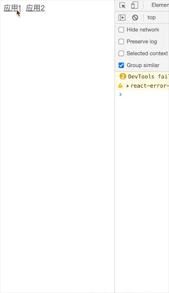

在qiankun中使用了single-spa来实现子应用的生命周期及路由劫持，下面来简单实现下功能

## 例子

注册路由

```javascript
registerApplication(
  'app1',
  async props => {
    return {
      bootstrap: [
        async props => {
          console.log(props);
          console.log('bootstrap1');
        },
      ],
      mount: async props => {
        console.log('mount1');
      },
      unmount: async props => {
         console.log('unmount1');
      },
    };
  },
  location => location.hash.startsWith('#/a'), // 根据路径来判断是否应该加载
  {
   a: 'a',
  }
);
registerApplication(
  'app2',
  async props => {
    return {
      bootstrap: async props => {
        console.log('bootstrap2');
      },
      mount: async props => {
        console.log('mount2');
      },
      unmount: async props => {
        console.log('unmount2');
      },
    };
  },
  location => location.hash.startsWith('#/b'), // 根据路径来判断是否应该加载
);
```

启动

```javascript
start(); // 启动这个应用
```



这里registerApplication方法用来注册子应用，共有4个参数

```typescript
interface Options {
  appName: string; // 应用名
  loadApp: (customProps: Record<string, unknown>) => Promise<ILifeCycle>; // 生命周期
  activeWhen: (location: Location) => boolean; // 是否激活路由
  customProps?: Record<string, unknown>; // props对象
}
```

在loadApp中可以返回生命周期对象，包含

1. bootstrap // 初始化子应用
2. mount // 加载子应用
3. unmount // 卸载子应用

他们可以是函数，也可以是函数数组

## registerApplication

registerApplication 比较简单，主要来收集子应用信息

```typescript
const apps: App[] = []; // 用来存放所有的应用

export function registerApplication(
  appName: string,
  loadApp: (customProps: Record<string, unknown>) => Promise<ILifeCycle>,
  activeWhen: (location: Location) => boolean,
  customProps?: Record<string, unknown>,
) {
  // 添加应用
  apps.push({
    name: appName,
    loadApp,
    activeWhen,
    customProps,
    status: Status.NOT_LOADED, // 应用初始状态
  });
  reroute(); // 加载应用
}
```
刚开始会对应用初始化一个应用初始状态 NOT_LOADED
子应用的生命周期状态一共分为以下几种

```typescript
export enum Status {
  NOT_LOADED = 'NOT_LOADED', // 应用初始状态
  LOADING_SOURCE_CODE ='LOADING_SOURCE_CODE', // 加载资源
  NOT_BOOTSTRAPPED = 'NOT_BOOTSTRAPPED', // 还没有调用bootstrap方法
  BOOTSTRAPPING = 'BOOTSTRAPPING', // 启动中
  NOT_MOUNTED = 'NOT_MOUNTED', // 没有调用mount方法
  MOUNTING = 'MOUNTING', // 正在挂载中
  MOUNTED = 'MOUNTED', // 挂载完毕
  UPDATING = 'UPDATING', // 更新中
  UNMOUNTING = 'UNMOUNTING', // 解除挂载
  UNLOADING = 'UNLOADING', // 完全卸载中
  LOAD_ERR = 'LOAD_ERR',
  SKIP_BECAUSE_BROKEN = 'SKIP_BECAUSE_BROKEN',
}
```

## reroute

reroute会重新设置路由，每次注册路由和加载应用会调用，所以reroute内部会分为2种情况，根据started变量来判断是注册时调用还是已经加载过应用（start函数是否已经调用过）
```typescript
export function reroute(eventArguments?: any) {
  // 获取需要加载、挂载、卸载的应用
  const { appsToLoad, appsToMount, appsToUnmount } = getAppChanges();

  if (started) {
    // app装载
    return performAppChanges();
  } else {
    // 注册应用时 需要预先加载
    return loadApps();
  }

  async function loadApps() { // 预加载应用
    // ...
  }

  async function performAppChanges() { // 根据路径来装载应用
    // ...
  }
}
```

getAppChanges 会根据各个应用的生命周期状态来划分出 需要初始化的应用（appsToLoad）需要加载的应用（appsToMount）需要卸载的应用（appsToUnmount）

```typescript
export function getAppChanges() {
  const appsToUnmount: App[] = []; // 要卸载的app
  const appsToLoad: App[] = []; // 要初始化的app
  const appsToMount: App[] = []; // 需要加载的
  apps.forEach(app => {
    const appSholdBeActive = shouldBeActive(app); // 调用activeWhen判断是否被激活
    switch (app.status) {
      case Status.NOT_LOADED:
      case Status.LOADING_SOURCE_CODE:
        if (appSholdBeActive) {
          // 没有加载且被激活
          appsToLoad.push(app);
        }
        break;
      case Status.NOT_BOOTSTRAPPED:
      case Status.BOOTSTRAPPING:
      case Status.NOT_MOUNTED:
        if (appSholdBeActive) {
          // 没有挂载且被激活
          appsToMount.push(app);
        }
        break;
      case Status.MOUNTED: // unmount
        if (!appSholdBeActive) {
          // 已经挂载但是没有激活，需要被卸载
          appsToUnmount.push(app);
        }
    }
  });
  return { appsToUnmount, appsToLoad, appsToMount };
}
```
## loadApps

在还没调用start函数时，reroute会调用loadApps来进行app装载

```typescript
async function loadApps() { // 预加载应用
  await Promise.all(appsToLoad.map(toLoadPromise)); // 就是获取到bootstrap,mount和unmount方法放到app上
  callCapturedEventListeners(eventArguments); // 捕获路由监听
}
```

toLoadPromise 初始化应用，并执行应用的loadApp返回的生命周期对象
```typescript
export async function toLoadPromise(app: App) {
  if (app.loadPromise) {
      return app.loadPromise; //缓存机制
  }
  return (app.loadPromise = Promise.resolve().then(async () => {
      app.status = Status.LOADING_SOURCE_CODE;
      let { bootstrap, mount, unmount } = await app.loadApp(app.customProps);
      app.status = Status.NOT_BOOTSTRAPPED; // 没有调用bootstrap方法
      app.bootstrap = flattenFnArray(bootstrap);
      app.mount = flattenFnArray(mount);
      app.unmount = flattenFnArray(unmount);
      delete app.loadPromise;
      return app;
  }))
}
```

flattenFnArray方法会使用Array.reduce函数对生命周期函数整合成链式调用
```typescript
function flattenFnArray(fns: AppLSFn[] | AppLSFn | undefined) {
  if (!fns) {
    return () => Promise.resolve();
  }
  fns = Array.isArray(fns) ? fns : [fns];
  /**
   * 通过promise链来链式调用  多个方法组合成一个方法 compose
   * @example
   * [
   *  async function(){ console.log(1) },
   *  async function(){ console.log(2) },
   *  async function(){ console.log(3) },
   * ]
   * 转化为
   * Promise.then(() => { console.log(1) }).then(() => { console.log(2) }).then(() => { console.log(3) })
   */
  return (props: any) => (fns as AppLSFn[]).reduce((p, fn) => p.then(() => fn(props)), Promise.resolve());
}
```
## performAppChanges

在执行start函数后，reroute会调用performAppChanges来装载应用，主要流程是对3种状态的应用分别调用他们对应的生命周期函数

```typescript
async function performAppChanges() { // 根据路径来装载应用
    // 先卸载不需要的应用 
    let unmountPromises = appsToUnmount.map(toUnmountPromise); // 需要去卸载的app
    // 去加载需要的应用

    // 这个应用可能需要加载 但是路径不匹配  加载app1 的时候，这个时候切换到了app2
    appsToLoad.map(async (app)=>{ // 将需要求加载的应用拿到 => 加载 => 启动 => 挂载
        app = await toLoadPromise(app); 
        app = await toBootstrapPromise(app);
        return toMountPromise(app);
    })
    appsToMount.map(async (app)=>{
        app = await toBootstrapPromise(app);
        return toMountPromise(app);
    });
  	callCapturedEventListeners(eventArguments); // 捕获路由监听
  }
```

toUnmountPromise、toBootstrapPromise、toMountPromise函数则是调用自身的unmount、bootstrap、mount

```typescript
export async function toUnmountPromise(app: App) {
  // 当前应用没有被挂载直接什么都不做了
  if (app.status !== Status.MOUNTED) {
      return app;
  }
  app.status = Status.UNMOUNTING;
  await app.unmount!(app.customProps)
  app.status = Status.NOT_MOUNTED;
  return app;
}

export async function toBootstrapPromise(app: App) {
  if(app.status !== Status.NOT_BOOTSTRAPPED){
      return app;
  }
  app.status = Status.BOOTSTRAPPING;
  await app.bootstrap!(app.customProps);
  app.status = Status.NOT_MOUNTED;
  return app;
}

export async function toMountPromise(app: App){
  if(app.status !== Status.NOT_MOUNTED){
      return app;
  }
  app.status = Status.MOUNTING;
  await app.mount!(app.customProps);
  app.status = Status.MOUNTED;
  return app;
}
```

## 路由劫持

生命周期的执行已经实现了，下一步是进行路由劫持，当路由变化时重启生命周期

首先是对 hashchange 和 popstate 2个事件进行劫持、监听收集事件

```typescript
function urlReroute() {
  reroute(arguments); // 会根据路径重新加载不同的应用
}
const capturedEventListeners = {
  // 后续挂载的事件先暂存起来
  hashchange: [],
  popstate: [], // 当应用切换完成后可以调用
} as any;

// 我们处理应用加载的逻辑是在最前面
window.addEventListener('hashchange', urlReroute);
window.addEventListener('popstate', urlReroute);

// 保存原来的方法
const originalAddEventListener = window.addEventListener;
const originalRemoveEventListener = window.removeEventListener;
// 重写监听方法
window.addEventListener = function(eventName: any, fn: any) {
  if (
    routingEventsListeningTo.indexOf(eventName) >= 0 &&
    !capturedEventListeners[eventName].some((listener: any) => listener == fn)
  ) {
    // 添加监听事件
    capturedEventListeners[eventName].push(fn);
    return;
  }
  // 执行原本的监听方法
  //@ts-ignore
  return originalAddEventListener.apply(this, arguments);
};
// 重写移除监听方法
window.removeEventListener = function(eventName: any, fn: any) {
  // 移除监听事件
  if (routingEventsListeningTo.indexOf(eventName) >= 0) {
    capturedEventListeners[eventName] = capturedEventListeners[eventName].filter((l: any) => l !== fn);
    return;
  }
  // 执行原本的移除监听方法
  //@ts-ignore
  return originalRemoveEventListener.apply(this, arguments);
};
```
对于HTML5 的 hostroy api，是无法监听到popstate事件的，所以还需要对history.pushState 和 history.replaceState 进行重写

```typescript
function patchedUpdateState(updateState: any) {
  return function() {
    const urlBefore = window.location.href;
    // @ts-ignore
    updateState.apply(this, arguments); // 调用切换方法
    const urlAfter = window.location.href;

    if (urlBefore !== urlAfter) {
      // 重新加载应用 传入事件源
      // @ts-ignore
      urlReroute(new PopStateEvent('popstate'));
    }
  };
}

window.history.pushState = patchedUpdateState(window.history.pushState);
window.history.replaceState = patchedUpdateState(window.history.replaceState);
```

## callCapturedEventListeners

最后路由变化后，捕获执行收集的函数执行

```typescript
export function callCapturedEventListeners(eventArguments?: any) {
  if (eventArguments) {
    const eventType = eventArguments[0].type;
    if (routingEventsListeningTo.indexOf(eventType) >= 0) {
      capturedEventListeners[eventType].forEach((listener: Function) => {
        try {
          // @ts-ignore
          listener.apply(this, eventArguments);
        } catch (e) {
          setTimeout(() => {
            throw e;
          });
        }
      });
    }
  }
}
```
