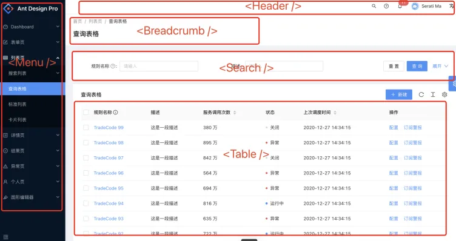
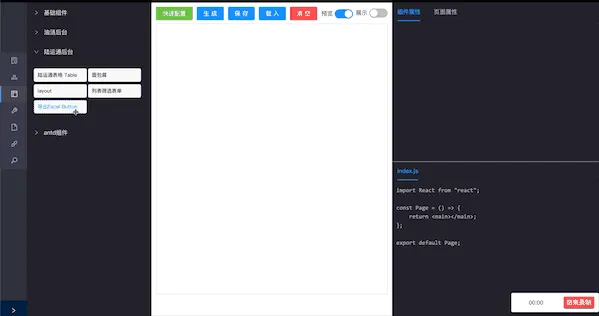
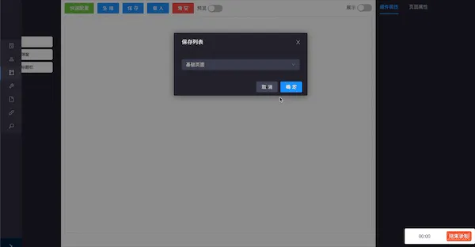

## 组件的复用

在搭建用户界面上有一个很流行的概念就是“组件化”，就是用户界面都可以划分为一个个独立区块，每个区块都有自身独立的渲染逻辑。



今年在项目的重构方向一直向“全组件化”靠拢，既万物皆组件的概念，每一个页面都是单纯由组件构成。

组件的全面覆盖有2大优势

1. 提升代码的复用性

     对于相同的内容区块，可以直接调用组件来展示，无需再写相同的ui界面与逻辑

2. 提升代码的可维护性

     对于页面的整体逻辑，组件化的实现可以将每个独立的逻辑解耦出来，比起所有逻辑糅杂在一起可维护性更高

## 逻辑的复用

得益于React 16.8 Hooks的出现，逻辑的复用变得更简单。逻辑的复用则是对于相同的逻辑进行封装，与组件化相似只是概念会更加抽象。

比如上图中，\<Search \/\>筛选组件 与 \<Table \/\>表格组件之间会存在交互，useTable方法则承担了这一功能，抽象了筛选出表单数据、发起请求、分页等功能。useTable则就是逻辑的复用。

逻辑复用的好处是显而易见的，除了让庞大的逻辑变得更精简以外，对于大型复杂单页，逻辑的划分和复用使得代码可读性更高，更易于维护。

## 实践

介绍了组件与逻辑的复用，我认为**配合组件与逻辑的复用，能让开发更加简便高效**
**
这里我开发了组件拖拽的展示工具，更好地交互式生成页面代码
**


如上图，当把 导出Excel 按钮拖入工作台后，右下角的代码中自动填入2条语句（其实是4条，这里不算导入语句）

```javascript
// 代表逻辑复用
// 封装导出、校验等功能
const { onOutputExcel } = useOutputExcel(formData);

// 代表组件复用
// 封装UI样式，点击事件
<Button onClick={onOutputExcel}>导出Excel</Button>
```

本质就是将左侧的展示组件绑定它对应的 组件代码 + 逻辑代码，拖拽进入工作台，收集它的绑定的代码注入模板代码中

当然一个按钮还不够，我可以加入多个页面元素，自由拖拽整合，拼接成完整的页面。这样，基础界面就相当轻松地搭建出来。



相比原先使用固定模板，拖拽形式搭建会更加灵活，可以应对不同类型页面，自由配置表单表格等等。这样极大减少了重复创建页面、配置大量表单的时间，能用1%的时间完成20%的基础工作。 （一名不愿意透露姓名的使用者表示，从原先3点半下班直接提早到了2点半）

除此之外，对于同一个逻辑，不同的开发者肯定有不同的实现方法。由于逻辑的复用，大家只需遵循一种（最优）方法，针对于项目中开发风格迥异的编程人员来说能达到一定的统一。再加上复用的代码模板化，所生成的代码也是严格统一的，一个空格都不会有偏差（身为强迫症患者的福音）

最后将页面切成块，也划分了UI跟逻辑，对于测试也相当便利。

不过距离能创建完整页面还很远，因为后端接口无法统一，你不知道这个业务对应的接口是什么，不知道每一项列表的字段是什么，所以还是需要进行二次开发（或者搭建中间层）其次业务是非常灵活的，一个按钮可能是增、删、改、查，或者是发起请求，我们无法从拖拽、编辑展示组件能让它们获得具体的业务逻辑，除非我有足够多的组件去涵盖所有业务，当然这已经是非常非常理想化了，只有长期的迭代去慢慢沉淀。

所以我花了大半年时间也只做到基础建设，不过这样已经做得够多了，在第三季度我想着搭建一个平台，让这个工具能成为各个项目通用的搭建基础界面解决方案。每个项目组都可以上传自己的组件与逻辑，开发时可以像在超市选购一样，挑选自己对应的组件来搭建，流水线般地生产代码。

在经过分享、多次会议来介绍这一套方案后，大家都认为是个不错的想法，但最后还是不了了之了~~其实我自己也觉得很难实现~~。后期复盘，总结了一下不足之处：

- 整个公司的UI风格不统一

      各个项目的UI风格没有统一就意味着大家都要“重复造轮子”，这是一项很大的工程。对用户界面而且，样式不同即便功能再相似，也难以复用，只能重写一套代码。

- 前端架构不统一

各个项目有可能是CRA、umi或者是dva脚手架创建，可能有不同文件目录等差异，要接入这套方案可能面临小部分重构去抹平差异。 

- 学习成本

实际实行起来其实并没有这么简单，从展示组件、对应的编辑组件、插件等都需要一定的学习成本。


- 是否有真正的需求

对于稳定迭代的项目，其实并不会有特别直观的产出，而且封装可复用的组件、逻辑对于当前稳定的项目可能并没多大实质性的用处（除非后期大重构）

- 自身设计问题

即便在整体设计上，我已经很大地规避了“贴合业务”式设计，并且引入了简单的插件机制来解决不同项目的业务之间的差异性，但是毕竟一开始只是一个提高效率的小工具，我自己就是设计、开发、产品，喜欢什么功能就开发什么功能，完全按照自己的喜好来，无法站在全局的角度去看待不同项目之间的真正的开发痛点。所以真正用起来也会是挺别扭的。

最后总体上算是不成功的，只能自己当做玩具来用用，安慰自己这不是凭我一个人一朝一夕能完成的。不过秉承做梦就要做大的原则，假如我有足够的UI组件可以搭建任意页面，假如我有足够的逻辑覆盖一切的业务，那我能让设计、开发、测试统统失业，只需要产品小姐姐即可[doge]

## 后记

最早的时候只是苦于配置大量表单，是一件繁琐又重复的劳动，而后就想着写一个可以交互式配置表单的工具减轻点工作量。其实那时候也只想比同事的webstorm的模板更快点。后来既然表单都可以配置了，为什么不能直接配置页面呢？于是着手开发一个页面配置工具，这样就不用操心基础页面搭建，专心于具体业务实现。再后来页面都能配置了，为什么不能写一个通用的让其他项目组都能使用呢？然后设计更加灵活的拖拽形式的配置，再分享、推广等等等。

整体的实现还是得益于代码的复用，组件复用的概念已经很流行了，而近年框架的技术更新使得逻辑复用也更加容易，项目今年也基于逻辑复用进行过重构，最后也通过逻辑复用解决展示组件绑定逻辑的难题。

从一个小的点切入，再去深入思考更深层的开发（业务）需求，如果有什么想法那就赶紧去做吧。
