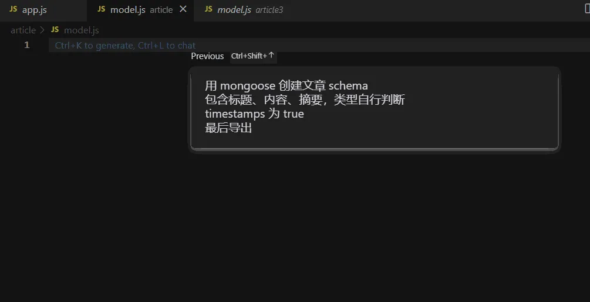

本文例举利用 AI 生成模板代码，探索 AI 生成重复性高、逻辑性低的代码来减少重复劳动的可行性。文中使用的编程工具为 [Cursor](https://www.cursor.so/)。

## 代码质量测评

首先肯定要去验证一下，AI 生成的代码是否可靠、实用。刚好我有个祖传博客代码需要重构，可以通过 AI 来生成一下其中的文章模块。

在 Cursor 编辑器中创建 app.js，按住 command + K 输入 prompt。

这里我写 prompt 习惯是，我要用框架/库实现什么功能，其中的细节是什么。这样描述基本能让 AI 理解你的需求

### 创建 express 服务

```
利用express启动一个服务
```


```javascript
const express = require('express'); // 引入express模块
const app = express(); // 创建express实例

app.listen(3000, () => { // 监听3000端口
  console.log('Server started on port 3000');
});
```


第二步连接数据库，因为这里可能涉及到改动原先的代码，所以可以先全选代码，再输入 prompt，编辑器会在原代码上做修改。

```
连接 mongo，database 为 blog
```


```javascript
const express = require('express'); // 引入express模块
const mongoose = require('mongoose'); // 引入mongoose模块
const app = express(); // 创建express实例

mongoose.connect('mongodb://localhost/blog', { useNewUrlParser: true }); // 链接mongo，database为blog

app.listen(3000, () => { // 监听3000端口
  console.log('Server started on port 3000');
});
```

最终成功启动服务


### 创建文章 model

```
用 mongoose 创建文章 schema
包含标题、内容、摘要，类型自行判断
timestamps 为 true
最后导出
```



```javascript
const mongoose = require('mongoose');

const articleSchema = new mongoose.Schema({
  title: {
    type: String,
    required: true
  },
  content: {
    type: String,
    required: true
  },
  summary: {
    type: String,
    required: true
  },
}, { timestamps: true });

module.exports = mongoose.model('Article', articleSchema);
```

其中我提到了“类型自行判断”，实际上并不需要，因为在你没提到的内容，它会自行给到它推断合理的代码。不会因为你不说，就不会生成。但是对于一些特定的参数，比如 timestamps，就需要额外指定。

### 创建文章 controller

创建 controller 需要导入之前写的 model，但是编辑器不会跨文件解析。这时你可以在 prompt 说明在哪个文件中导入叫哪个名字的 model，甚至可以直接把代码贴在 prompt 中

```
```
// model.js 代码....
```
根据以上文章model代码，导入并生成文章的增删改查、获取文章列表的controller
```

```javascript
const Article = require('./model');

exports.createArticle = async (req, res) => {
  try {
    const article = await Article.create(req.body);
    res.status(201).json(article);
  } catch (error) {
    res.status(500).json({ error: error.message });
  }
};

exports.getArticleById = async (req, res) => {
  try {
    const article = await Article.findById(req.params.id);
    if (!article) {
      return res.status(404).json({ error: 'Article not found' });
    }
    res.json(article);
  } catch (error) {
    res.status(500).json({ error: error.message });
  }
};

exports.updateArticle = async (req, res) => {
  try {
    const article = await Article.findByIdAndUpdate(req.params.id, req.body, { new: true });
    if (!article) {
      return res.status(404).json({ error: 'Article not found' });
    }
    res.json(article);
  } catch (error) {
    res.status(500).json({ error: error.message });
  }
};

exports.deleteArticle = async (req, res) => {
  try {
    const article = await Article.findByIdAndDelete(req.params.id);
    if (!article) {
      return res.status(404).json({ error: 'Article not found' });
    }
    res.status(204).send();
  } catch (error) {
    res.status(500).json({ error: error.message });
  }
};

exports.getArticles = async (req, res) => { // Adding a new controller to get all articles
  try {
    const articles = await Article.find();
    res.json(articles);
  } catch (error) {
    res.status(500).json({ error: error.message });
  }
};
```

以上代码大致还行，看起来能跑，但是太简单了。获取文章列表没有分页等功能，当然也是我的 prompt 写得不够详细。下面再优化一下

选中 getArticles 方法

```
修改getArticles，支持分页查询和文章标题模糊搜索
```


```javascript
exports.getArticles = async (req, res) => { // Adding a new controller to get all articles
  try {
    const { page = 1, limit = 10, title } = req.query;
    const query = {};
    if (title) {
      query.title = { $regex: title, $options: 'i' };
    }
    const articles = await Article.find(query)
      .limit(limit * 1)
      .skip((page - 1) * limit)
      .exec();
    const count = await Article.countDocuments(query);
    res.json({
      articles,
      totalPages: Math.ceil(count / limit),
      currentPage: page
    });
  } catch (error) {
    res.status(500).json({ error: error.message });
  }
};
```

还行吧。。至少说明有足够详细的 prompt 就可以生成对应的功能代码。

### 注册路由

最后创建 routes.js 注册文章路由。这次我描述一下 controller 里面的内容

```
从controller.js导入 createArticle、getArticleById、updateArticle、deleteArticle、getArticles方法
注册相应的express路由
```

```javascript
const express = require('express');
const router = express.Router();
const { createArticle, getArticleById, updateArticle, deleteArticle, getArticles } = require('./controller');

router.post('/', createArticle);
router.get('/:id', getArticleById);
router.put('/:id', updateArticle);
router.delete('/:id', deleteArticle);
router.get('/', getArticles);

module.exports = router;
```

最后把路由挂载在 express 上，顺便注册插件解决一下 json 参数问题

```
注册article文件夹下的routes
注册json插件
```


```javascript
const express = require('express'); // 引入express模块
const mongoose = require('mongoose'); // 引入mongoose模块
const app = express(); // 创建express实例
const articleRoutes = require('./article/routes'); // 引入article文件夹下的routes
const bodyParser = require('body-parser'); // 引入body-parser模块

mongoose.connect('mongodb://localhost/blog', { useNewUrlParser: true }); // 链接mongo，database为blog

app.use(bodyParser.json()); // 注册json插件
app.use('/article', articleRoutes); // 注册article文件夹下的routes

app.listen(3000, () => { // 监听3000端口
  console.log('Server started on port 3000');
});


```

### 总结

验证一下接口是否可用

**创建文章**


**获取列表**


**获取详情**


**更新文章**


当然以上的功能还是不完善的，比如还缺少权限认证，但只要你有相应的 prompt，就可以生成对应的代码，因为篇幅关系就不展示了。以上的测评至少可用说明 AI 生成的代码是可用的。

但是以上的代码还是太太太简单了，远远达不到生产代码，只能当做花瓶。要达到能在生产使用的模板代码，还需要做些额外的操作。

## 模板代码的生成


先思考一下，作为前端写过最多的 UI 界面是什么？如果是 B 端开发，围绕着各种管理后台，肯定绕不过表格表单。

我在 3 年前写过一个早期的低代码平台，通过拖拖拽拽生成 UI 代码。


这种在当时看起来还是比较好的生成代码方案，但也存在几个致命的问题

1. 依赖于框架

比如上述平台生成的是 React 代码，换了工作用了 Vue，那基本就废弃了。再写一套模板的工作量是很大的

2. 依赖于业务

假如换了另一套业务，上面的 UI 也不太适用了，得重新编写物料组件，同样工作量不小

3. 难以涉及简单逻辑

比如表格中的操作按钮，可能会有链接、删除、打开某个弹窗，即便是简单逻辑也很难去编写、配置

~~所以换了工作就没动力维护了~~

等到 AI 出现能处理代码，我觉得这一切都可行了，毕竟 AI 就是一个天然庞大的物料组件库。

### 简单 UI 模板

以 Vue3 + ant-design-vue 为例，先写一个 Table 组件的基础模板，通过描述表格项 prompt 来让 AI 帮我们生成。

```javascript
<template>
    <a-table
        :data-source="dataSource"
        :columns="columns">
    </a-table>
</template>
<script setup>
import { ref } from 'vue';

const dataSource = ref([]);

const columns = [];
</script>
```

```
生成学号、姓名、性别、出生年月、操作这5项。
出生年月格式化年月日形式
操作包含查看详情、删除
```


```javascript
<template>
  <a-table
    :data-source="dataSource"
    :columns="columns"
  >
    <template #birth="{ text }">
      {{ new Date(text).toLocaleDateString() }}
    </template>
    <template #action>
      <a @click="handleView">查看详情</a>
      <a-divider type="vertical" />
      <a @click="handleDelete">删除</a>
    </template>
  </a-table>
</template>

<script setup>
import { ref } from 'vue';

const dataSource = ref([
  {
    id: 1,
    name: 'John Doe',
    gender: 'Male',
    birth: '1990-01-01',
  },
  {
    id: 2,
    name: 'Jane Doe',
    gender: 'Female',
    birth: '1995-05-05',
  },
]);

const columns = [
  {
    title: '学号',
    dataIndex: 'id',
  },
  {
    title: '姓名',
    dataIndex: 'name',
  },
  {
    title: '性别',
    dataIndex: 'gender',
  },
  {
    title: '出生年月',
    dataIndex: 'birth',
    slots: { customRender: 'birth' },
  },
  {
    title: '操作',
    slots: { customRender: 'action' },
  },
];

function handleView() {
  // handle view logic here
}

function handleDelete() {
  // handle delete logic here
}
</script>


```

生成的代码是可运行的，还帮你 mock 了数据，但还有小问题。其中 column.slots 已经被新版的 antdv 废弃了，虽然能用但我还是想用最新的写法。其次我希望用 dayjs 库来格式化时间。于是来修改一下模板

```javascript
<template>
    <a-table
        :data-source="dataSource"
        :columns="columns">
+        <template #bodyCell="{ column, record }">
+        </template>
    </a-table>
</template>
<script setup>
import { ref } from 'vue';

const dataSource = ref([]);

const columns = [];
</script>

```

```
生成学号、姓名、性别、出生年月、操作这5项。
其中出生年月是自定义项，在表格中用dayjs格式化年月日形式
操作是自定义项，包含查看详情、删除
```

```javascript
<template>
  <a-table
    :data-source="dataSource"
    :columns="columns"
  >
    <template #bodyCell="{ column, record }">
      <template v-if="column.key === 'birth'">{{ dayjs(record[column.key]).format('YYYY-MM-DD') }}</template>
      <template v-else-if="column.key === 'action'">
        <a-button type="link" @click="handleView(record)">查看详情</a-button>
        <a-button type="link" @click="handleDelete(record)">删除</a-button>
      </template>
      <template v-else>{{ record[column.key] }}</template>
    </template>
  </a-table>
</template>

<script setup>
import { ref } from 'vue';
import dayjs from 'dayjs';

const dataSource = ref([
  {
    id: 1,
    name: '张三',
    gender: '男',
    birth: '1990-01-01',
  },
  {
    id: 2,
    name: '李四',
    gender: '女',
    birth: '1995-05-05',
  },
]);

const columns = [
  {
    title: '学号',
    dataIndex: 'id',
    key: 'id',
  },
  {
    title: '姓名',
    dataIndex: 'name',
    key: 'name',
  },
  {
    title: '性别',
    dataIndex: 'gender',
    key: 'gender',
  },
  {
    title: '出生年月',
    dataIndex: 'birth',
    key: 'birth',
  },
  {
    title: '操作',
    key: 'action',
  },
];

const handleView = (record) => {
  // handle view logic here
};

const handleDelete = (record) => {
  // handle delete logic here
};
</script>
```

这样就符合我的要求了。其实即便没有模板，AI 也能给你生成像样的代码。这里模板代码的作用就是限制 AI 在你的模板上生成符合你的要求的代码。不过你也可以不用修改模板，或者补充 prompt 添加例如 `不需要column.slots`等更明确的说法，也能达到相同的效果。

### 逻辑生成

可能有人会说，上面的代码生成，我复制粘贴也可以，能省多少事？当然不止如此，同时我们也可以让 AI 去生成简单逻辑。比如查看详情按钮可以跳转学生的详情页，删除按钮弹出确认提示。修改下 prompt

```
查看详情点击后使用 vue-router 跳转学生详情页面
点击删除弹窗提示
其他不用修改
```


```javascript
<template>
  <a-table
    :data-source="dataSource"
    :columns="columns"
  >
    <template #bodyCell="{ column, record }">
      <template v-if="column.key === 'birth'">{{ dayjs(record[column.key]).format('YYYY-MM-DD') }}</template>
      <template v-else-if="column.key === 'action'">
        <a-button type="link" @click="handleView(record)">查看详情</a-button>
        <a-button type="link" @click="handleDelete(record)">删除</a-button>
      </template>
      <template v-else>{{ record[column.key] }}</template>
    </template>
  </a-table>
</template>

<script setup>
import { ref } from 'vue';
import dayjs from 'dayjs';
import { useRouter } from 'vue-router';
import { Modal } from 'ant-design-vue';

const dataSource = ref([
  {
    id: 1,
    name: '张三',
    gender: '男',
    birth: '1990-01-01',
  },
  {
    id: 2,
    name: '李四',
    gender: '女',
    birth: '1995-05-05',
  },
]);

const columns = [
  {
    title: '学号',
    dataIndex: 'id',
    key: 'id',
  },
  {
    title: '姓名',
    dataIndex: 'name',
    key: 'name',
  },
  {
    title: '性别',
    dataIndex: 'gender',
    key: 'gender',
  },
  {
    title: '出生年月',
    dataIndex: 'birth',
    key: 'birth',
  },
  {
    title: '操作',
    key: 'action',
  },
];

const router = useRouter();

const handleView = (record) => {
  router.push(`/student/${record.id}`);
};

const handleDelete = (record) => {
  Modal.confirm({
    title: '确认删除',
    content: `确定要删除学号为 ${record.id} 的学生吗？`,
    onOk() {
      // handle delete logic here
    },
  });
};
</script>
```

基本实现了简单逻辑，如果需要更多逻辑编写，只要描述对应的 prompt 即可。

### 代码识别

在真实的开发环境中，其实没有这么多“demo”型的基础代码，更多是封装过的。那 AI 是否能理解这些代码，并能在这基础上生成我们需要的代码？

下面写了一个自定义组件，并且用了一个自定义 hooks，同样的需求看是否能生成。

```javascript
<template>
  <my-table
    :data="data"
    :loading="loading"
    :columns="columns"
    :pagination="pagination"
    @change="handleTableChange">
    <template #bodyCell="{ column, record, index }">
          <template v-if="column.dataIndex === 'action'">
              <span>
                  <a>操作</a>
              </span>
          </template>
      </template>
  </my-table>
</template>

<script setup>
import { ref } from 'vue';
import useTable from '@/hooks/useTable';

const data = ref([]);
const columns = [];

const {
    pagination,
    loading,
    handleTableChange
} = useTable();

</script>
```

```
生成学号、姓名、性别、出生年月、操作这5项。
mock2组数据
操作是自定义项，包含查看详情、删除
表格组件的change事件会传递页码信息，现在需要在当前方法上再封装一层打印页码
```

```javascript
<template>
  <my-table
    :data="data"
    :loading="loading"
    :columns="columns"
    :pagination="pagination"
    @change="handleTableChangeWithLogging">
    <template #bodyCell="{ column, record, index }">
      <template v-if="column.dataIndex === 'action'">
        <span>
          <a @click="handleViewDetail(record)">查看详情</a>
          <a @click="handleDelete(record)">删除</a>
        </span>
      </template>
    </template>
  </my-table>
</template>

<script setup>
import { ref } from 'vue';
import useTable from '@/hooks/useTable';

const data = ref([
  {
    id: '001',
    name: 'John Doe',
    gender: 'Male',
    birth: '1990-01-01'
  },
  {
    id: '002',
    name: 'Jane Doe',
    gender: 'Female',
    birth: '1995-05-05'
  }
]);
const columns = [
  {
    title: '学号',
    dataIndex: 'id'
  },
  {
    title: '姓名',
    dataIndex: 'name'
  },
  {
    title: '性别',
    dataIndex: 'gender'
  },
  {
    title: '出生年月',
    dataIndex: 'birth'
  },
  {
    title: '操作',
    dataIndex: 'action'
  }
];

const {
  pagination,
  loading,
  handleTableChange
} = useTable();

const handleViewDetail = (record) => {
  console.log(`View detail of record with id ${record.id}`);
};

const handleDelete = (record) => {
  console.log(`Delete record with id ${record.id}`);
};

const handleTableChangeWithLogging = (pagination, filters, sorter) => {
  console.log(`Current page: ${pagination.current}`);
  handleTableChange(pagination, filters, sorter);
};
</script>


```

这次提出了 4 个需求，1-3 是都可以直接实现的，至少 AI 能通过变量命名和模板代码示例能理解它是做什么的。但是对于第 4 个需求，想打印页码，试了几次终于写出了合理 prompt 让它帮我生成了对应的方法。从这里开始就有负担了（太难写了）我得描述得很清楚，如果想实现其他功能，我可能要把这个 my-table 组件的文档贴给它。

所以我们需要充足的 prompt 库。

### 总结

通过 AI 生成模板代码的效果总体令人差强人意，但是在我这么多次实验下来，还是展露了一些问题。比如同样的 prompt 生成的代码略微都有不相同之处。相比于之前提到的低代码平台生成的模板代码，低代码平台能生成更稳定、一致的代码。而 AI 生成的，还是可能得需要我们去微调，无法保证生成即可使用。

其实主要的原因还是在于我们的 prompt 描述得不够细致，无法让 AI 理解我们的具体需求，以至于无法让 AI 限定生成我们想要的代码。所以如果真正要实现完全靠 AI 生成模板代码，则需要一个庞大的 prompt 库的支持。

## 拓展

除了基础代码，其实还可以直接通过 AI 生成应用层面的东西。比如这个邮件


当然现在这种图片肯定不是靠手动画出来的，一般会有一个创作平台，有一套基础模板，然后妥妥拽拽生成想要的排版，再导出图片。

既然有了基础模板，那同理 AI 也可以直接生成，甚至你可以指挥它修改。

首先我也写一个简单的模板，大概这样


差不多就行。然后把模板和文章内容交给 AI，让它自行解析文章，匹配模板返回 html 代码。

```
下面是一段模板html代码
```
<div class="title">主标题</div>
<div class="sub-title">小标题</div>
<div class="content">正文</div>

<a href="" class="link">链接</a>
<div class="contact">
    <p>客服POPO：XXXXX</p>
    <P>反馈群号：XXXXX</P>
</div>
```
给你一段文章内容，自行解析文章结构匹配模板html代码
检测到是主标题，输出 div.title
检测到是小标题，输出 div.sub-title
检测到是正文文字，输出 div.content
检测到图片地址，输出 img.img 宽度 100%
检查到链接并附带链接地址，输出a.link
检测到是联系方式，输出div.contact
文章内容如下
```
AIGC大赛开始啦
https://static.zzh.cool/20180726213434.jpg?imageView2/2/w/400/q/75
URS致力于为业务团队提供安全稳定的帐号服务。网易邮箱一直以来都是URS的重点合作对象，2021年URS紧跟邮箱需求，进行了多次深度合作，协助邮箱在帐号登录风控和修复率提升等方面取得了诸多成果。在2022年URS将继续保持开放共享的态度，与业务共同发展，达成更高的使命和愿景
匠心卓越奖
DDoS防护平台
安全BP始终和业务在一起，打通业务和安全的最后一公里；
不断深入业务，帮助业务评估安全风险和解决安全难题；
持续赋能业务,致力于业务安全体系建设与合规发展。
https://static.zzh.cool/20180726213405.jpg?imageView2/2/w/400/q/75
业务安全合作伙伴建设
提前布局，实现IPv6防御，满足游戏小小云需求知己知彼，紧跟攻击趋势，给业务稳稳的安全感精益求精，解决业务痛点，落地大数据智能防御
https://static.zzh.cool/20180726213336.jpg?imageView2/2/w/400/q/75
https://static.zzh.cool/20180726213336.jpg?imageView2/2/w/400/q/75
点击申报[www.test.com]
若您有产品使用问题，请联系
客服POPO：123456
产品反馈群：123456
```
```

返回结果：


大致差不多，还有一点点瑕疵，再微调一下

```
修改以上代码
“匠心卓越奖”改成小标题，设置红色
最后2张图片宽度改为49%，同一排展示
“若您有产品使用问题，请联系”这句话居中显示，与上面间距20像素
其他不变
```

最终结果


对于没有 html 基础的人来说，还算是方便的。

甚至不仅仅限制于代码，能让程序去完成的重复性劳动同样也能靠简单的语言指挥 AI 去做。比如结合命令行，输入 “删除某某文件” 这样的任务，让 AI 去理解你的意图，如把 delete filename 等关键字写入你提供的脚本，然后自动执行就可以指挥它做你想要做的事。

## 总结

与传统拼模板字符串的低代码工具相比，AI 生成的代码不局限于框架和语言，无论是 Vue 还是 React，无论是 js 还是 java 都能给到你想要的结果。但是低代码工具能生成非常标准且一致的代码，AI 则要更准确、详细的 prompt，不然生成的代码也会略有差别，还需要手动去调整。

与同类型产品  Copilot 相比，通过 GPT 模型生成通用且长的代码块更具有优势。但是在复杂逻辑上，开发者需要花费精力去表达逻辑，思考想要的东西，编写详尽的 prompt。即便如此，也并非一定能生成开发者想要的代码。但是 Copilot 没有这样的心智负担，它自己能通过代码上下文去理解开发者意图，再去给开发者提出建议。日常开发中能把两者结合使用，应该能提高很大的开发效率。

最后从上述的测评、测试来看，AI 生成的代码是可用但不是完美的。不过我们不用专门花心思去写某个功能的物料，只要平日多用多记录，把成功案例的 prompt 记录下来。等到下次再遇到类似的功能，就可以把之前的 prompt 拿过来做点修改就可以使用、生成代码了。 
