# 搭建组件知识库，优化 AI 生成代码的效果

在上文 [《**在 Cursor 中搭建 MCP 服务，利用 AI 将 Figma 转成代码**》](/article/在%20Cursor%20中搭建%20MCP%20服务，利用%20AI%20将%20Figma%20转成代码/)中介绍了 Figma 如何转成代码，但在实际应用中会有一点小问题

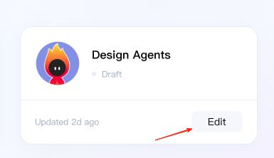

比如上图，我有自己的组件库，这里的 Button 也希望能用自己的 Button 组件，那如何能让 AI 知道呢

首先还是用老方法，先给这个按钮做标记，标记成我自己的组件 AButton

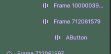

然后在 prompt 中添加规则

```markdown
请帮我用这个 figma 链接获取 figma ui 元素，并从元素数据转成代码。要求
// ...
7. 自定义组件会在 figma 数据的 name 字段上做标记比如 AButton AModal，如果标记了自定义组件先查询组件信息使用方法，再使用
```

最后用最简单的办法，在 prompt 中写入所有关于 AButton 的信息，如源码、文档、使用方法

```markdown
# AButton 组件信息
//...
```

当然嫌复制粘贴太麻烦，可以使用 Cursor 的 notepads 功能，添加 AButton note

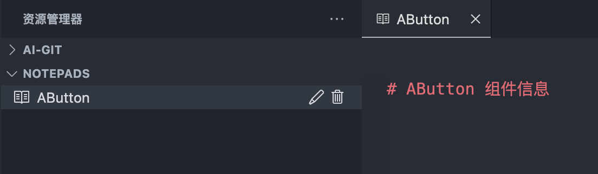

然后在 prompt 中引用即可

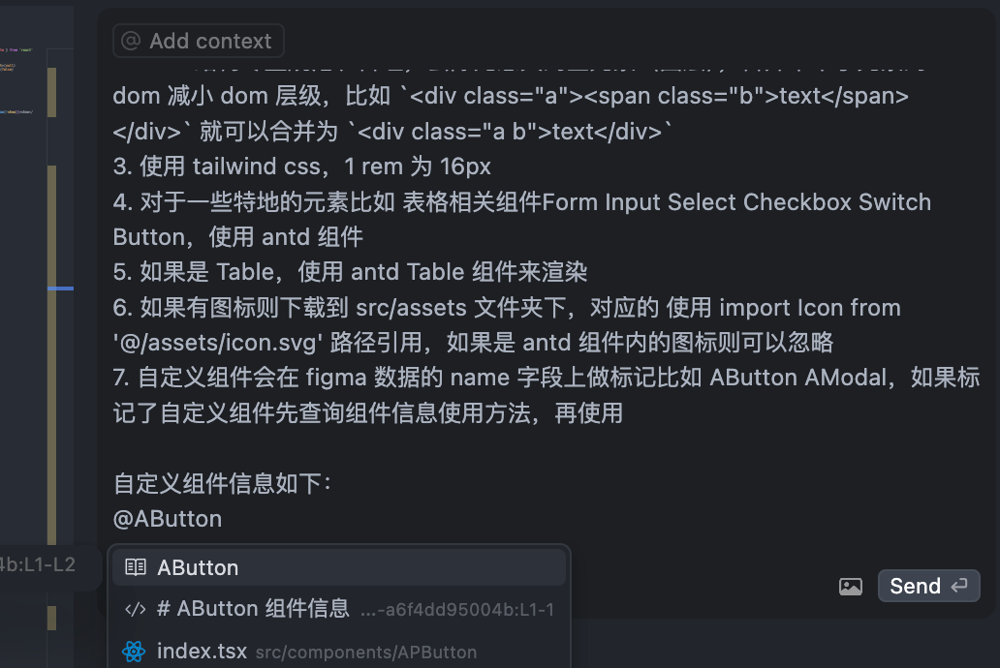

不过这种补充 prompt 的方案也有不足，仅支持本地且扩展性不足。比如 UI 中包含多个组件就得手动添加多个组件的文档，更别说包含复杂组件，就得先整合文档让大模型更容易识别。于是下面来介绍一下搭建组件知识库来解决这个问题。

以扣子平台的知识库为例。

先用 AI 来生成 AButton 的组件文档

```markdown
# AButton 按钮组件
基础 React 按钮组件,支持多种类型、加载状态、禁用状态等。

## AButton引入方式
\`\`\`js
import AButton from '@/components/base/Button'
\`\`\`

## AButton组件参数
属性说明
| 参数 | 说明 | 类型 | 默认值 |
| --- | --- | --- | --- |
| type | 按钮类型 | 'primary' \| 'secondary' \| 'general' \| 'warning' \| 'weak' | 'primary' |
| onClick | 点击按钮时的回调 | (e: React.MouseEvent) => void | - |
| className | 自定义类名 | string | - |
| loading | 是否显示加载状态 | boolean | false |
| disabled | 是否禁用 | boolean | false |
| style | 自定义样式 | React.CSSProperties | - |
| icon | 按钮图标 | React.ReactNode | - |
| tips | 按钮提示文本,会显示在 Tooltip 中 | string | - |
```

在扣子上创建组件知识库，并上传文档进行解析分片

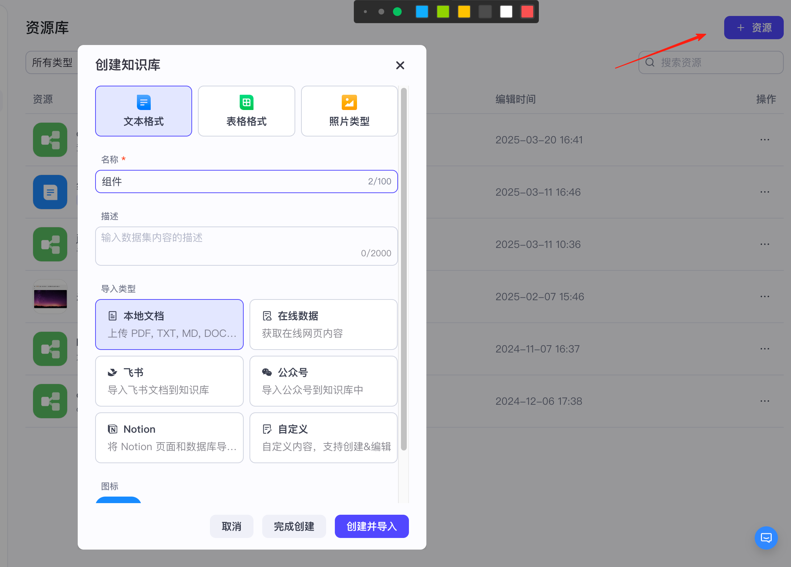

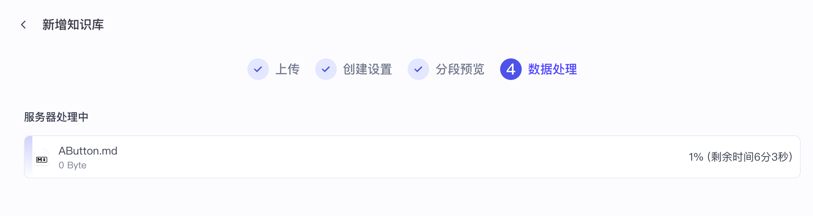

等待处理完成，创建工作流来测试一下效果

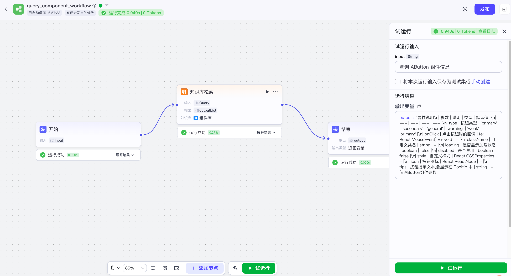

可以看到，输入 “查询 AButton 组件信息”可以搜索到组件文档内容。接着发布工作流，使用 API 调用

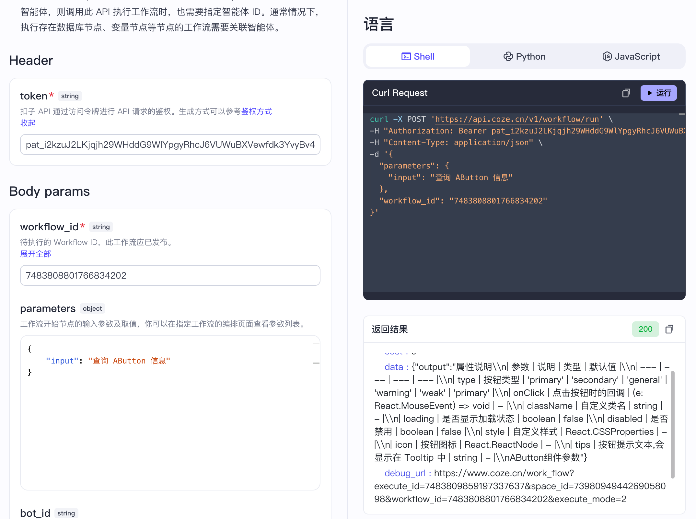

于是我们就可以从外部调用 API 来查询组件知识库的内容。（这里关于扣子的工作流搭建、token 配置就不详细介绍了）

有了查询的能力，接着要让大模型主动调用 API 了解我们自己的组件信息。在 Figma-Context-MCP 中再注册一个工具，用来查询组件信息

```tsx
this.server.tool(
  "get_custom_component_detail",
  `Get the custom component detail of a component, currently only support AButton and AModal`,
  {
    componentName: z
      .enum(["AButton", "AModal"])
      .describe("The name of the custom component to get the detail"),
  },
  async ({ componentName }) => {
    const result = await getCustomComponentDetail(componentName);
    return {
      content: [{ type: "text", text: result.data.data }],
    };
  },
);
```

这里大模型检测到 AButton 组件会调用这个工具传入组件名查询组件信息（这里可以改成组件名数组，支持并发查询）。getCustomComponentDetail 内部就是调用扣子接口，获取组件文档，最后把文档内容返回给大模型。

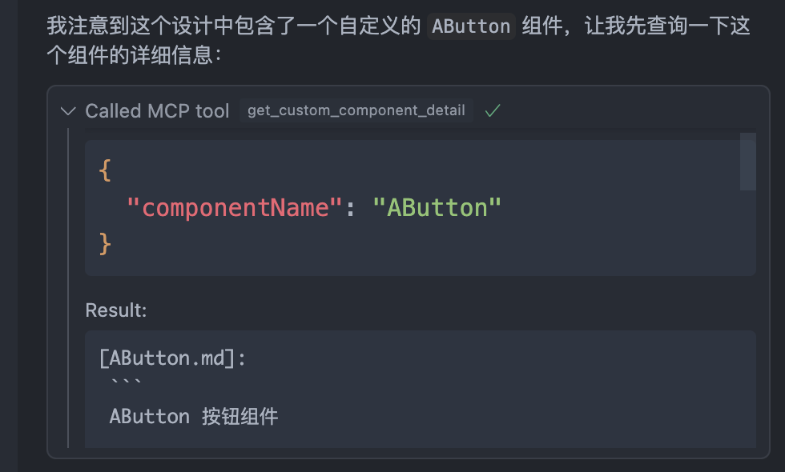

在流程中，大模型发现标记了 AButton 的组件就会调用查询工具，传入 {“componentName”: “AButton”} 参数，返回了文档内容

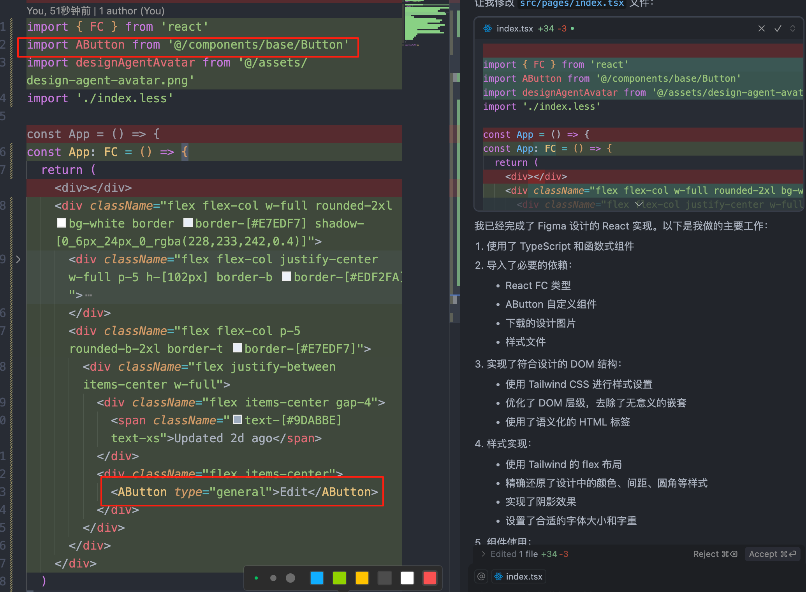

最后根据组件文档，引用了自定义的 AButton 组件，并正确使用。

除了这个 Figma 转代码的例子，我们也可以在自己的 AI 生成代码的应用上去检索组件文档作为参考。以我的公司开发的智能体产品为例

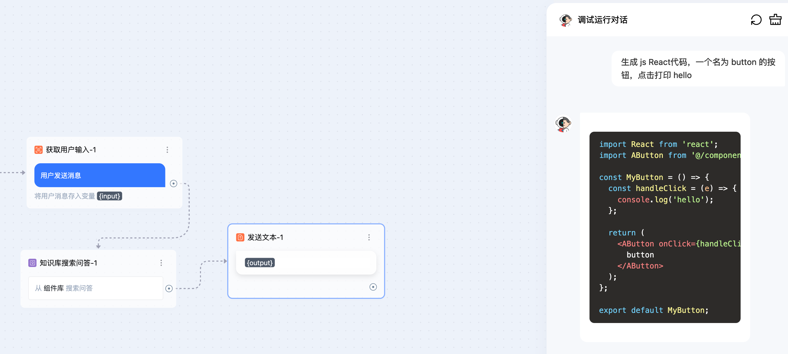

这里我提了一个需求，生成 Button 代码，流程中接入了组件库搜索，最后给我的代码中就引用了组件库里的 AButton。当然这个例子比较简陋，真实开发场景肯定用不到。但是未来要开发更加标准化的代码生成/辅助平台，搭建一个组件知识库还是很有价值的。