近几个月都在研究富文本编辑器相关的内容，自己业务中的富文本编辑器改过 3 个版本，踩过不少坑，终于开发出满意的一版，分享下整体的设计思路。

## 背景

整体的功能是将一段音频经过算法识别，识别出说话的人，说话的内容和时间。再由服务端传输给前端，展示在富文本编辑器里，可由用户进行修改订正、保存。

识别后的数据结构主要分为段落跟词，段落中包含说话人的信息和时间，词中包括内容和时间，例如

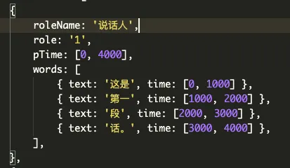

```typescript
interface IParagraph {
    roleName: string; // 说话人姓名
    role: string; // 说话人id
    pTime: [number, number]; // 起始/结束时间
    words: IWord[]; // 词列表
}

interface IWord {
    text: string; // 内容
    time: [number, number]; // 起始/结束时间
}
```

然后把这段数据渲染出来

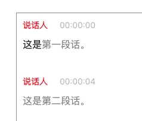

与传统富文本编辑器相比，我们并不需求对字体样式的一些操作，如加粗、下划线、字号等等，但是对返回的内容有要求。

比如传统富文本编辑器返回的结果是一段 html 文本 

<p><span>这是</span><span>第一</span><span>段</span><span>话。</span></p>

我们的需求则是，在编辑后，依然返回原样的数据结构给服务端

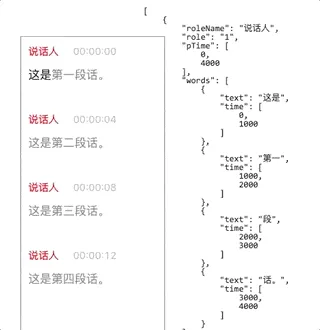

这里如何监控用户在编辑器中修改的内容，把修改后的dom重新映射成对应的数据结构才是难点。下面就介绍下各个版本的设计，说话人相关的内容和实现就不展开了，主要还是段落和词。

## 第一版

通常我们能想到，编辑某个词能改变对应这个词的数据，那只要每个词都是一个 input 就行了，然后监听这个 input 内容变化，找到对应的词改变内容就行了。

最早一版我们就是这么做的

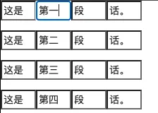

这种方案的用户体验实在太差，只能在一个词中编辑内容，跨词就不行了，无法达到“自由编辑”的能力。唯一解只有 contenteditable 了。

当然 contenteditable 也有许多问题，比如

**dom 不可控**

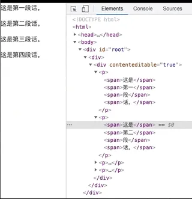

这里进行了分段、合段操作，dom 并不是我想要的样子，还加上了一些样式。况且我还得给它加上说话人。

**光标偏移**

这里删除了“二”这个字，光标无法正常跟在“第”后面。js 控制 dom 发生更新，光标会偏移，跳到了这个词的最前面。所以在用户每次操作后，都得重置光标位置。

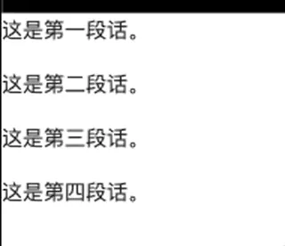

**中文输入法**

中文输入法的问题应该是富文本编辑器过不了的坎，主要是中文输入法无法被 event.preventDefault 阻止，同时也会让 dom 发生一些不可逆的变化。

**无法准确获取编辑内容**

给 contenteditable dom 添加 keydown 事件，虽然能获取输入内容，但是无法定位具体编辑的位置，需要配合光标位置来判断。


以上几点综合起来就有很大难题了，尤其是光标偏移。如果在修改 dom，同步重新创建 Range 对象重置光标是没问题的，但是我的项目使用了 vue ，只能在 nextTick 后重置，如果用户操作速度很快，就无法保证光标位置的准确。

针对以上几个问题，在第一版中我采用以下策略来更新 dom，映射对应的数据

1. 段落内编辑不主动控制 dom

用户在一个段落内，编辑、删除词并不会破坏来的 dom 结构，等在用户操作结束后，我再遍历整个段落的词，再组合成对应数据。

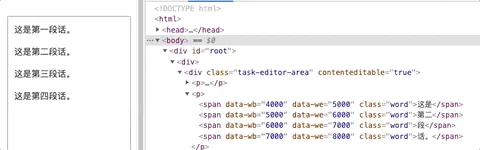

上面操作中，无论增删都不会破坏 span 的结构 （如果整个词都删除，span 会移除）这样既避免了光标偏移问题，也规避的中文输入带来的副作用。

然后等到用户操作完毕后，再遍历段落的词，收集 dom 上 dataset 的数据，文字组合成段落数据。

```javascript
document.querySelector('.para').childNodes.forEach(word => {
  const { wb, we } = word.dataset;
  const text = word.innerText;
});
```

利用 debounce 整合段落数据

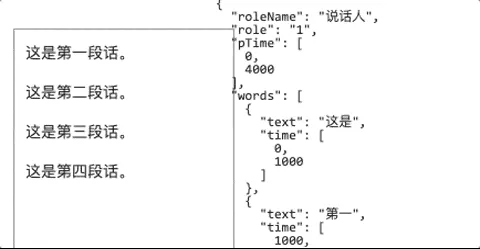

2. 段落之间编辑，先操作数据，通过数据渲染 dom

因为换行等操作 dom 是不可控的，所以先操作数据换行，利用 vue 将数据渲染到 dom 中

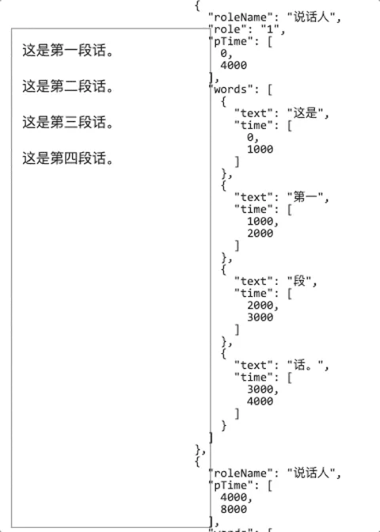

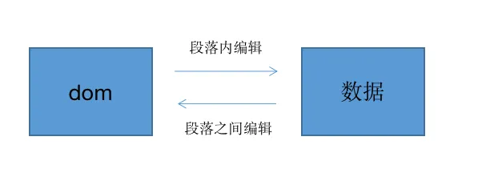
总体来说，每次用户的编辑操作，区分是段落内还是跨段落操作， 段落内就遍历 dom 更新数据，段落外就更新数据，渲染新 dom。这样也算达到了 dom 与数据的一致，虽然看起来别扭了点，也算是绕过了如输入法、光标等坑，完成了需求。唯一不足的是用户在高速操作，会有可能会造成 dom 与数据之间同步不及时。

## 第二版：性能优化


而后团队加了会议音频转写的功能，一段会议的音频大多都有 1 个小时到 2 个小时时长，大约百来段，数万个词。测试了下 4 个小时的音频，在数万个词的压力下，整个编辑器变得非常卡顿。


上图可以看到，在按下回车光标消失到换行，大约卡顿了1秒时间，用户体验已经很差了。

因为富文本编辑器的特殊性，每段的内容高度不确定，又可以自由编辑，导致无法很容易地用虚拟滚动方案来优化。同样分页也不太适合，比如 10 段为一页，用户只要多分几段就占了一页，体验也同样很差。这样最终矛头就指向了 vue。

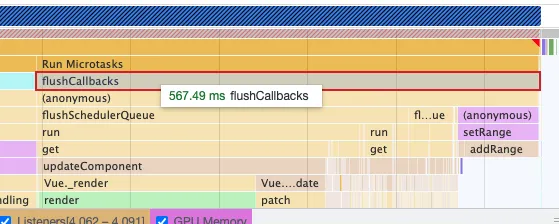

从火焰图上看，确实花费了不少时间在更新、渲染上。也不是说 vue 不好，本身这样的场景已经不适合 vue，这么大量的数据做 diff，数据添加响应能力是需要很大的开销。那 vue 负责的 render 跟 diff 这2块内容只能由自己来写了。

render 其实还好，根据数据内容调用 dom api，createElement 就行了。关键还是 diff 模块

上文说到段落和词都有一个起始时间和结尾时间，从始至终都是按序的。并且用户在编辑内容过程中，无论怎么操作，增删改查都无法改变时间顺序。因为用户无法主动去创建一个词，唯一的情况是删了一个词又按下了回撤建，这样会比原先多一个词，但即便这样也是按序的。

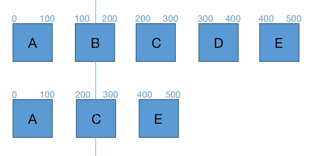

假设上面是新旧段落数据，我在每个词上标记了起始时间和结尾时间，这里新数据我删掉了 B 和 D。两组数据进行 diff ，第一组 A 是相同的，遍历到第二组，新数据的 C 起始时间是 200，而旧数据 B 起始时间是 100，C 的起始时间要大于 B的起始时间，说明旧数据 B 要被移除。


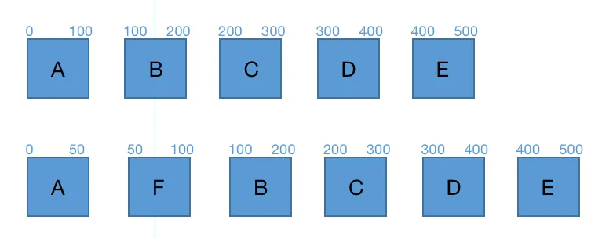

相反，假设我添加了一个 F，时间是 50 - 100 符合时间按序。遍历到第二组时，F 的起始时间 50 是小于 B 的起始时间 100的，这说明新数据 F 要被添加到 B 的前面。

所以我的 diff 策略就是对比数据的起始时间，通过起始时间的大小来判断数据的增删，如果时间相同就再对比细节。这样的 diff 策略相比 vue snabbdom 双指针头尾对比，它只需要一次顺序遍历就可以完成 diff，简单易懂，也为后续优化做了铺垫。

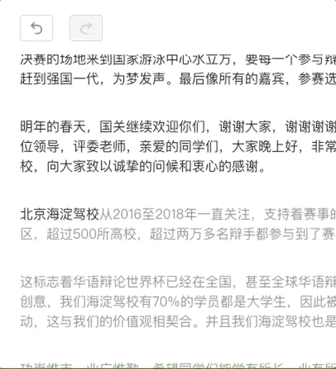

最终效果，从按下回车到换行，大概 300-400 ms，优化效果还是很明显的。

## 第三版：Slate

前面两版迭代虽然能解决大部分问题，但是在可扩展性上是非常不理想的，很多场景只有针对性的解决方案，一旦需求增加，在原方案上就难以扩展。

比如，如果想要添加一个文字加粗功能，在词的数据结构上添加 bold 字段表示是否加粗

```typescript
interface IWord {
    text: string; // 内容
    time: [number, number]; // 起始/结束时间
  	bold?: boolean; // 加粗
}
```

渲染的时候，判断 bold 字段，给 dom 上添加粗体样式

```javascript
if (word.bold) {
	wordElement.style.fontWeight = 'bold';
}
```

看起来还好，但在段落内编辑时，遍历 dom 生成段落数据时就变得十分别扭。除了要获取起始、结尾时间和文字内容外，还得去得到是否粗体的样式

```javascript
document.querySelector('.para').childNodes.forEach(word => {
  const { wb, we } = word.dataset;
  const text = word.innerText;
  
  const bold = word.style.fontWeight; // 是否加粗
});
```

这里粗体样式尚且还能从 dom 上获取，如果添加的是评论、批注，带着一大堆列表数据呢？总不能把列表数据序列化后，添加到 dom 的 dataset 上吧。

长久来看以上的方案设计都不好，怎么去重构？直到我发现了 [Slate](https://doodlewind.github.io/slate-doc-cn/)

### Slate

Slate 并不是一个完整的富文本编辑器，它算是富文本编辑器的内核。这样说起来太抽象，下面举个例子

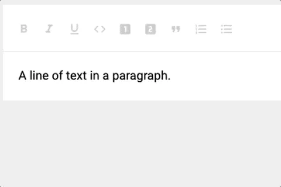

这里我在富文本编辑器里做了 2 步操作，第一步光标选到 paragraph 中 a 与 g 之间，第二步按下回车键。而在 Slate 中是这样做的

```javascript
// 创建 editor
const editor = createEditor();

// 设置内容
editor.children = [
  {
    type: 'paragraph',
    children: [{ text: 'A line of text in a paragraph.' }],
  },
];

console.log(editor.children)

// 光标选到 paragraph 中 a 与 g 之间
Transforms.select(editor, { anchor: { path: [0, 0], offset: 24 }, focus: { path: [0, 0], offset: 24 } });

// 按下回车
editor.insertBreak();

console.log(editor.children)
```
对于 2 步操作，Slate 对应的是调用了 2 个方法。 

Transforms.select 表示光标选中，path: [0, 0] 表示第一段的第一个 text, offset: 24 表示偏移 24 个字符。这里便指的是 paragraph 中 a 与 g 之间的位置

insertBreak 就是按下回车换行

再来对比前后 children 的数据变化

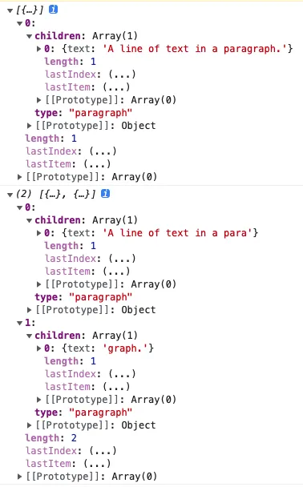
显然，Slate 帮你把数据处理成了换行后的样子。所以 Slate 算是富文本编辑器的内核，由它来控制着 model 和 controller ，而 view 则交由 slate-react 等来处理。反正我数据都处理好了，你帮忙渲染就行了。此外 slate-react 会控制、阻止用户的所有输入行为，转化成 Slate 提供的方法调用

整体流程是这样的

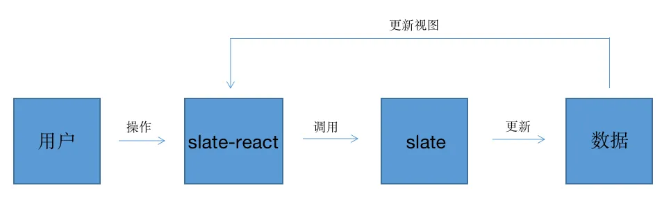

其中有 2 个重点

**如何实时获取光标位置**

editor 对象中是有 selection 属性来存放光标位置的

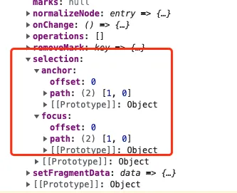

在 slate-react 中，监听 document 的 selectionchange 来获取光标变化，从而设置 editor 对象中光标的位置。

**如何控制、阻止用户输入行为**

编辑器监听 [beforeinput](https://developer.mozilla.org/zh-CN/docs/Web/API/HTMLElement/beforeinput_event) 事件，用户在输入、删除、换行、剪切等等会影响文本内容的操作就会触发 beforeinput 事件，从而阻止完全由 Slate 来控制。

```javascript
element.addEventListener('beforeinput', (e) => {
	// 阻止默认事件
	e.preventDefault();
  const { inputType: type, data } = e;
  
  switch (type) {
    case 'insertFromDrop':
    case 'insertFromPaste':
    case 'insertFromYank':
    case 'insertReplacementText':
    case 'insertText': {
      // 插入文字
      break;
    }

    case 'insertLineBreak':
    case 'insertParagraph': {
      // 换行
      break;
    }


    case 'deleteContent':
    case 'deleteContentForward': {
      // 前删
      break;
    }

    case 'deleteByCut':
    case 'deleteSoftLineBackward':
    case 'deleteContentBackward': {
      // 后删
      break;
    }
  }
});
```
 
介绍到这里，Slate 的思想很符合我的业务需求。我们也是需要维护一组文本数据，同时要保证数据与编辑器的内容（dom）一致。但是在原方案中，段落内编辑，由 dom 组合成段落数据会造成不一致的隐患，同时限制了整个富文本编辑器的扩展。

所以在第三版，我采用 Slate 的思想来重构，自己来编写 core 内核和 dom 渲染模块。因为我们的编辑器功能简单，只有增删改、分段合段等，且需要编辑起始/结尾的时间的需求，Slate 绝大部分方法用不上就没使用。

### dom 渲染模块

因为没有 react 也又脱离了 vue，整个渲染模块采用模仿 snabbdom 的 Virtual dom 形式来渲染、diff。

在初次渲染时，先将数据转化成 vnode，再通过 vnode 创建 dom 挂载在富文本编辑器里。

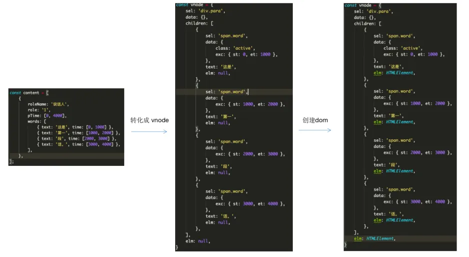
其中 sel 表示 dom 的 tag + classname，data 里表示 dom 的属性，exc 属性是我额外加的，表示只做保存数据，所以起始结尾时间保存到了 exc 里面。children 表示子元素， text 表示文本内容，elm 就是 dom 实例了。

接着将数字 1 插入“这是”后面，同时删除“段”

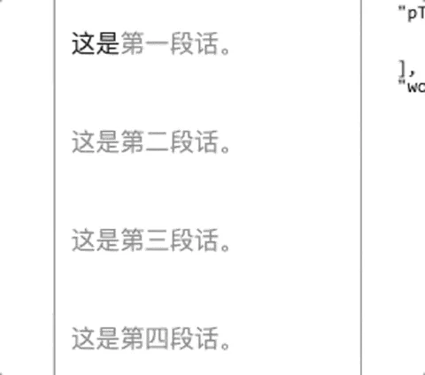

这时候编辑器内核就会处理，给到我们新的数据，再转化成新的 vnode

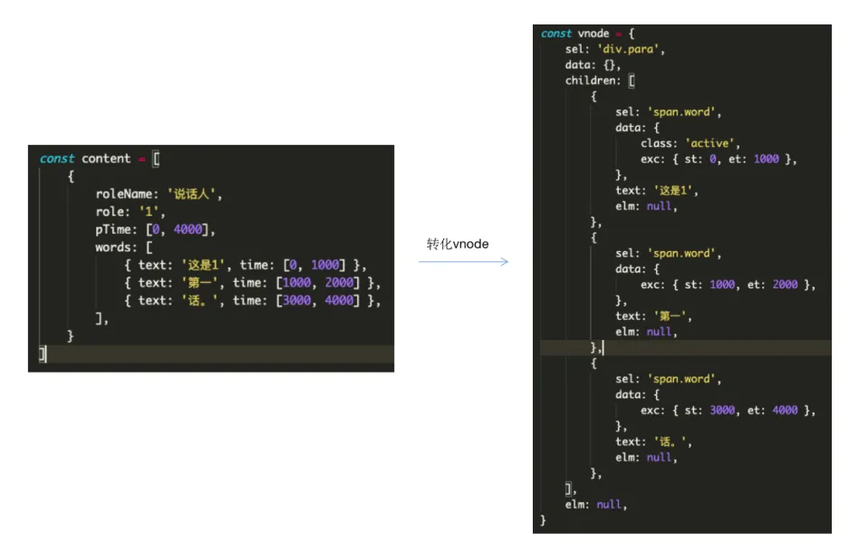 

接着就是新旧 vnode 的 diff 过程了，同样我采用了第二版的策略，对比起始时间。

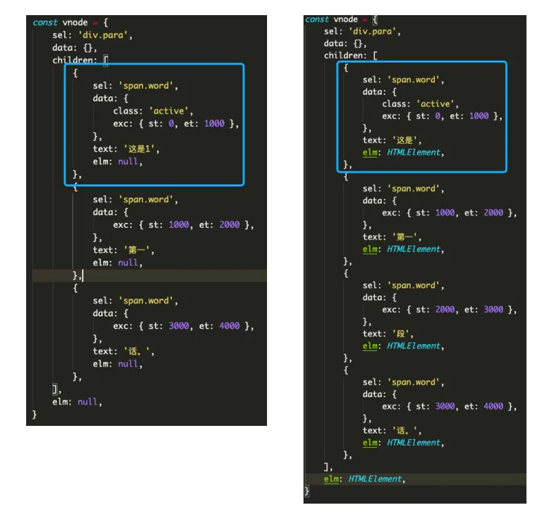
第一组数据相比，sel 相同，data 里面的内容相同，但是 text 不同。那么就更新旧的 dom 上的 innerText，然后把 dom 赋给新的 vnode

```javascript
if (vnode.text !== oldVnode.text) {
  oldVnode.elm.innerText = vnode.text;
}
vnode.elm = oldVnode.elm;
```

要是 data 里面内容不相同的话，遍历 data 改变 dom 的 attribute 就可以了（diff 源码不会还有人没背过吧？）

第二组内容相同，接下来对比第三组

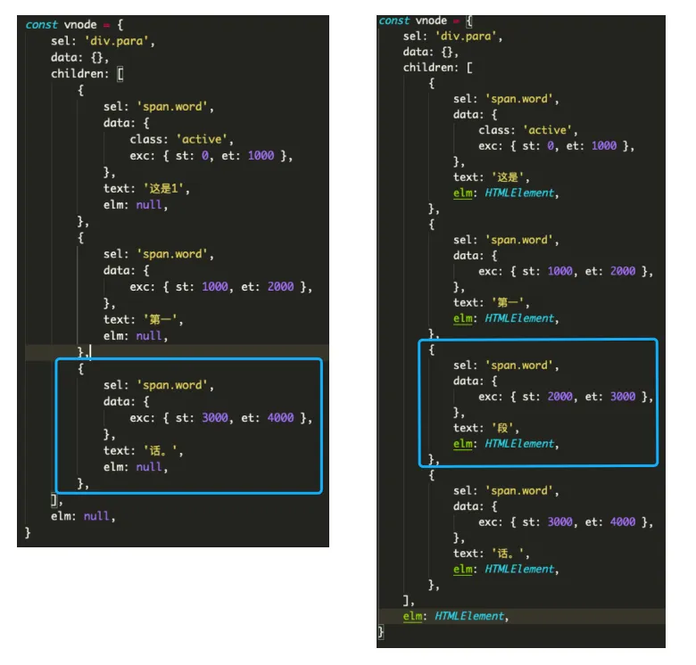

这里可以发现，起始时间不同，新的数据起始时间大于旧的数据。根据策略，旧数据要被移除

```javascript
if (vnode.data.exc.st > oldNode.data.exc.st) {
	oldNode.elm.remove();
  i++; // 旧数据 diff 索引递增，新数据与下一个旧数据相对比
}
```
最后第四组数据相同，只要把 oldVnode 的 elm 赋 vnode 就可以了。

还有一种新增数据的情况，假设新增了一个词（这种情况都是用户删除后回撤导致的）

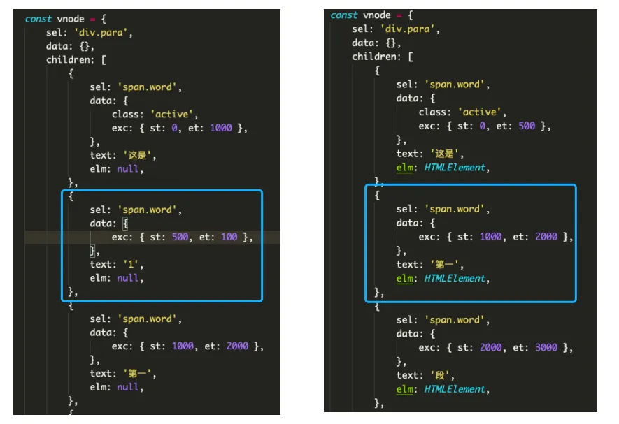

这时，新数据的起始时间是小于旧数据的，根据策略要在旧数据前插入新数据

```javascript
if (vnode.data.exc.st < oldVnode.data.exc.st) {
	const element = createElement(vnode); // 创建 dom
  parentVnode.elm.insertBefore(element, oldVnode.elm); // 将新 dom 插入到旧数据前面
  vnode.elm = element; 
  j++; // 新数据 diff 索引递增，下一个新数据与旧数据相对比
}
```

最后的一种情况就是新旧数据没有遍历完，只要按序新增/删除数据即可。

### core 内核

core 相对就比较简单了，在内部储存了 selection 光标位置和 content 数据。

```javascript
class EditorCore {
  constructor() {
    this.selection = null;
    this.content = null;
  }
  
  // 插入文字
  insertText(text) {}
  
  // 后删
  deleteBackward() {}
  
  // 前删
  deleteForward() {}
  
  // 合并段落
  mergeParagraph() {}

  // 分段
  splitParagraph() {}
}
```

其中添加了几种基础功能，插入文字、删除、合并分段。

在 beforeinput 事件中，阻止用户的行为，调用内核方法

```javascript
element.addEventListener('beforeinput', (e) => {
	// 阻止默认事件
	e.preventDefault();
  const { inputType: type, data } = e;
  
  switch (type) {
    case 'insertFromDrop':
    case 'insertFromPaste':
    case 'insertFromYank':
    case 'insertReplacementText':
    case 'insertText': {
      // 插入文字
      if (typeof data === 'string') {
        this.editorCore.insertText(e.data);
        this.update(); // 更新dom
      }
      break;
    }

    case 'insertLineBreak':
    case 'insertParagraph': {
      // 换行
      this.editorCore.splitParagraph();
      this.update();
      break;
    }


    case 'deleteContent':
    case 'deleteContentForward': {
      // 前删
      this.editorCore.deleteForward();
      this.update();
      break;
    }

    case 'deleteByCut':
    case 'deleteSoftLineBackward':
    case 'deleteContentBackward': {
      // 后删
      this.editorCore.deleteBackward();
      this.update();
      break;
    }
  }
});
```

在光标的处理上，监听 selectionchange 事件，实时更新光标位置

```javascript
const selection = window.getSelection();
if (selection.rangeCount > 0 && !this.isComposing) {
  const range = selection.getRangeAt(0);
  const { startContainer, startOffset, endContainer, endOffset } = range;
  const startDom = startContainer;
  const endDom = endContainer;

  const startPath = findPath(startDom, this.vnode);
  const endPath = findPath(endDom, this.vnode);
  if (startPath && endPath) {
    this.editorCore.setSelection({
      anchor: { path: startPath, offset: startOffset },
      focus: { path: endPath, offset: endOffset },
    });
  }
}
```

这里知道了光标所在的 dom，因为我是保存 vnode 的，所以可以遍历 vnode 找到对应的 path。而像 slate-react 则是创建 weekmap 保存 node 与 index 索引的关系，然后查找到对应的 path

```javascript
while() {
	if (element === vnode.elm) {
    return path;
  }
}
```

最后当 dom 更新完毕后，再去 core 中获取光标的位置，重新定位光标

```javascript
resetRange() {
  if (this.editorCore.selection) {
    const range = document.createRange();
    const { anchor, focus } = this.editorCore.selection;
    // 通过 path 在 vnode 上找到 dom 实例
    const start = findWordElementByPath(anchor.path, this.vnode);
    if (!this.virtualScroll || this.element.contains(start)) {
      range.setStart(start, anchor.offset);
      if (this.editorCore.isCollapsed()) {
        range.setEnd(start, anchor.offset);
      } else {
        const end = findWordElementByPath(focus.path, this.vnode);
        range.setEnd(end, focus.offset);
      }
      const sel = window.getSelection();
      sel.removeAllRanges();
      sel.addRange(range);
    }
  } else {
    this.element.blur();
  }
}
```
### 
### 扩展性

与之前的方案不同，这版完全准守了从数据映射到 dom 的单一流向，保证了一致性，从而功能的扩展也提供了便利

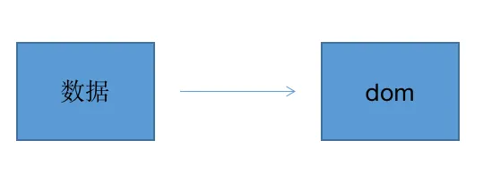

例如添加粗体功能，首先在 core 中添加 boldText 方法

```javascript
class EditorCore {
  constructor() {
    this.selection = null;
    this.content = null;
  }
  
  boldText() {}
  
}
```

其作用就是在数据中添加 bold 属性，如

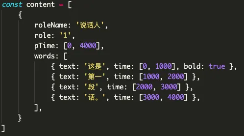

然后监听编辑器 keydown 事件，判断 cmd + B 调用 core 中的 boldText

```javascript
element.addEventListener('keydown', (e) => {
	if (hotkeys.isBold(e)) { // cmd + B
  	this.editor.boldText();
    this.update(); // 更新
  }
}
```

修改完数据后，则开始渲染更新， 创建 vnode

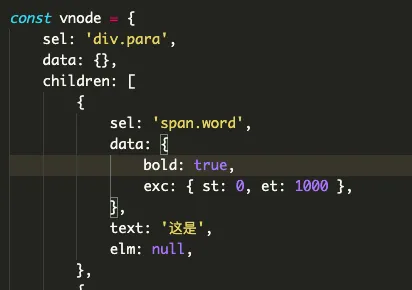

新旧数据进行 diff，发现之前的旧数据没有 bold 属性，于是就对 dom 进行加粗

```javascript
if (vnode.data.bold && !oldVnode.data.bold) {
  oldVnode.elm.style.fonWeight = 'bold';
  vnode.elm = oldVnode.elm;
}
```

当然也不用局限在样式修改上，无论是批注、评论各种形式都是可以实现的，毕竟数据掌握在你手里，数据处理方法由你来定，dom 更新流程更是可控的。
