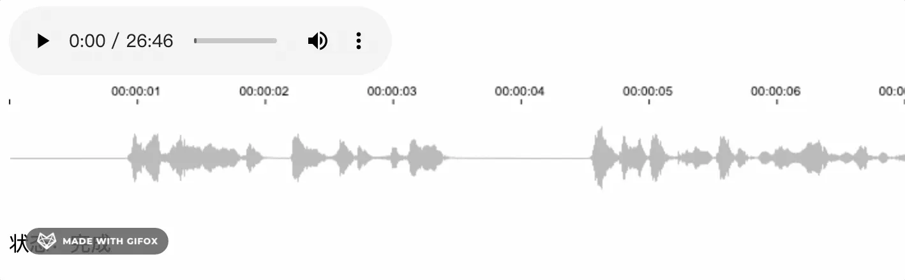

在业务中接触到了音视频相关的处理，需求是获取音频，渲染对应的波形。在多次尝试了不同时长的音频，逐步攻克了由于时长、体量增大的音频带来的性能问题，以下是我的一些总结。

## 音频波形的渲染

**请求数据**

首先通过 fetch 去请求音频数据，得到一个 ArrayBuffer 对象

```javascript
fetchData() {
  fetch(this.url)
    .then((response) => {
        return response.arrayBuffer();
    }).then((buffer) => {
        this.decodeAudioData(buffer); // 解码
    });
},
```

ArrayBuffer 是为了处理二进制数据流而出现的，但是JS没有办法直接处理（读写）它里面的内容，如果需要则要转换成 TypedArray

**解码**

接下来通过 audioContext 对象，接口的 decodeAudioData() 方法可用于异步解码音频文件中的 ArrayBuffer 

```javascript
decodeAudioData(buffer) {
  const audioCtx = new (window.AudioContext || window.webkitAudioContext)();
  audioCtx.decodeAudioData(
    buffer,
    (audiobuffer) => {
      const { sampleRate } = audiobuffer; // 获取采样率
      const channelData = audiobuffer.getChannelData(0);
      this.draw(channelData); // 绘图
    },
  );
},
```

解码成功后会得到 AudioBuffer 对象


里面包含了音频时长、长度、通道数、采样率

采样就是将模拟声音信号转换为数字声音信号的过程，采样率就是单位时间内对音频信号进行采集的次数，它以赫兹(Hz)或千赫兹(kHz)为单位。MP3采样率一般是44.1kHz，即每秒要对声音进行44100次分析，记录下每次分析之间的差别。采样越高获得的声音信息也就越完整。


这里 **总时长 * 采样率 = 总长度  **总时长跟实际会有 0.1 - 0.2 秒偏差，实际 audio dom 上获取的音频时长 94.32 秒，我们以这个为准

然后调用 getChannelData() 方法返回 TypedArray 对象，其中包含与通道关联的PCM数据，通道参数定义(0表示第一个通道) 不能大于 numberOfChannels

TypedArray 是一个描述 ArrayBuffer 的类数组视图，虽然并没有一个 TypedArray 的全局属性和构造器，但是提供了一系列基于它的特定数据类型的数组（可以理解为 TypedArray 是interface而它们扩展的类）


**绘图**

知道音频时长后，再确定绘制波形 canvas 的宽度，设置每秒宽 100 像素，时长 94.32 秒 得到 canvas 宽 9432 像素

```html
<template>
  <div id="app">
    <audio controls :src="url" @loadedmetadata="loadData"></audio>
    <canvas ref="timeline" :width="width" height="20"></canvas>
    <canvas ref="wave" :width="width" height="80"></canvas>
  </div>
</template>
```
```javascript
export default {
  data() {
    unitWidth: 100,
    totalTime: 0,
    width: 0
  },
  methods: {
    loadData() {
      this.totalTime = e.target.duration;
      this.width = this.unitWidth * this.totalTime; // 9432
      this.timelineCtx = this.$refs.timeline.getContext('2d');
      this.waveCtx = this.$refs.wave.getContext('2d');
      this.fetchData();
    }
  }
}
```

由解码得到的 channelData 长度为 4150273，canvas 宽度为 9432 像素，那么每个像素分配到 440.02 个数据，相当于 channelData 每 440.02 个点渲染一个像素


但是 440.02 并不是一个整数，每 100 个像素就会有 2 个数据偏差，每 2.2 万像素就会偏差一个像素点，音频时长越长偏差就越大，况且这里小数只有 0.2，小数越大偏差就约明显

所以接下来将 440.02 取整，并微调 unitWidth

```javascript
draw(channelData) {
  	const step = Math.floor(channelData.length / (this.totalTime * this.unitWidth));
  	this.unitWidth = channelData.length / step / this.totalTime; // 最终为 100.00465051276122
  	this.width = this.unitWidth * this.totalTime;
  	this.drawTimeline(); // 绘制时间轴
    this.drawWave(channelData, step); // 绘制波形
},
```

绘制时间轴，这里就不做解析了

```javascript
drawTimeline() {
  for (let i = 0; i < Math.ceil(this.totalTime); i += 1) {
    this.timelineCtx.font = '10px Arial';
    this.timelineCtx.fillStyle = 'rgba(0, 0, 0, 1)';
    this.timelineCtx.fillRect(this.unitWidth * i, 14, 1, 4);
    if (i > 0) {
      this.timelineCtx.fillText(
        durationToTime(i).split('.')[0],
        this.unitWidth * i - 20,
        11,
      );
    }
  }
},
```

绘制波形需要对整个 channelData 进行遍历，每 440 个数据，算出最大值和最小值，最大值与最小值的差值越大，则整个波形也越大

```javascript
drawWave(channelData, step) {
  let stepIndex = 0;
  let xIndex = 0;
  let min = 1;
  let max = -1;
  for (let i = 0; i < channelData.length; i += 1) {
    stepIndex += 1;
    const item = channelData[i] || 0;
    if (item < min) {
      min = item;
    } else if (item > max) {
      max = item;
    }
    if (stepIndex >= step) {
      xIndex += 1;
      this.waveCtx.fillStyle = 'rgba(0, 0, 0, 0.3)';
      const l = (max - min) * 40 * 0.8;
      this.waveCtx.fillRect(xIndex, 40 - (l / 2), 1, Math.max(1, l));
      stepIndex = 0;
      min = 1;
      max = -1;
    }
  }
},
```

最终的效果：


## 分段渲染

尝试下一段 26 分钟的音频，发现波形并不能渲染出来。按照之前的方案，一段 26 分钟的音频，canvas 的宽度已经高达 16 万多像素，这时肯定需要将 canvas 分段。

以 2 分钟为一段，将 26 分钟多的视频分为 14 段，算出对应宽度并定位布局

```html
<template>
  <div id="app">
    <audio controls :src="url" @loadedmetadata="loadData"></audio>
    <div class="wave-box">
      <div>
        <canvas
          v-for="item in canvas"
          :key="item.key"
          :ref="`timeline${item.key}`"
          height="20"
          :width="item.width"
          :style="{ left: `${item.left}px`}"
          class="timeline">
        </canvas>
      </div>
      <div>
        <canvas
          v-for="item in canvas"
          :key="item.key"
          :ref="`wave${item.key}`"
          height="80"
          :width="item.width"
          :style="{ left: `${item.left}px`}"
          class="wave">
        </canvas>
      </div>
    </div>
  </div>
</template>
```

```javascript
loadData(e) {
  this.totalTime = e.target.duration;
  this.width = this.totalTime * this.unitWidth;

  const w = this.unitWidth * 2 * 60; // 2分钟一条时间轴
  const num = Math.ceil(this.width / w);
  const canvas = [];
  for (let i = 0; i < num; i += 1) {
    canvas.push({
      width: i === num - 1 ? this.width % w : w,
      key: i,
      left: i * w,
    });
  }
  this.canvas = canvas;
  this.$nextTick(() => {
    for (let i = 0; i < this.canvas.length; i += 1) {
      this[`wave${i}Ctx`] = this.$refs[`wave${i}`][0].getContext('2d');
      this[`timeline${i}Ctx`] = this.$refs[`timeline${i}`][0].getContext('2d');
    }
  });
  this.fetchData();
},
```

**时间轴分段渲染**

时间轴渲染方案较原先做一点改版，每一秒时间先得到对应 canvas 画布的索引，在对应画布上渲染

```javascript
drawTimeline() {
  for (let i = 0; i < Math.ceil(this.totalTime); i += 1) {
    const n = Math.floor(i / 120);
    this[`timeline${n}Ctx`].font = '10px Arial';
    this[`timeline${n}Ctx`].fillStyle = 'rgba(0, 0, 0, 1)';
    this[`timeline${n}Ctx`].fillRect(this.unitWidth * (i % 120), 14, 1, 4);
    if (i > 0) {
      this[`timeline${n}Ctx`].fillText(
        durationToTime(i).split('.')[0],
        this.unitWidth * (i % 120) - 20,
        11,
      );
    }
  }
},
```
### 
**波形分段渲染**

同理，渲染每个像素点前，得到对应的 canvas

```javascript
drawWave(channelData, step) {
  let stepIndex = 0;
  let xIndex = 0;
  let min = 1;
  let max = -1;
  for (let i = 0; i < channelData.length; i += 1) {
    stepIndex += 1;
    const item = channelData[i] || 0;
    if (item < min) {
      min = item;
    } else if (item > max) {
      max = item;
    }
    if (stepIndex >= step) {
      xIndex += 1;
      const n = Math.floor(xIndex / (120 * this.unitWidth));
      this[`wave${n}Ctx`].fillStyle = 'rgba(0, 0, 0, 0.3)';
      const l = (max - min) * 40 * 0.8;
      this[`wave${n}Ctx`].fillRect(xIndex % (120 * this.unitWidth), 40 - (l / 2), 1, Math.max(1, l));
      stepIndex = 0;
      min = 1;
      max = -1;
    }
  }
},
```

最终效果


## 异步渲染

在绘制波形的时候，我发现浏览器会直接被阻塞卡死，这里我加上了时间跟状态（加载数据、解码、绘图、完成）


上面gif中可以看出，在 3.7 秒时卡住，状态直接跳过了“绘图”

我们再给绘图加上 log，看花费了多少时间

```javascript
draw(channelData) {
  console.time('时长');
  this.drawTimeline();
  this.drawWave(channelData, step);
  console.timeEnd('时长');
},
```


可以看到，整个绘图过程花费 1 秒多，在这 1 秒内，浏览器被阻塞无法做任何动作。所以我想将这些任务根据 canvas 的数量拆分开来，异步地一个个去执行

**时间轴**

这里将渲染时间轴方法写成单个任务，每次执行渲染一个 canvas

```javascript
drawTimeline(n) {
  const start = n * 120;
  const end = n === this.canvas.length - 1 ? Math.ceil(this.totalTime) : start + 120;
  for (let i = start; i < end; i += 1) {
    this[`timeline${n}Ctx`].font = '10px Arial';
    this[`timeline${n}Ctx`].fillStyle = 'rgba(0, 0, 0, 1)';
    this[`timeline${n}Ctx`].fillRect(this.unitWidth * (i % 120), 14, 1, 4);
    if (i % 120) {
      this[`timeline${n}Ctx`].fillText(
        durationToTime(i).split('.')[0],
        this.unitWidth * (i % 120) - 20,
        11,
      );
    }
  }
},
```


**波形**

同理，将波形渲染方法写成单个任务，并计算当前任务的 channelData 数据的位置

```javascript
drawWave(channelData, step, n) {
  let stepIndex = 0;
  let xIndex = 0;
  let min = 1;
  let max = -1;

  const dataLength = 120 * this.sampleRate; // 每2分钟的数据长度 时间 * 采样频率
  const start = n * dataLength;
  const end = n === this.canvas.length - 1 ? Math.ceil(this.totalTime) * this.sampleRate : start + dataLength;

  for (let i = start; i < end; i += 1) {
    stepIndex += 1;
    const item = channelData[i] || 0;
    if (item < min) {
      min = item;
    } else if (item > max) {
      max = item;
    }
    if (stepIndex >= step) {
      xIndex += 1;
      this[`wave${n}Ctx`].fillStyle = 'rgba(0, 0, 0, 0.3)';
      const l = (max - min) * 40 * 0.8;
      this[`wave${n}Ctx`].fillRect(xIndex, 40 - (l / 2), 1, Math.max(1, l));
      stepIndex = 0;
      min = 1;
      max = -1;
    }
  }
},
```

最后利用 setTimeout 一个个执行任务

```javascript
draw(channelData) {
  for (let i = 0; i < this.canvas.length; i += 1) {
    setTimeout(() => {
      this.drawTimeline(i);
      this.drawWave(channelData, step, i);
    }, i * 100);
  }
},
```



从 gif 可以看到原本需要卡顿 1 秒，现在被分割成多个任务异步渲染，也将卡顿时间拆分，增加用户体验

## 时间切片

这次再来挑战 1 小时 54 分钟音频


上图看到即便做了异步的优化，但本质不能减少卡顿时间，长时间音频依然得花大量时间计算、渲染。

那如何去减少卡顿的时间？

我们知道卡顿是因为有大量的数据去计算波形的最大值、最小值，计算过程中会直接阻塞浏览器从而造成卡顿。减少卡顿必须得对这段计算进行“特殊处理”。

可以想到不阻塞浏览器有 web worker 和 requestIdleCallback, 熟悉 react 的同学肯定知道，我们可以通过 requestIdleCallback api 去把计算任务放到浏览器空闲时间去做

下面我将一次渲染任务一分为 10，每次渲染 12 秒音频波形，浏览器空闲时间执行 12 秒波形渲染，首先创建一个 Task 任务类

```javascript
class Task {
  constructor(ctx, {
    num, totoal, sampleRate, totalTime, step, channelData,
  }) {
    this.num = num;
    this.channelData = channelData;
    this.start = (num - 1) * 120 * sampleRate;
    this.end = num === totoal ? (totalTime - (num - 1) * 120) * sampleRate : num * 120 * sampleRate;
    this.stepIndex = 0;
    this.min = -1;
    this.max = 0;
    this.xIndex = 0;
    this.step = step;
    this.ctx = ctx;
    this.times = 1;
    this.maxTimes = 10;
    this.renderLength = Math.ceil((this.end - this.start) / this.maxTimes);
  }

  run() {
    if (this.times > tiis.maxTimes) {
      return null;
    }
    const start = (this.times - 1) * this.renderLength + this.start;
    const end = this.times === this.maxTimes ? this.end : start + this.renderLength;
    for (let i = start; i < end; i += 1) {
      this.stepIndex += 1;
      const item = this.channelData[i] || 0;
      if (item < this.min) {
        this.min = item;
      } else if (item > this.max) {
        this.max = item;
      }
      if (this.stepIndex >= this.step) {
        this.xIndex += 1;
        this.ctx.fillStyle = 'rgba(0, 0, 0, 0.1)';
        const l = (this.max - this.min) * 40 * 0.8;
        this.ctx.fillRect(this.xIndex, 40 - (l / 2), 1, Math.max(1, l));
        this.stepIndex = 0;
        this.min = 1;
        this.max = -1;
      }
    }
    this.times += 1;
    return this;
  }
}

export default Task;

```

上面 Task 类作用就是每调用 run 方法就渲染 12 秒的波形，第 11 次调用后会返回 null 告诉程序渲染下一条 canvas

```javascript
drawWave(channelData, step) {
  let i = 1;
  let draw;
  const drawWork = (deadline) => {
    if (deadline.timeRemaining() > 0) {
      if (i <= this.canvas.length) {
        if (!draw) {
          draw = new Task(this[`wave${i - 1}Ctx`], {
            num: i,
            total: this.canvas.length,
            sampleRate: this.sampleRate,
            totalTime: this.totalTime,
            step,
            channelData,
          });
        }
        draw = draw.run();
        if (!draw) {
          i += 1;
        }
      }
    }
    if (i <= this.canvas.length) {
      requestIdleCallback(drawWork);
    }
  };


  if (requestIdleCallback) {
    requestIdleCallback(drawWork, { timeout: 1000 });
  } else {
    // 不支持 requestIdleCallback 采用异步方案
  }
  this.status = '完成';
},
```

最终结果


效果明显好多了，但是任务分得越多越细，波形对应时间的误差也会越大。因为任务分 10 段时，数据是直接除以 10 的，不一定是 step 的倍数，所以会造成偏差，下面再做一步优化

```javascript
this.renderLength = Math.ceil((this.end - this.start) / step / this.maxTimes) * step
```

同理时间轴也可以做时间切片优化，这里就不介绍了。

## 分段解码

这次换一个 3 小时 43 分钟的音频，页面直接崩溃


查明原因是在解码阶段 decodeAudioData 方法解析不了太大数据，下面就对请求到的 buffer 进行分段，分别去解码。

方案有 2 种，一是使用 Promise.all 得到 Array\<channelData\> 数据

```javascript
decodeAudioData(buffer) {
  const audioCtx = new (window.AudioContext || window.webkitAudioContext)();
  const promiseArray = [];
  const size = 1024 * 1024 * 0.1;
  const num = Math.ceil(buffer.byteLength / size);

  for (let i = 0; i < num; i += 1) {
    const p = new Promise((resolve) => {
      audioCtx.decodeAudioData(
        buffer.slice(size * i, size * (i + 1)),
        (audiobuffer) => {
          const { sampleRate } = audiobuffer;
          const channelData = audiobuffer.getChannelData(0);
          this.sampleRate = sampleRate;
          resolve(channelData);
        },
      );
    });
    promiseArray.push(p);
  }
  Promise.all(promiseArray)
    .then((res) => {
    console.log(res);
  });
},
```

得到的结果


decodeAudioData 其实也有 Promise 写法，但回调函数语法兼容性更好，~~我只看Chrome对我没影响~~

另一种是递归，得到 Array\<channelData\> 数据

```javascript
decodeAudioData(buffer) {
  const audioCtx = new (window.AudioContext || window.webkitAudioContext)();
  const size = 1024 * 1024 * 0.1;
  const num = Math.ceil(buffer.byteLength / size);
  let i = 0;
  const channelData = [];
  let len = 0
  const decode = () => {
    audioCtx.decodeAudioData(
      buffer.slice(size * i, size * (i + 1)),
      (audiobuffer) => {
        const { sampleRate } = audiobuffer;
        this.sampleRate = sampleRate;
        const cd = audiobuffer.getChannelData(0);
        channelData.push(cd);
        len += cd.length; // 记录 channelData 长度
        i += 1;
        if (i < num) {
          decode();
        } else {
          console.log(channelData);
        }
      },
    );
  };
  decode();
},
```


2 种方案得到数据一样，用时上 Promise.all 更优秀，但我更倾向于递归方案，因为还可以做后续优化

接着因为 channelData 的数据结构变了, 从原来 TypedArray 变成 Array\<TypedArray\>，再加个获取 channelData 对应数据的方法

```javascript
getChannelDataItem(index) {
  if (this.cdl > index) {
    return this.channelData[this.i][index - this.cdll];
  }
  this.i += 1;

  for (; this.i < this.channelData.length; this.i += 1) {
    this.cdll = this.cdl;
    this.cdl += this.channelData[this.i].length;
    if (this.cdl > index) {
      return this.channelData[this.i][index - this.cdll];
    }
  }
  return 0;
}
```

这个方法里加一层缓存，减少计算量，因为传入的参数 index 是稳定累加的

最终效果


但是问题来了，这 decodeAudioData 解码时间也太长了，上图显示花费了 25 秒，总不能让用户干等着，况且还没算上加载、渲染时间

所以这里再做一下优化，解码多少数据，优先渲染多少数据，不必等到所有数据解码后再渲染

```javascript
decodeAudioData(buffer) {
  const audioCtx = new (window.AudioContext || window.webkitAudioContext)();
  const size = 1024 * 1024 * 0.1;
  const num = Math.ceil(buffer.byteLength / size);
  let i = 0;
  const channelData = [];
  let len = 0;

  let bufferData = new Float32Array(); // 储存多余数据
  const decode = () => {
    audioCtx.decodeAudioData(
      buffer.slice(size * i, size * (i + 1)),
      (audiobuffer) => {
        i += 1;
        const { sampleRate } = audiobuffer;
        this.sampleRate = sampleRate;
        const cd = audiobuffer.getChannelData(0);
        channelData.push(cd);

        const step = Math.floor(this.totalTime * sampleRate / (100 * Math.ceil(this.totalTime)));
        if (i === 1) {
          this.draw(null, step); // 这里改成渲染时间轴
        }

        if (bufferData.length > 0) {
          const data = new Float32Array(bufferData.length + cd.length);
          data.set(bufferData, 0);
          data.set(cd, bufferData.length); // 合并数据
          this.drawWave(data.slice(0, data.length - data.length % step), len, step);
          len += (data.length - data.length % step);
          bufferData = data.slice(data.length - data.length % step, data.length);
        } else { // 第一次解码
          
          this.drawWave(cd.slice(0, cd.length - cd.length % step), len, step);
          len += (cd.length - cd.length % step); // 记录解码的累计长度
          bufferData = cd.slice(cd.length - cd.length % step, cd.length); // 存储多余的数据
        }

        if (i < num) {
          decode();
        }
      },
    );
  };
  decode();
},
```

这里加了 bufferData 变量，主要是因为解码出来的数据长度假设为 44500，而 step 为 400 （400个数据渲染一个像素）最终渲染出 111 个像素，多出来的 100 个数据就被抛弃，造成了误差。

所以这里加了 bufferData 来储存多余数据，下次 decode 后拼接起来

接着修改 drawWave 方法

```javascript
drawWave(channelData, len, step) {
  let draw = new Task(this, {
    channelData,
    x: len / step,
    step,
    unitWidth: this.unitWidth,
  });
  const drawWork = (deadline) => {
    if (deadline.timeRemaining() > 10) {
      draw = draw.run();
    }
    if (draw) {
      requestIdleCallback(drawWork, { timeout: 1000 });
    }
  };


  if (requestIdleCallback) {
    requestIdleCallback(drawWork, { timeout: 1000 });
  } else {
    //
  }
},
```

然后修改下 Task 类，之前是基于时间，每 2 分钟一个 Task 实例，再分成 10 分运行计算。现在则是基于 decodeAudioData 解码出来的一段 channelData，每一段一个 Task 实例，持续调用 run 方法结算数据、渲染。

```javascript
class Task {
  constructor(vm, {
    channelData,
    x,
    step,
    unitWidth,
  }) {
    this.w = unitWidth * 2 * 60;
    this.channelData = channelData;
    this.vm = vm;
    this.x = x;
    this.step = step;
    this.maxTimes = 20;
    this.renderLength = Math.ceil(channelData.length / step / this.maxTimes) * step;
  }

  times = 1

  min = 1

  max = -1

  stepIndex = 0

  run() {
    if (this.times > this.maxTimes) {
      return null;
    }
    const start = (this.times - 1) * this.renderLength;
    const end = start + this.renderLength;
    for (let i = start; i < end; i += 1) {
      this.stepIndex += 1;
      const item = this.channelData[i] || 0;
      if (item < this.min) {
        this.min = item;
      } else if (item > this.max) {
        this.max = item;
      }
      if (this.stepIndex >= this.step) {
        this.x += 1;
        const num = Math.floor(this.x / this.w);

        if (this.vm[`wave${num}Ctx`]) {
          this.vm[`wave${num}Ctx`].fillStyle = 'rgba(0, 0, 0, 0.1)';
          const l = (this.max - this.min) * 40 * 0.8;
          this.vm[`wave${num}Ctx`].fillRect((this.x % this.w), 40 - (l / 2), 1, Math.max(1, l));
          this.stepIndex = 0;
          this.min = 1;
          this.max = -1;
        }
      }
    }
    this.times += 1;
    return this;
  }
}

export default T;
```

这里的 maxTimes 并不一定写死，最好能把单个任务控制在 10ms 左右

最终结果


相比下再也不用等待 25 秒了。但是似乎还是有点卡顿？

用 Performance 来查看下，是什么导致的。 选中 FPS 红色的点（表示帧数低）查看火焰图上耗时的函数，再点击具体代码位置


结果是储存 bufferData 花费了很多时间，打印下具体时间


那换成不储存，浪费就浪费 误差就误差试试效果


仔细看是有好一点，具体的取舍还是看实际业务吧。


最后谈谈关于性能优化，我不会那么迫切地去做性能上的优化，我认为性能优化都是基于业务的。比如上述波形渲染展示的功能，开始是限制2小时的，后来pm觉得可能会开放限制，所以增加了4小时音频测试。假设我们的业务只针对5-10分钟的音频，那我是觉得没什么必要做这样的优化，反而分段、切片让整体的逻辑复杂化。同样的，我相信95%的场景都不会存在所谓的性能瓶颈，无意义/过度地优化反而适得其反，有这个时间我会把上面的烂代码结构改得更合理、可读性更高点。抛开特定场景，一味地强调优化，怕就是想证明我强你菜，我kpi高你kpi低
